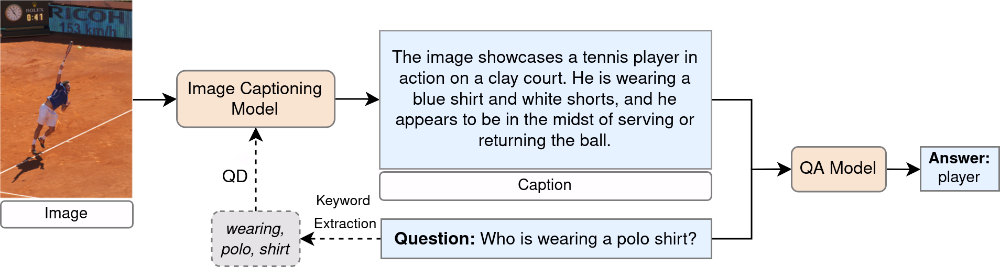
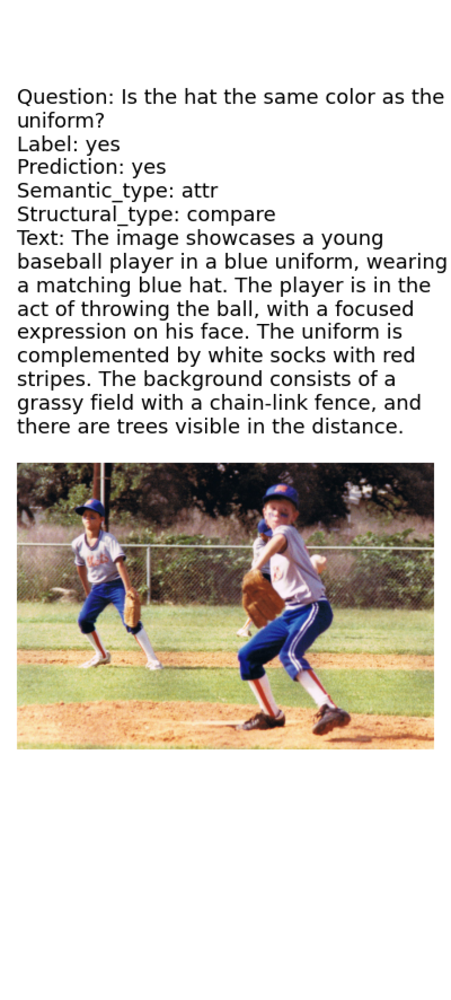
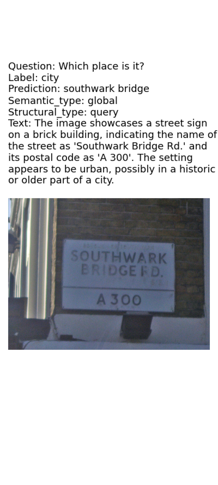
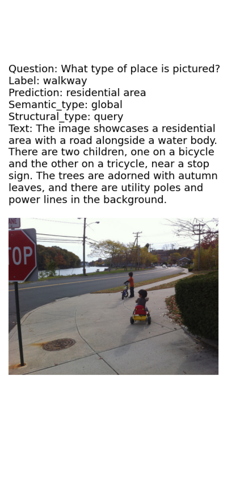
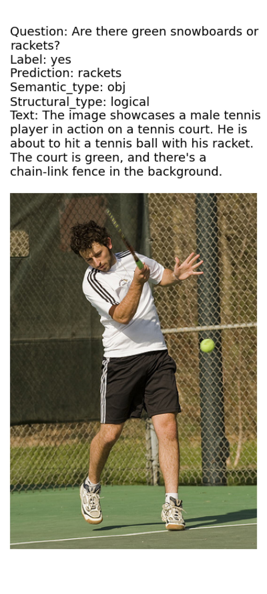
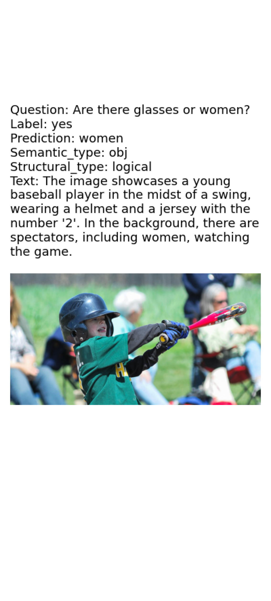
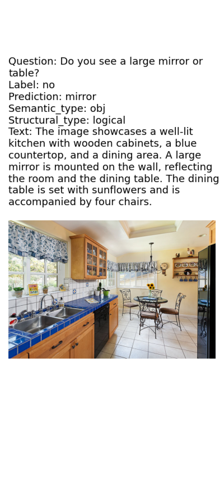
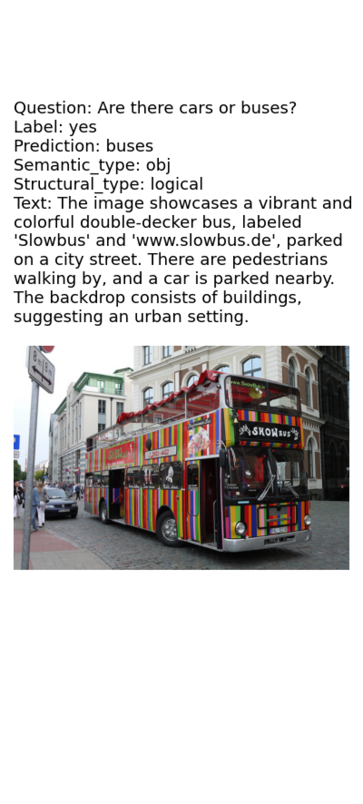
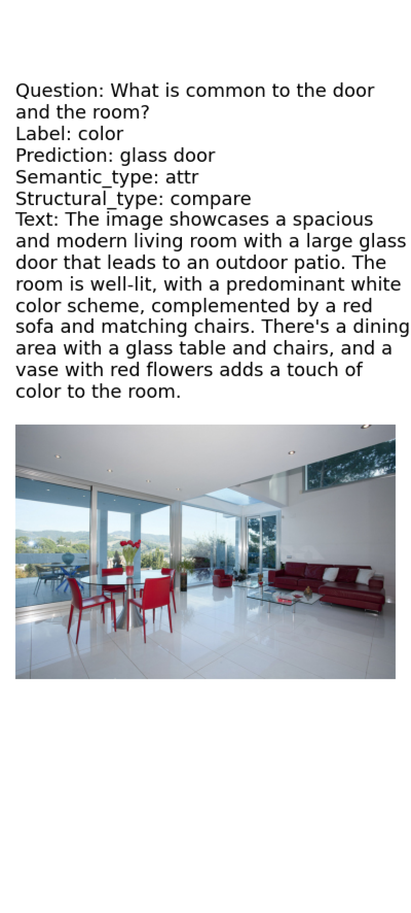
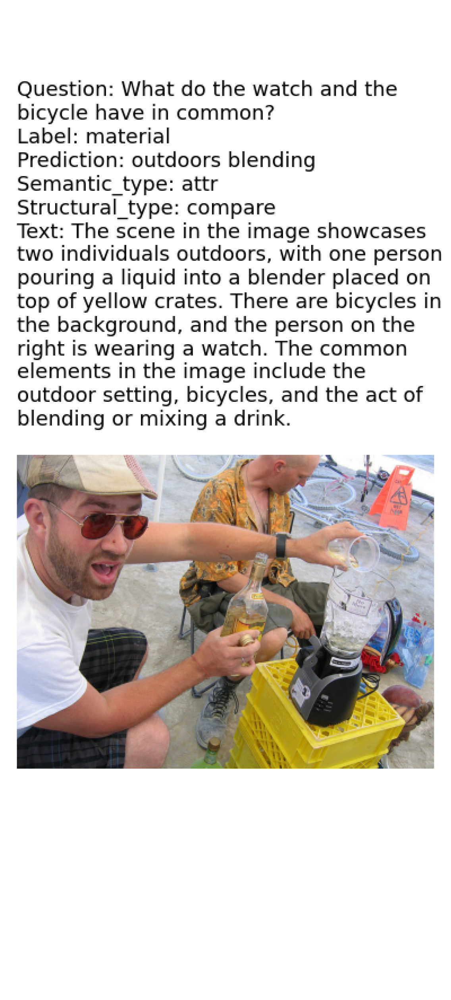

# 借助问题引导的图像描述作为前置提示，提升视觉问答系统的性能。

发布时间：2024年04月12日

`LLM应用` `视觉问答` `人工智能`

> Enhancing Visual Question Answering through Question-Driven Image Captions as Prompts

# 摘要

> 视觉问答（VQA）任务因其对视觉和语言内容的深入理解、推理和推断能力的要求而闻名，被誉为AI领域的终极挑战。近年来，众多神经网络架构涌现，旨在解决VQA难题。但在零样本学习环境下实现VQA的成功，仍面临重大挑战，这要求模型具备出色的泛化和推理能力。本研究尝试将图像描述作为VQA流程中的一个中介步骤，探讨其对性能的影响。特别是，我们尝试用图像描述替代原图像，并运用大型语言模型（LLMs）来构建一个零样本的学习环境。考虑到图像描述在这一过程中的重要性，我们比较了不同先进图像描述模型对各类问题在结构和语义上的VQA表现的影响。我们提出了一种直接而高效的以问题为导向的图像描述方法，通过这种方法，将上下文信息融入到问答模型中。该方法通过从问题中提取关键词，为每对图像和问题生成描述，并把这些问题驱动的描述整合到LLM的提示中。我们对在VQA流程中使用通用和问题驱动的图像描述进行了效果评估。研究显示，通过运用图像描述和发挥LLMs的潜力，我们有望在零样本条件下的GQA任务上取得优异表现。相关代码已在\url{https://github.com/ovguyo/captions-in-VQA}上公开。

> Visual question answering (VQA) is known as an AI-complete task as it requires understanding, reasoning, and inferring about the vision and the language content. Over the past few years, numerous neural architectures have been suggested for the VQA problem. However, achieving success in zero-shot VQA remains a challenge due to its requirement for advanced generalization and reasoning skills. This study explores the impact of incorporating image captioning as an intermediary process within the VQA pipeline. Specifically, we explore the efficacy of utilizing image captions instead of images and leveraging large language models (LLMs) to establish a zero-shot setting. Since image captioning is the most crucial step in this process, we compare the impact of state-of-the-art image captioning models on VQA performance across various question types in terms of structure and semantics. We propose a straightforward and efficient question-driven image captioning approach within this pipeline to transfer contextual information into the question-answering (QA) model. This method involves extracting keywords from the question, generating a caption for each image-question pair using the keywords, and incorporating the question-driven caption into the LLM prompt. We evaluate the efficacy of using general-purpose and question-driven image captions in the VQA pipeline. Our study highlights the potential of employing image captions and harnessing the capabilities of LLMs to achieve competitive performance on GQA under the zero-shot setting. Our code is available at \url{https://github.com/ovguyo/captions-in-VQA}.

[Arxiv](https://arxiv.org/abs/2404.08589)