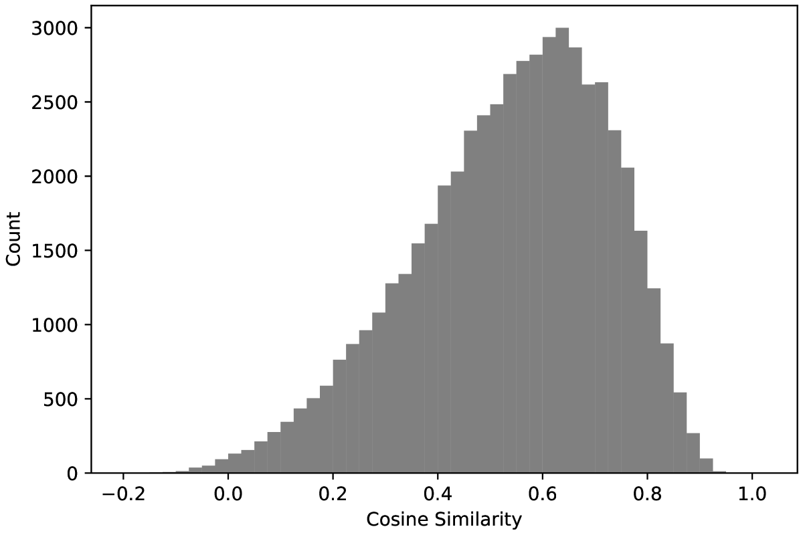
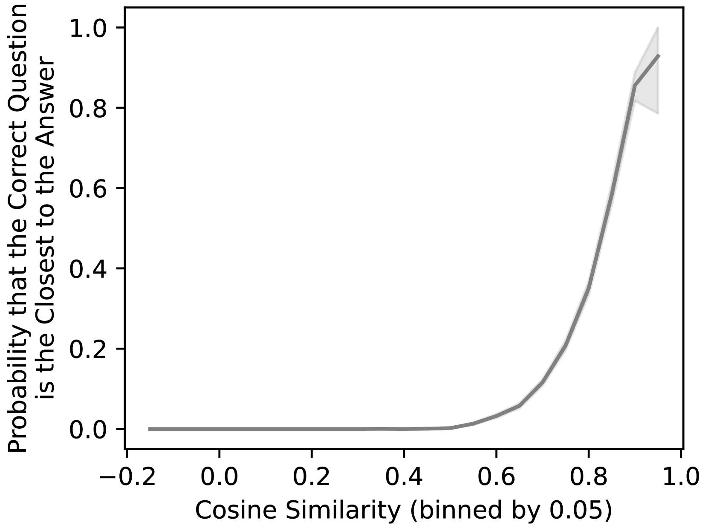
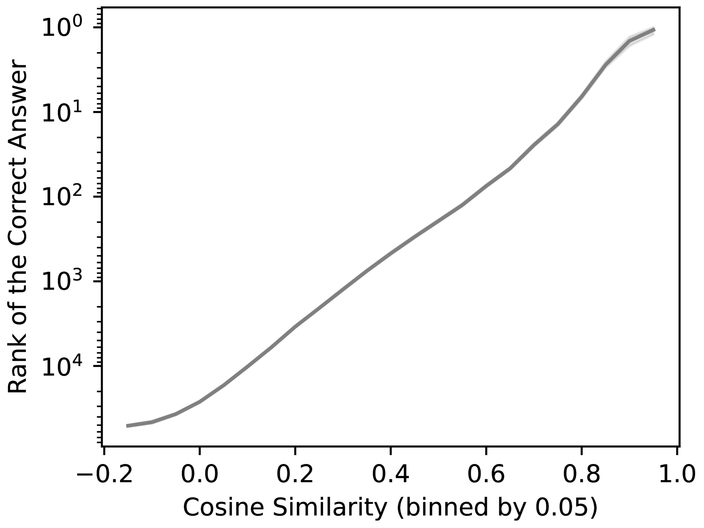
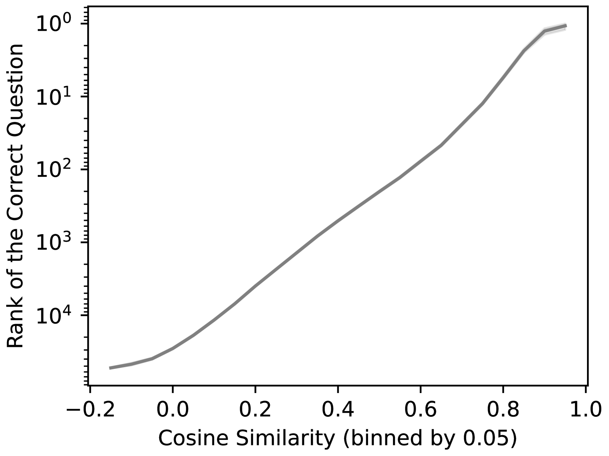
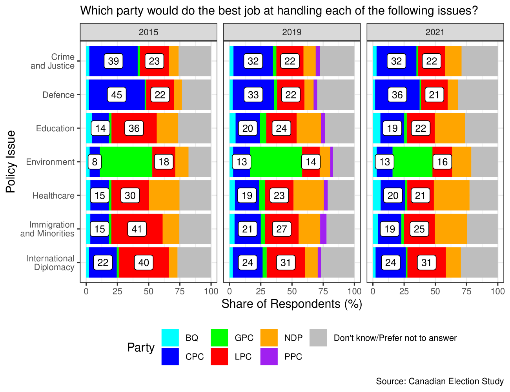
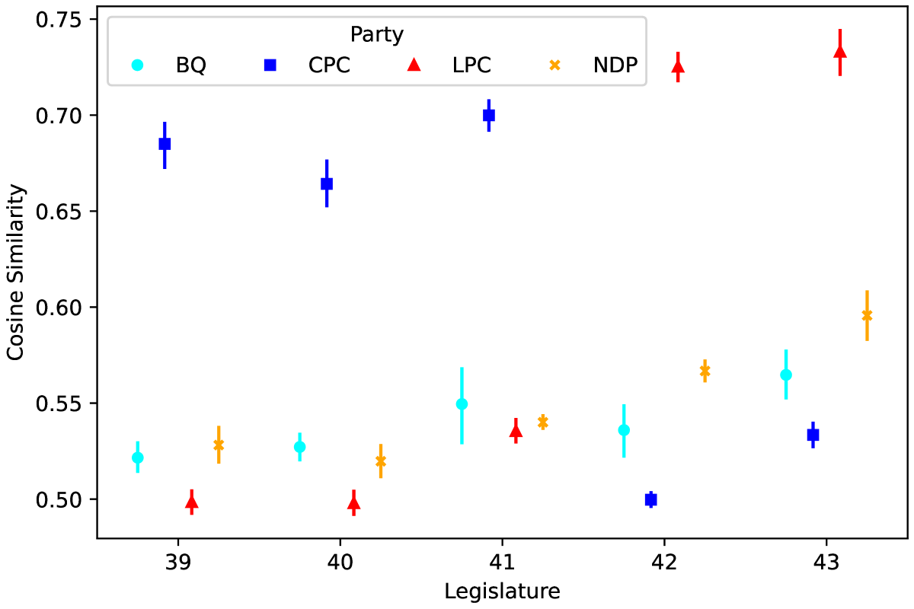
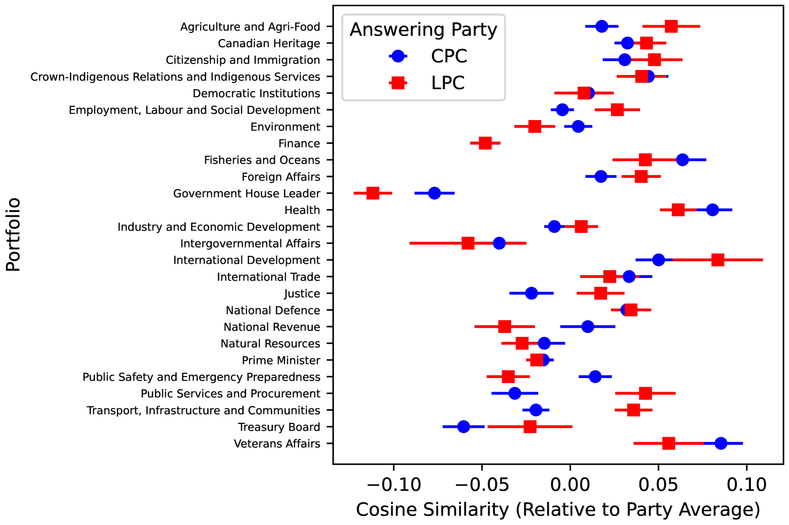
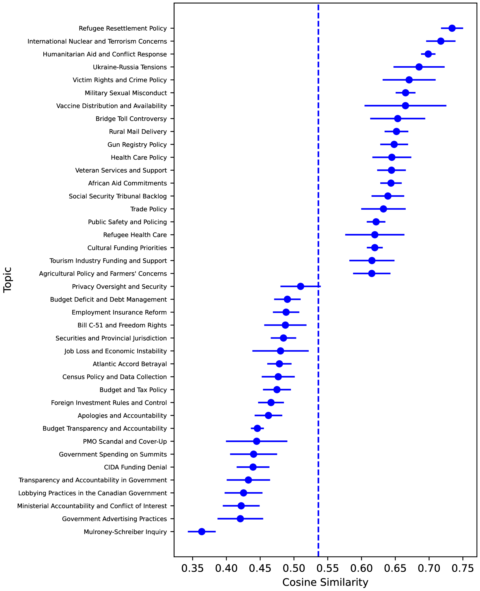
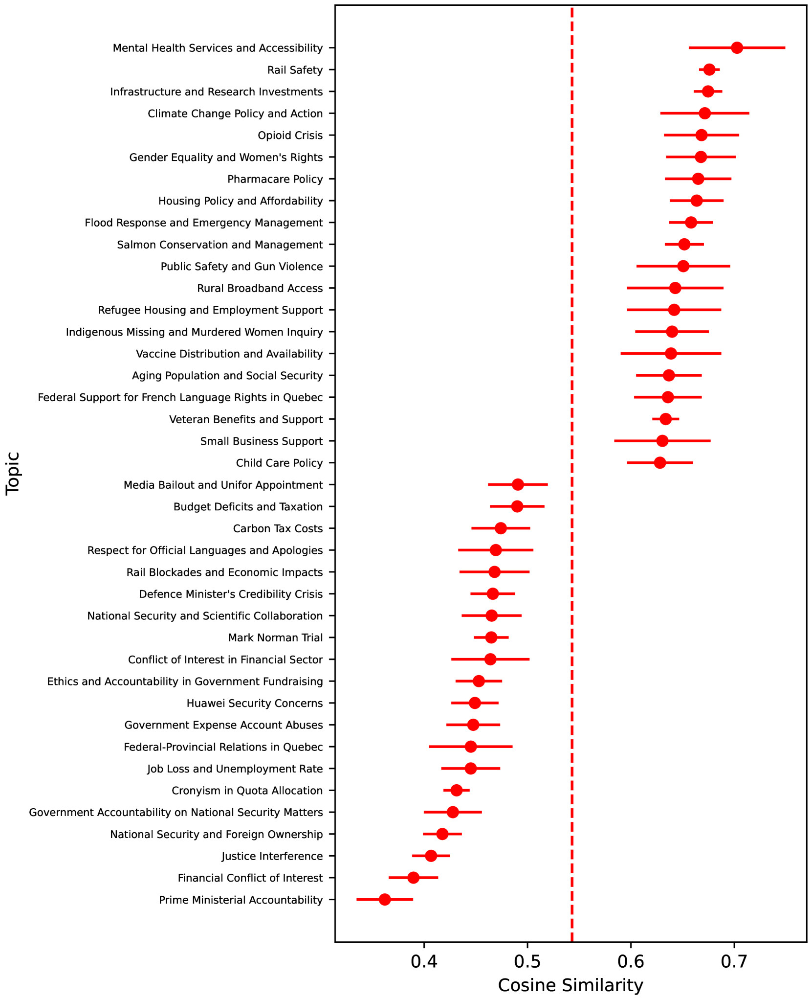

# 借助大型语言模型，我们探讨了政治问答环节中答案的质量评估问题。

发布时间：2024年04月12日

`LLM应用` `问答系统`

> Evaluating the Quality of Answers in Political Q&A Sessions with Large Language Models

# 摘要

> 本文介绍了一种新颖的政治问答环节答案质量评估方法。我们主张通过答案帮助我们准确推测出原始问题的程度来评价其质量，这一理念本质上展现了答案与问题的紧密相关性。借鉴语义搜索的理念，我们提出通过微调大型语言模型来实现这一评估，无需额外的标注数据。我们以加拿大国会问题时间为背景，展示了这一评估方法的应用。研究发现，答案质量受到提问者所属政党的显著影响，并且答案质量与问题主题之间存在显著的相关性。

> This paper presents a new approach to evaluating the quality of answers in political question-and-answer sessions. We propose to measure an answer's quality based on the degree to which it allows us to infer the initial question accurately. This conception of answer quality inherently reflects their relevance to initial questions. Drawing parallels with semantic search, we argue that this measurement approach can be operationalized by fine-tuning a large language model on the observed corpus of questions and answers without additional labeled data. We showcase our measurement approach within the context of the Question Period in the Canadian House of Commons. Our approach yields valuable insights into the correlates of the quality of answers in the Question Period. We find that answer quality varies significantly based on the party affiliation of the members of Parliament asking the questions and uncover a meaningful correlation between answer quality and the topics of the questions.

[Arxiv](https://arxiv.org/abs/2404.08816)