# 本文探讨了大型语言模型中主动归纳推理的实验设计方案。

发布时间：2024年04月12日

`LLM应用` `人工智能` `自适应提示设计`

> Experimental Design for Active Transductive Inference in Large Language Models

# 摘要

> 传导能力，即在推理阶段将查询特定的样本融入提示中，是大型语言模型（LLM）的新技能之一。本研究提出了一种创新的自适应提示设计框架——主动传导推理（ATI）。我们通过精心挑选少量样本来构建LLM的提示，这些样本最初未标记，我们邀请用户标注那些信息量最大的样本，从而有效降低LLM预测的不确定性。我们设计了两种选择样本的算法：GO和SAL。通过在线性模型中对这两种算法进行比较分析，我们发现GO算法之后，其与SAL的等效性也得到了验证。经过多种任务的实验验证，GO和SAL在选择推理阶段LLM提示的少量样本方面，均优于其他方法。

> Transduction, the ability to include query-specific examples in the prompt at inference time, is one of the emergent abilities of large language models (LLMs). In this work, we propose a framework for adaptive prompt design called active transductive inference (ATI). We design the LLM prompt by adaptively choosing few-shot examples for a given inference query. The examples are initially unlabeled and we query the user to label the most informative ones, which maximally reduces the uncertainty in the LLM prediction. We propose two algorithms, GO and SAL, which differ in how the few-shot examples are chosen. We analyze these algorithms in linear models: first GO and then use its equivalence with SAL. We experiment with many different tasks and show that GO and SAL outperform other methods for choosing few-shot examples in the LLM prompt at inference time.

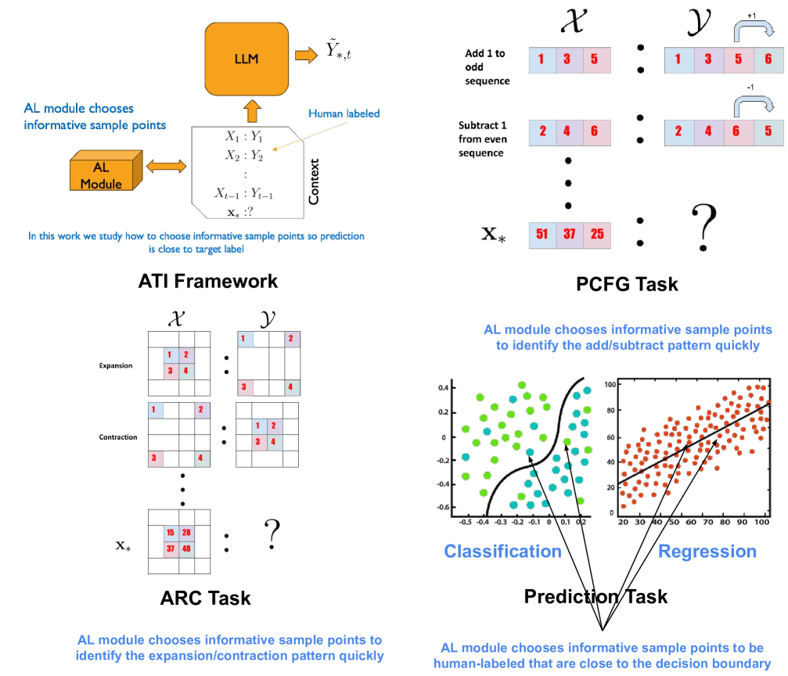

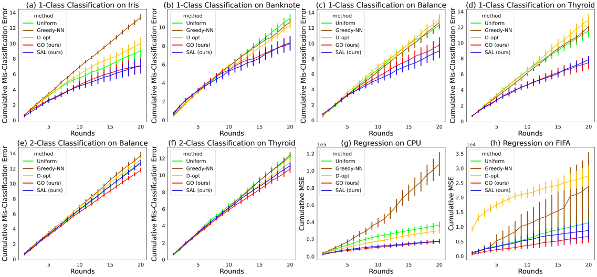

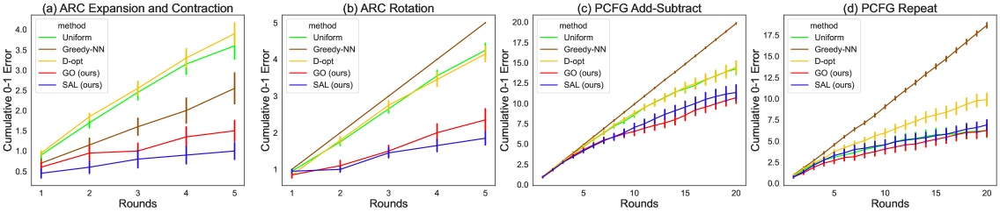

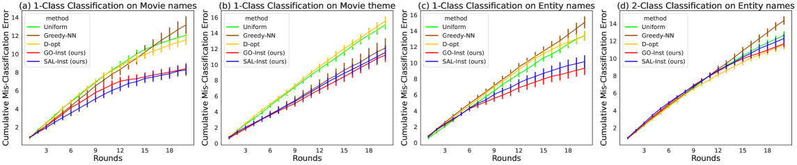

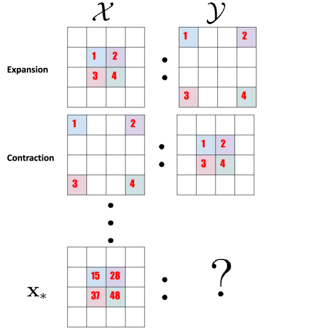

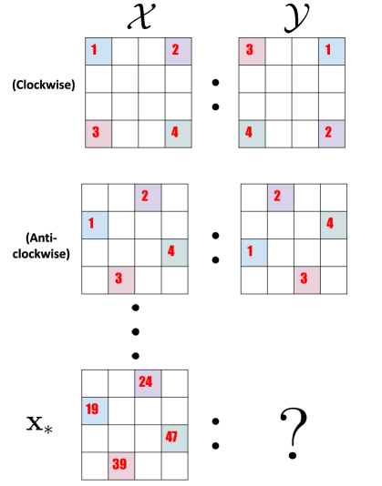

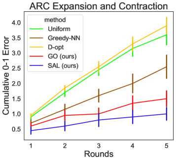

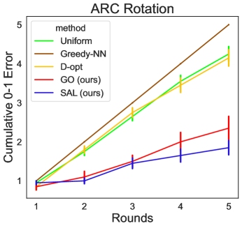

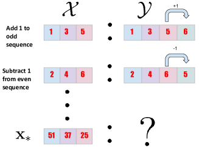

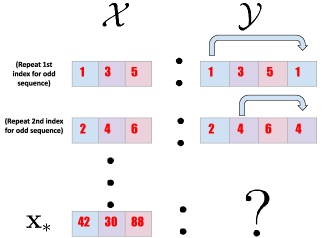

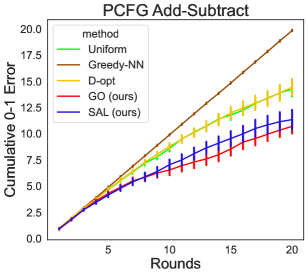

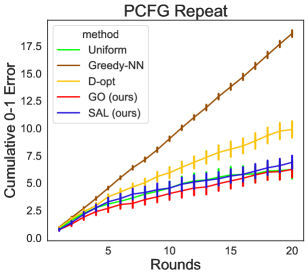

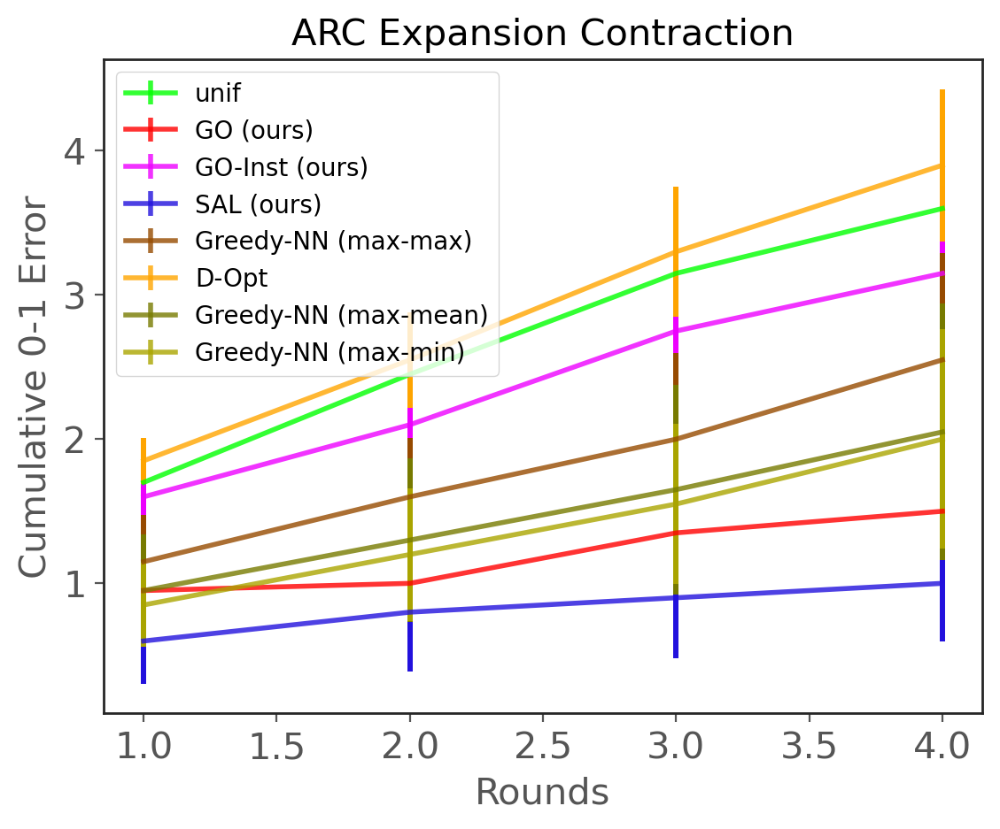

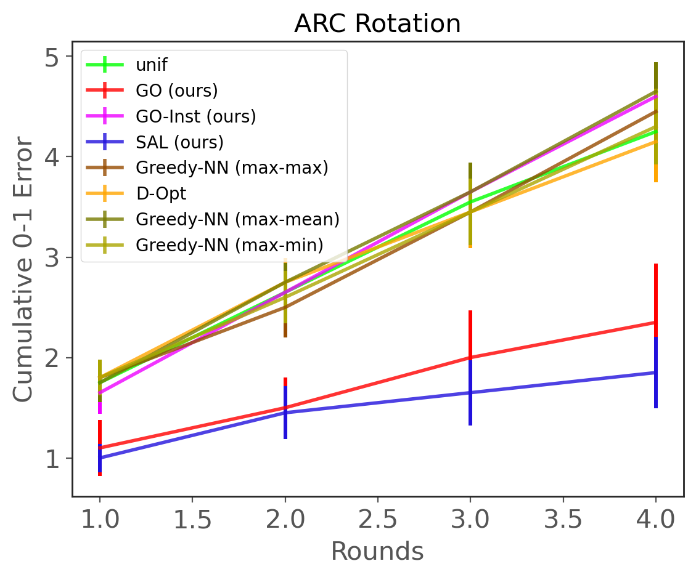

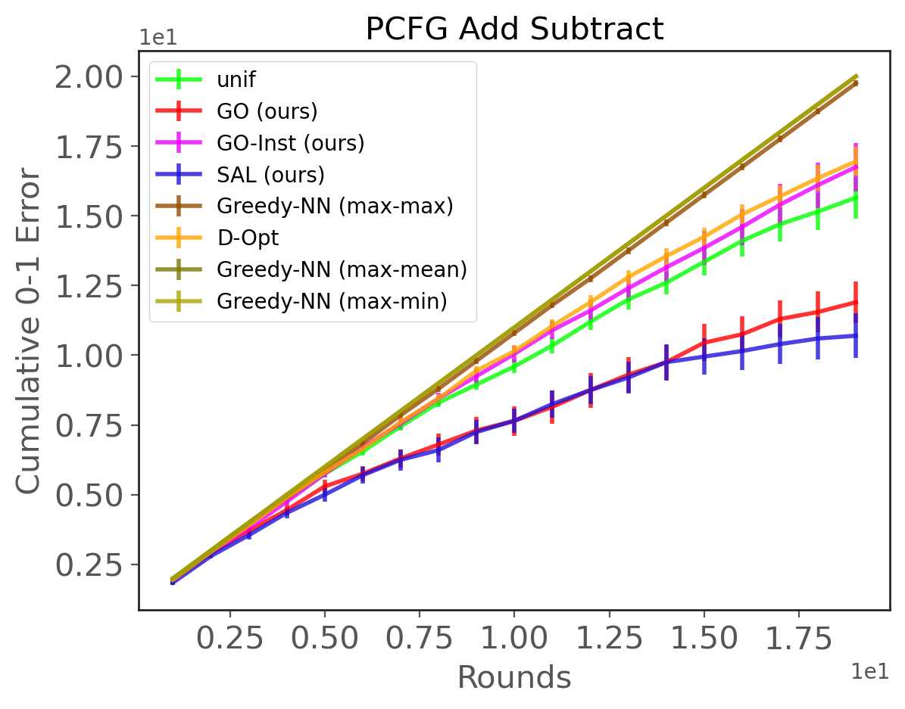

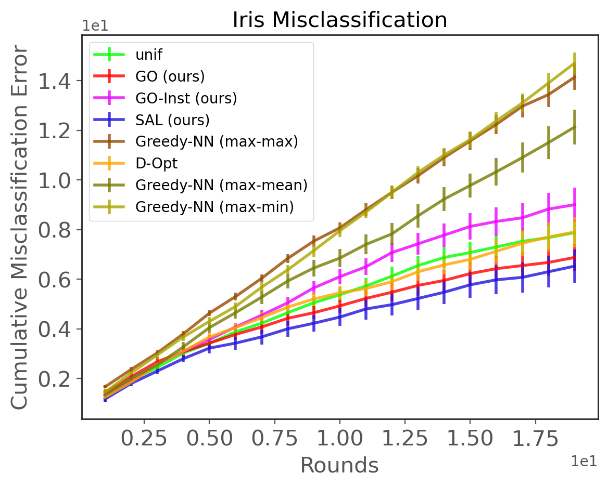

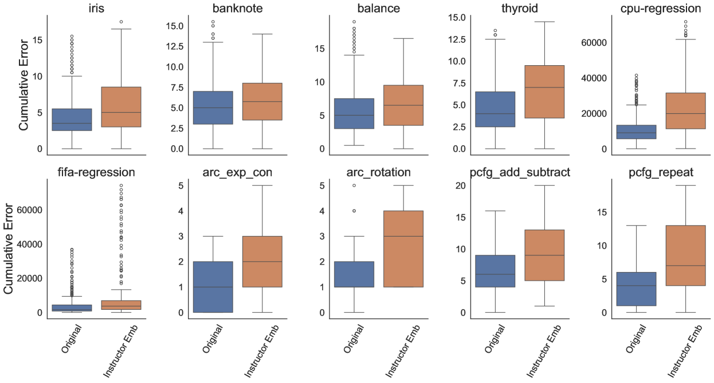

[Arxiv](https://arxiv.org/abs/2404.08846)