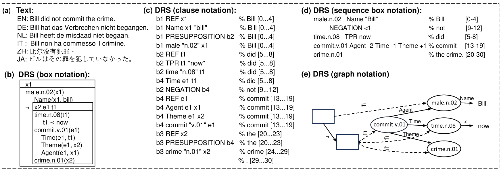
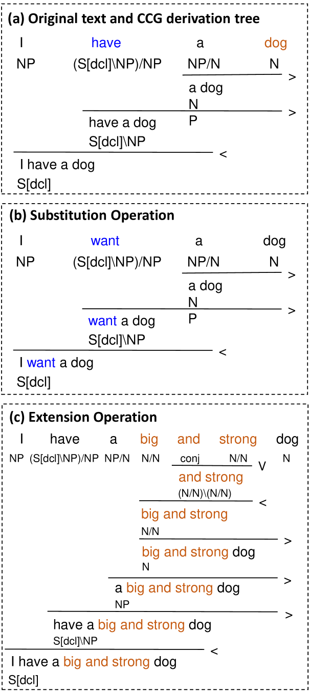
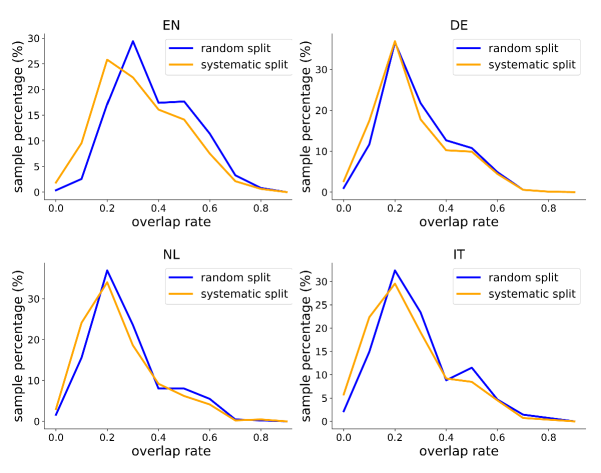
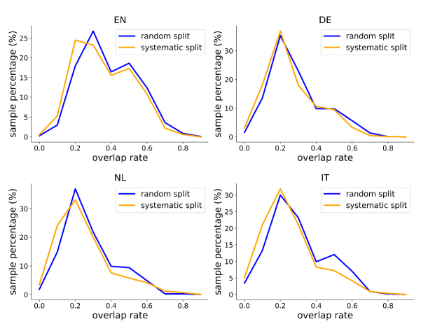

# 借助富有挑战性的基准测试，我们能够更深入地洞察神经网络在语义解析方面的表现。

发布时间：2024年04月12日

`RAG` `语义解析`

> Gaining More Insight into Neural Semantic Parsing with Challenging Benchmarks

# 摘要

> 平行语义库（PMB）致力于提供语义解析和文本生成的语料库。尽管神经网络解析器和生成器在PMB上取得了卓越成绩，我们认为这些语义处理任务远未完全解决。过去的高分成绩往往因为采用了不够严谨的数据划分和过于简单的测试集而被高估。为此，我们提出了一系列改进措施。首先，我们建议采用更为系统化的分割方法替代之前的随机分割，以增强标准测试数据的可信度。其次，除了标准测试集，我们还设计了两个更具挑战性的测试集：一个包含较长文本和话语结构，另一个旨在测试组合泛化能力。我们对五种神经模型进行了语义解析和意义转文本生成的评估。结果显示，在这些挑战集上，模型性能显著下降，有的甚至出现戏剧性变化，这暴露了神经模型在应对这些挑战时的不足之处。

> The Parallel Meaning Bank (PMB) serves as a corpus for semantic processing with a focus on semantic parsing and text generation. Currently, we witness an excellent performance of neural parsers and generators on the PMB. This might suggest that such semantic processing tasks have by and large been solved. We argue that this is not the case and that performance scores from the past on the PMB are inflated by non-optimal data splits and test sets that are too easy. In response, we introduce several changes. First, instead of the prior random split, we propose a more systematic splitting approach to improve the reliability of the standard test data. Second, except for the standard test set, we also propose two challenge sets: one with longer texts including discourse structure, and one that addresses compositional generalization. We evaluate five neural models for semantic parsing and meaning-to-text generation. Our results show that model performance declines (in some cases dramatically) on the challenge sets, revealing the limitations of neural models when confronting such challenges.

[Arxiv](https://arxiv.org/abs/2404.08354)