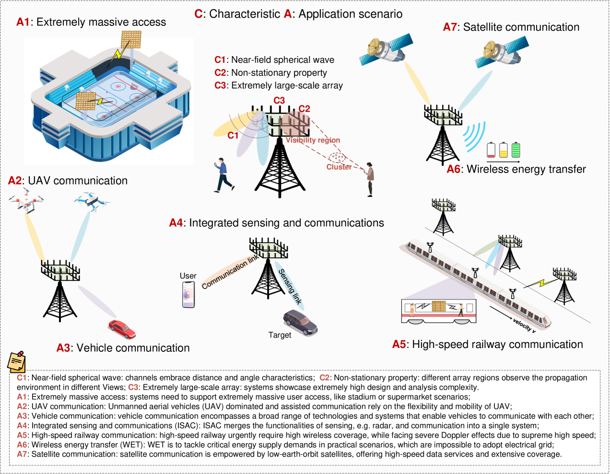
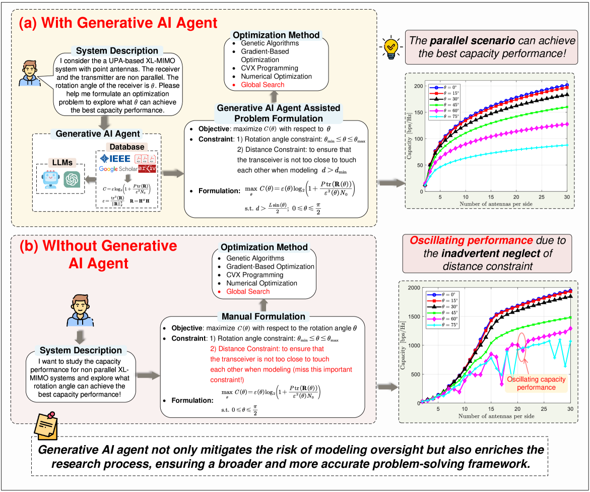
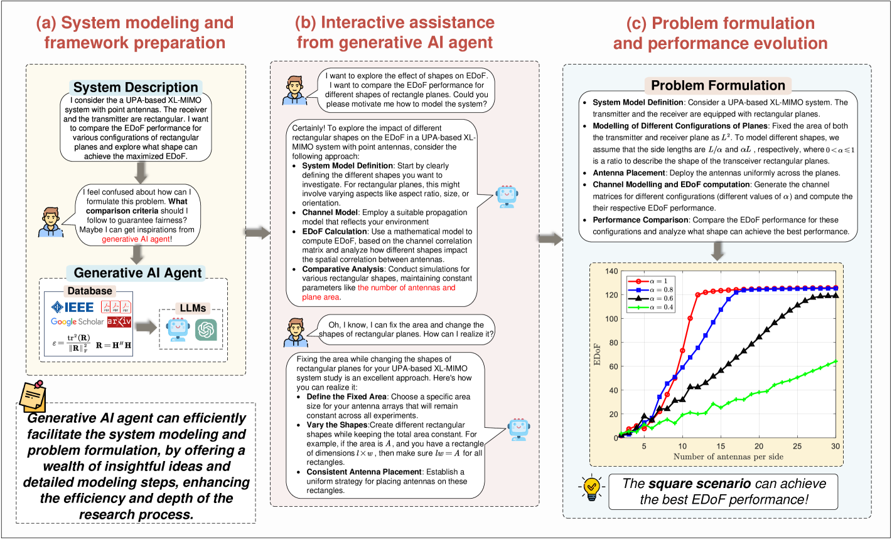

# 为下一代多输入多输出（MIMO）设计而生的创造性人工智能代理：探索其基本原理、面临的挑战以及未来的发展方向。

发布时间：2024年04月12日

`Agent` `人工智能`

> Generative AI Agent for Next-Generation MIMO Design: Fundamentals, Challenges, and Vision

# 摘要

> 预计新一代多输入多输出（MIMO）技术将具备智能化和可扩展性。本文深入探讨了由生成性人工智能（AI）代理驱动的新一代MIMO设计。文章首先回顾了新一代MIMO技术的发展历程、基本原理及其面临的挑战。随后，提出了一种新型的生成性AI代理，该代理结合了大型语言模型（LLM）和检索增强生成（RAG）技术，能够生成定制化和专业化的内容。文章进一步详细阐述了生成性AI代理框架的特性和优势，并针对新一代MIMO技术面临的挑战，从性能分析、信号处理和资源分配等多个维度进行了深入讨论。此外，文中还展示了两个案例研究，证明了在复杂配置环境中，利用生成性AI代理进行性能分析的有效性。这些案例凸显了将生成性AI代理整合进系统，可以显著提升新一代MIMO系统的分析和设计水平。文末，作者提出了未来研究的重要潜在方向。

> Next-generation multiple input multiple output (MIMO) is expected to be intelligent and scalable. In this paper, we study generative artificial intelligence (AI) agent-enabled next-generation MIMO design. Firstly, we provide an overview of the development, fundamentals, and challenges of the next-generation MIMO. Then, we propose the concept of the generative AI agent, which is capable of generating tailored and specialized contents with the aid of large language model (LLM) and retrieval augmented generation (RAG). Next, we comprehensively discuss the features and advantages of the generative AI agent framework. More importantly, to tackle existing challenges of next-generation MIMO, we discuss generative AI agent-enabled next-generation MIMO design, from the perspective of performance analysis, signal processing, and resource allocation. Furthermore, we present two compelling case studies that demonstrate the effectiveness of leveraging the generative AI agent for performance analysis in complex configuration scenarios. These examples highlight how the integration of generative AI agents can significantly enhance the analysis and design of next-generation MIMO systems. Finally, we discuss important potential research future directions.

[Arxiv](https://arxiv.org/abs/2404.08878)