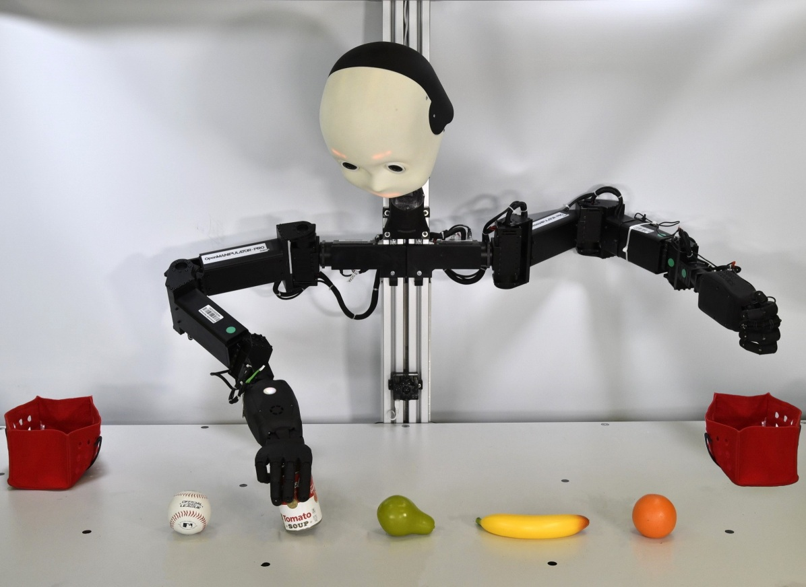
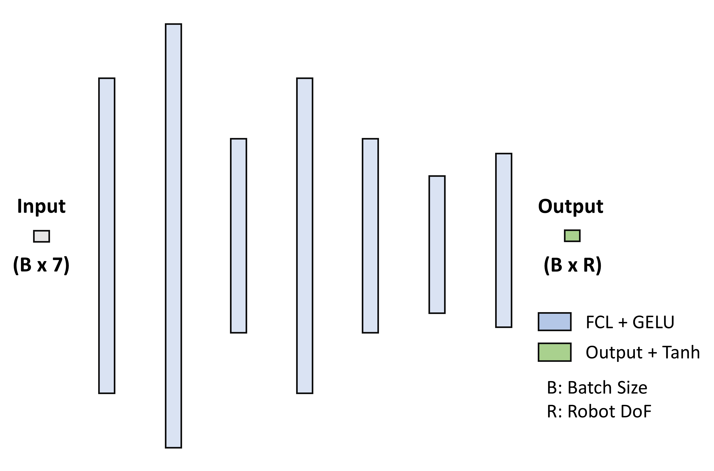
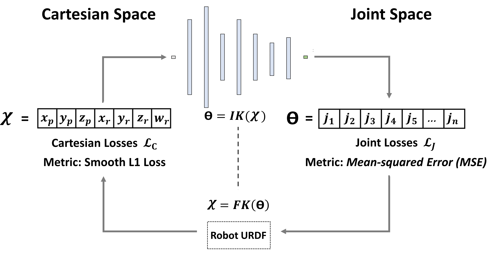
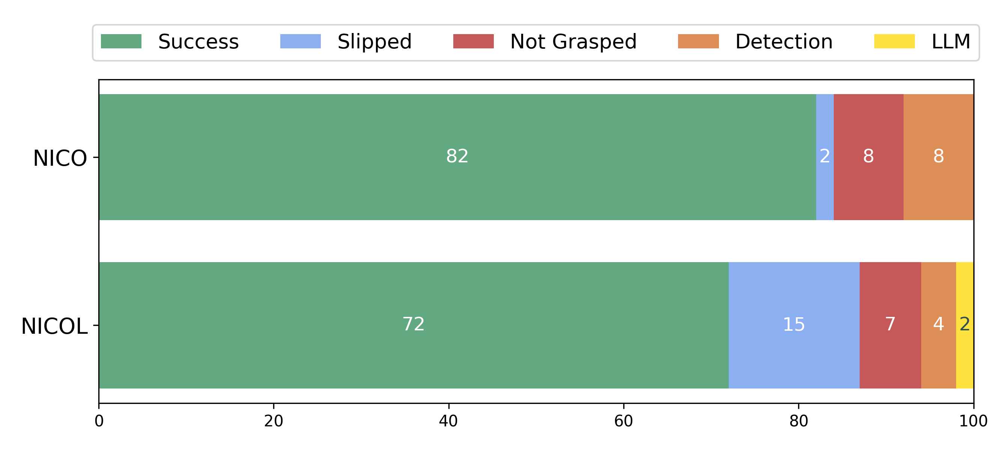

# 逆向运动学在赋予仿人机器人代理以抓取能力方面发挥着关键作用。

发布时间：2024年04月12日

`Agent` `机器人技术` `运动规划`

> Inverse Kinematics for Neuro-Robotic Grasping with Humanoid Embodied Agents

# 摘要

> 本研究提出了一种创新的零样本运动规划技术，使用户能够迅速在笛卡尔空间规划出流畅的机器人动作。该技术采用基于贝塞尔曲线的笛卡尔规划，并通过我们开发的神经网络启发式逆运动学（IK）算法 CycleIK 转换为关节空间路径，实现了对不同机器人设计的广泛适用性。我们在两个人形机器人 NICO 和 NICOL 上进行了实体硬件测试，模拟了人在环的抓取场景。所提出的运动规划系统以一个大型语言模型（LLM）作为核心，部署在一个具身代理中。我们进一步将原本为 NICOL 设计的具身代理扩展到 NICO。该代理能够执行一系列离散的物理动作，并且用户可以通过语音指令控制多种不同的机器人。我们还为其动作库新增了一个抓取原语，用于精细操控家用物品。在模拟环境中，CycleIK 与传统的数值 IK 解算器和先进的神经 IK 方法进行了比较，在算法运行时间极短的情况下，展现出了竞争力或更佳的性能。此外，我们在 NICOL 和 NICO 机器人上对抓取原语进行了测试，结果显示抓取成功率分别为 72% 和 82%。

> This paper introduces a novel zero-shot motion planning method that allows users to quickly design smooth robot motions in Cartesian space. A Bézier curve-based Cartesian plan is transformed into a joint space trajectory by our neuro-inspired inverse kinematics (IK) method CycleIK, for which we enable platform independence by scaling it to arbitrary robot designs. The motion planner is evaluated on the physical hardware of the two humanoid robots NICO and NICOL in a human-in-the-loop grasping scenario. Our method is deployed with an embodied agent that is a large language model (LLM) at its core. We generalize the embodied agent, that was introduced for NICOL, to also be embodied by NICO. The agent can execute a discrete set of physical actions and allows the user to verbally instruct various different robots. We contribute a grasping primitive to its action space that allows for precise manipulation of household objects. The new CycleIK method is compared to popular numerical IK solvers and state-of-the-art neural IK methods in simulation and is shown to be competitive with or outperform all evaluated methods when the algorithm runtime is very short. The grasping primitive is evaluated on both NICOL and NICO robots with a reported grasp success of 72% to 82% for each robot, respectively.

[Arxiv](https://arxiv.org/abs/2404.08825)