# GPT仅凭下一个词的预测是否足够？探究其在代码逻辑理解方面的表现

发布时间：2024年04月12日

`LLM理论` `代码分析` `人工智能编程`

> Is Next Token Prediction Sufficient for GPT? Exploration on Code Logic Comprehension

# 摘要

> 大型语言模型（LLMs）的发展迅猛，其在众多任务上的表现令人瞩目。然而，现有研究多聚焦于扩充预训练数据的体量与品质，仍旧采用自回归变换模型的下一个标记预测任务。这一方法对于模型深入理解代码逻辑的真实效果尚存疑，我们认为模型仍旧将代码视作普通文本，而忽略了人类所重视的逻辑内涵。为了验证这一点，我们推出了一项新任务——“逻辑等价代码选择”，要求参与者从一系列候选代码中挑选出与给定代码逻辑上等价的代码。实验结果显示，现有的LLMs在这项任务上表现欠佳，因为它们仅通过关键词的无序集合来理解代码。为了改善它们的性能，我们提出了一种改进的预训练任务——“下一个标记预测+”，旨在调整LLM的句子嵌入分布，同时保持其生成能力不受影响。实验结果表明，经过这一预训练，Code Llama和StarCoder这两个广泛使用的代码预训练模型，在逻辑等价代码选择任务和代码补全任务上均有显著提升。

> Large language models (LLMs) has experienced exponential growth, they demonstrate remarkable performance across various tasks. Notwithstanding, contemporary research primarily centers on enhancing the size and quality of pretraining data, still utilizing the next token prediction task on autoregressive transformer model structure. The efficacy of this task in truly facilitating the model's comprehension of code logic remains questionable, we speculate that it still interprets code as mere text, while human emphasizes the underlying logical knowledge. In order to prove it, we introduce a new task, "Logically Equivalent Code Selection," which necessitates the selection of logically equivalent code from a candidate set, given a query code. Our experimental findings indicate that current LLMs underperform in this task, since they understand code by unordered bag of keywords. To ameliorate their performance, we propose an advanced pretraining task, "Next Token Prediction+". This task aims to modify the sentence embedding distribution of the LLM without sacrificing its generative capabilities. Our experimental results reveal that following this pretraining, both Code Llama and StarCoder, the prevalent code domain pretraining models, display significant improvements on our logically equivalent code selection task and the code completion task.

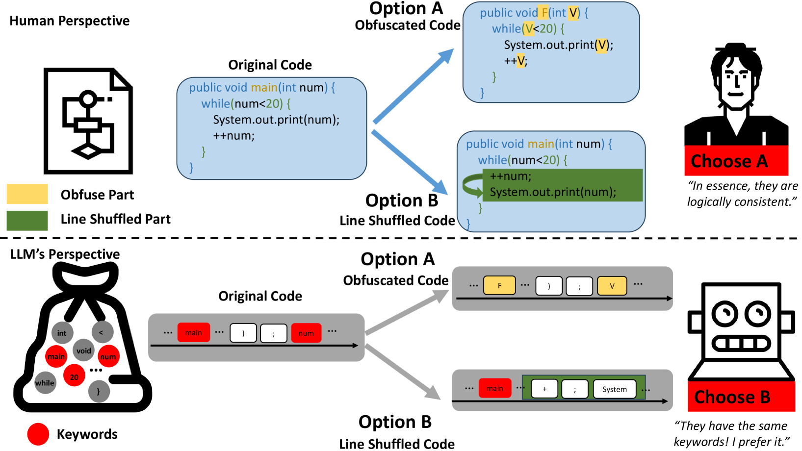

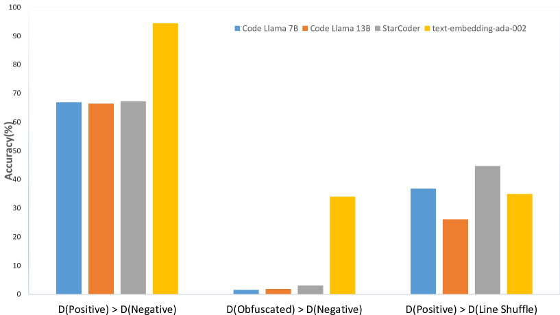

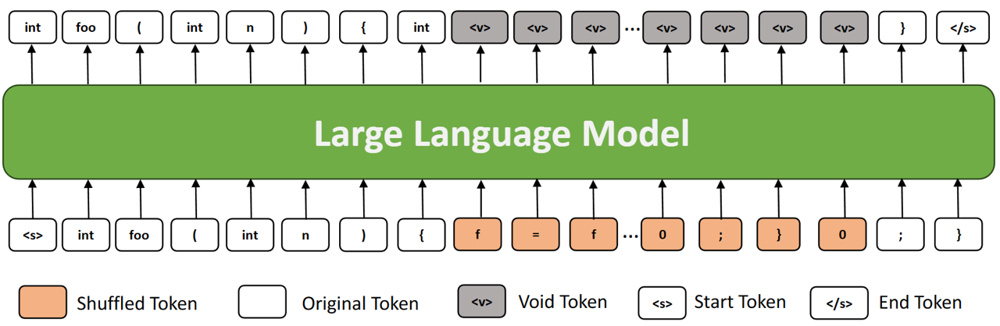

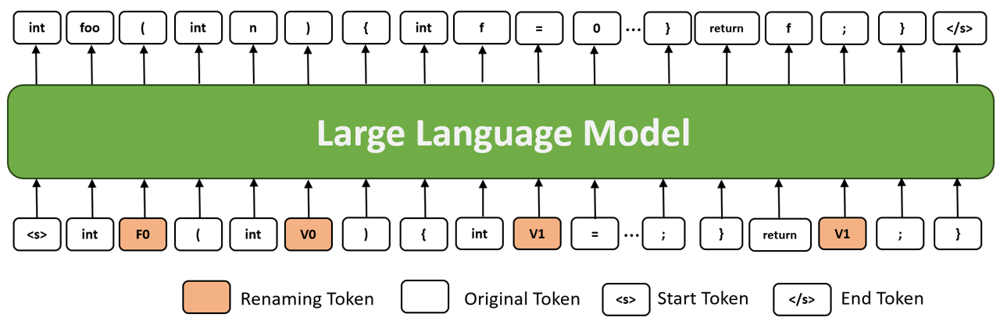

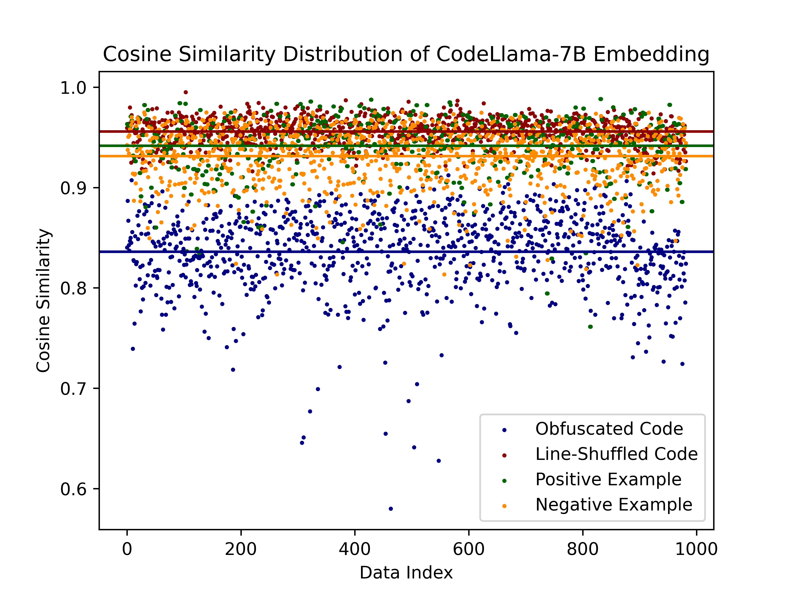

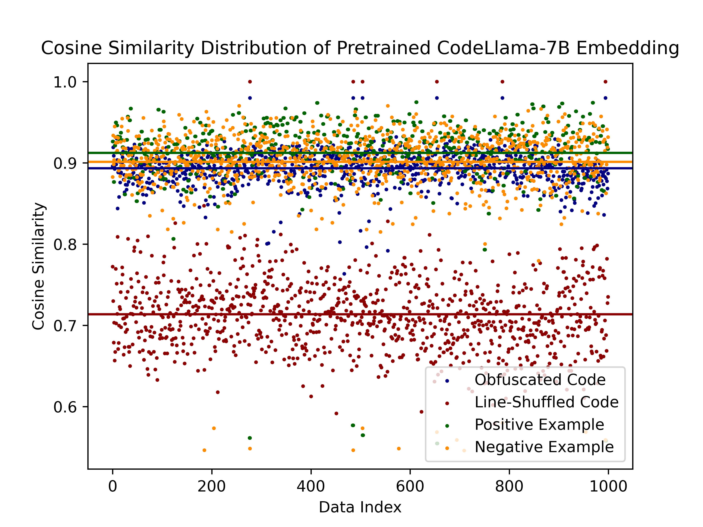

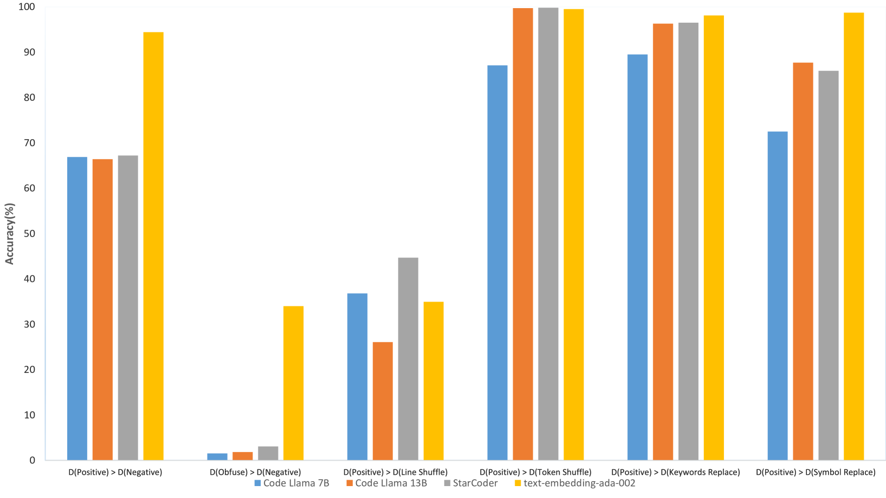

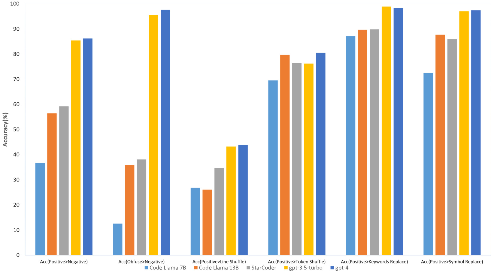

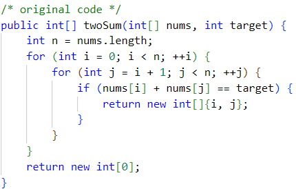

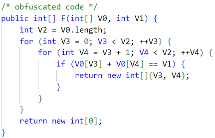

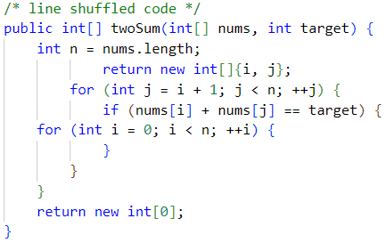

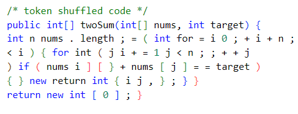

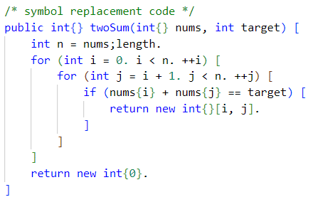

[Arxiv](https://arxiv.org/abs/2404.08885)