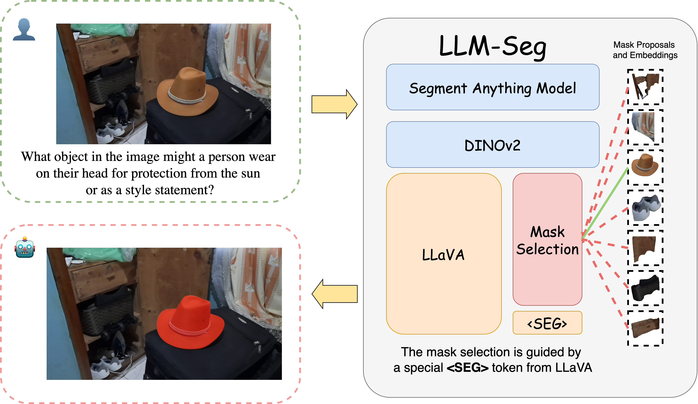
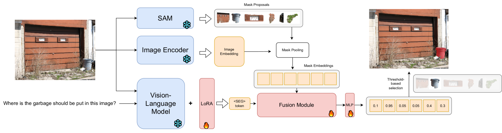
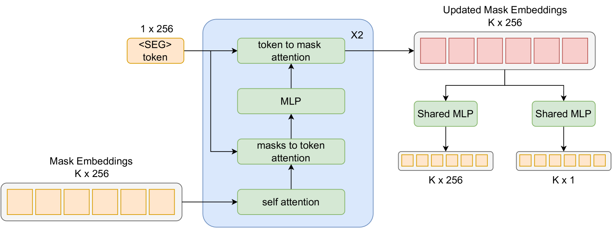
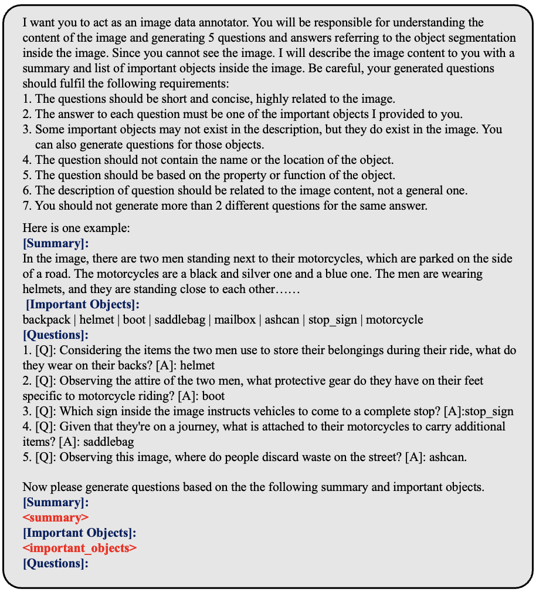
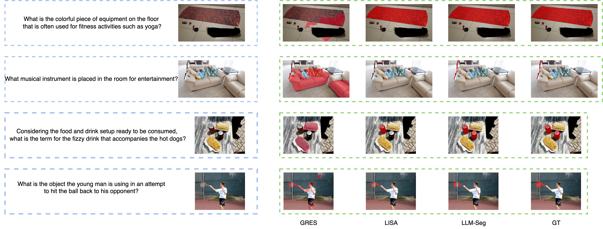

# LLM-Seg：融合图像分割与大型语言模型的推理能力

发布时间：2024年04月12日

`LLM应用` `计算机视觉` `自动驾驶`

> LLM-Seg: Bridging Image Segmentation and Large Language Model Reasoning

# 摘要

> 识别目标对象的人类指令对于感知系统极为关键。随着大型语言模型（LLMs）的飞速发展，图像分割领域迎来了创新机遇。本研究探索了推理分割任务，这是一种创新方法，它赋予分割系统通过LLM的推理能力来解读用户的隐含意图，并精确分割目标对象。我们在推理分割的理论与实践上均取得突破，提出了LLM-Seg框架，它巧妙地将现有的分割模型与LLM结合起来，通过选择性的遮罩提案实现有效连接。此外，我们还设计了一条自动化数据生成流水线，并创建了名为LLM-Seg40K的全新推理分割数据集。实验结果显示，LLM-Seg在性能上与当前主流方法不相上下。这条流水线还能高效地产出优质的数据集。LLM-Seg40K作为新兴的基准数据集，为推理分割技术的培训和评估提供了新的平台。相关代码、模型及数据集已在 https://github.com/wangjunchi/LLMSeg 上公布。

> Understanding human instructions to identify the target objects is vital for perception systems. In recent years, the advancements of Large Language Models (LLMs) have introduced new possibilities for image segmentation. In this work, we delve into reasoning segmentation, a novel task that enables segmentation system to reason and interpret implicit user intention via large language model reasoning and then segment the corresponding target. Our work on reasoning segmentation contributes on both the methodological design and dataset labeling. For the model, we propose a new framework named LLM-Seg. LLM-Seg effectively connects the current foundational Segmentation Anything Model and the LLM by mask proposals selection. For the dataset, we propose an automatic data generation pipeline and construct a new reasoning segmentation dataset named LLM-Seg40K. Experiments demonstrate that our LLM-Seg exhibits competitive performance compared with existing methods. Furthermore, our proposed pipeline can efficiently produce high-quality reasoning segmentation datasets. The LLM-Seg40K dataset, developed through this pipeline, serves as a new benchmark for training and evaluating various reasoning segmentation approaches. Our code, models and dataset are at https://github.com/wangjunchi/LLMSeg.

[Arxiv](https://arxiv.org/abs/2404.08767)