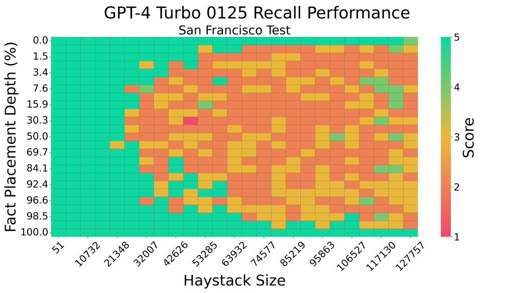
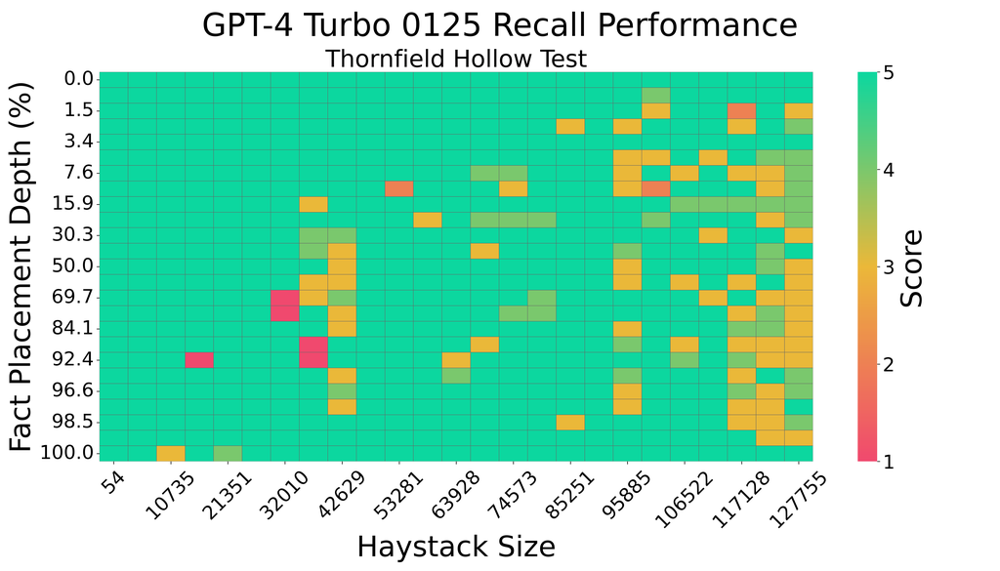
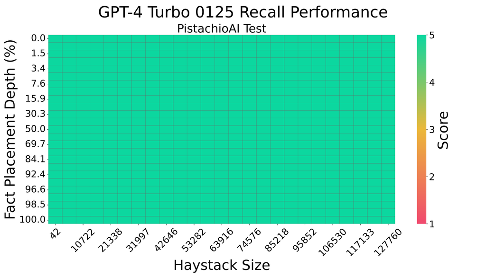
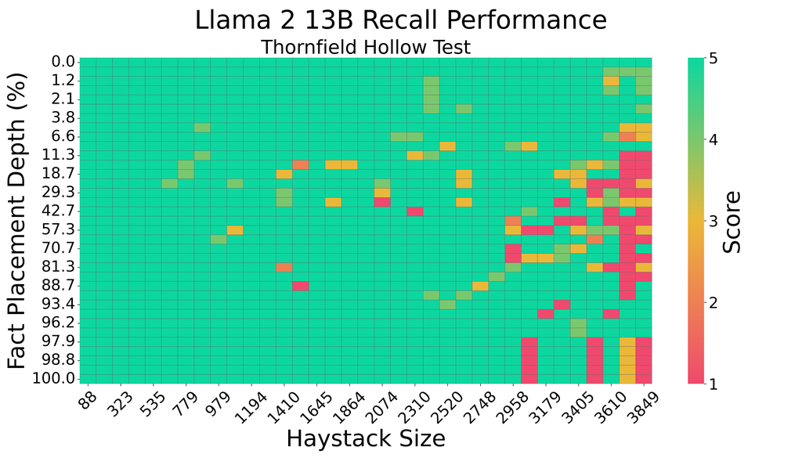
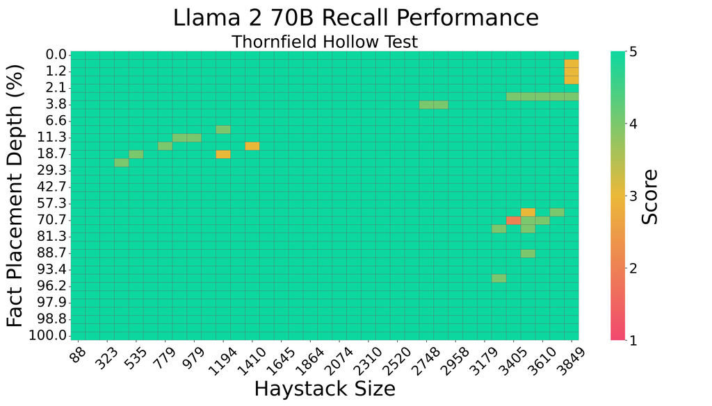
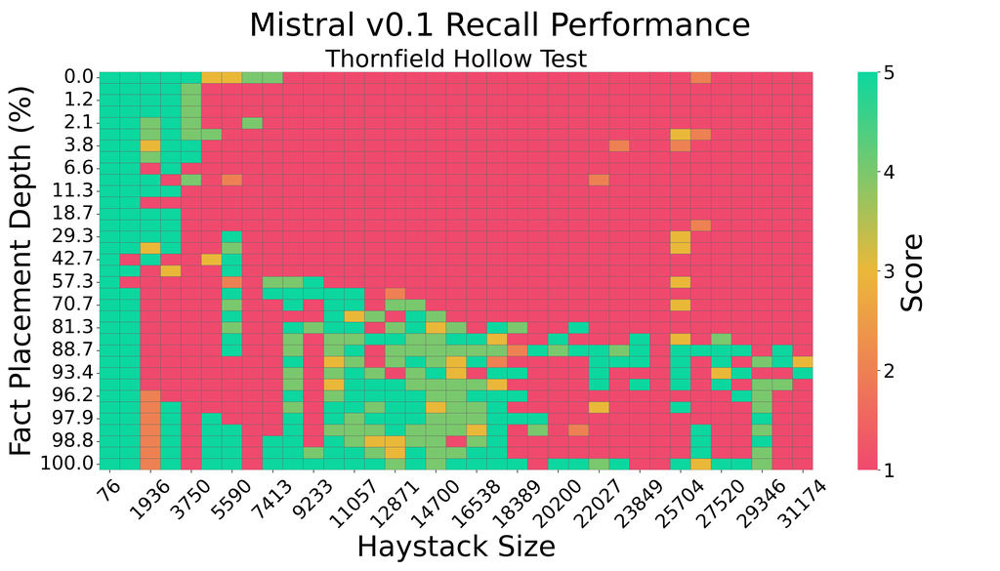
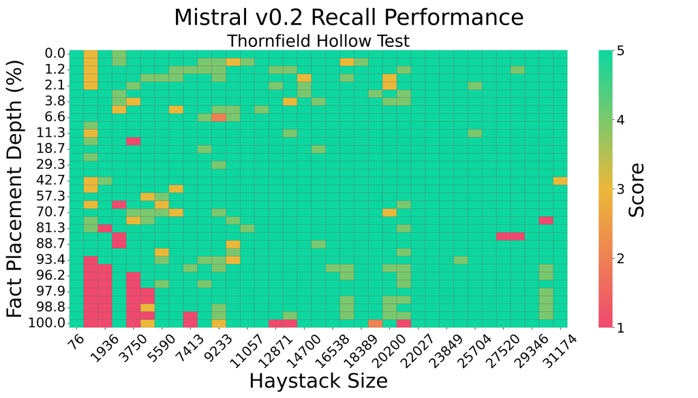
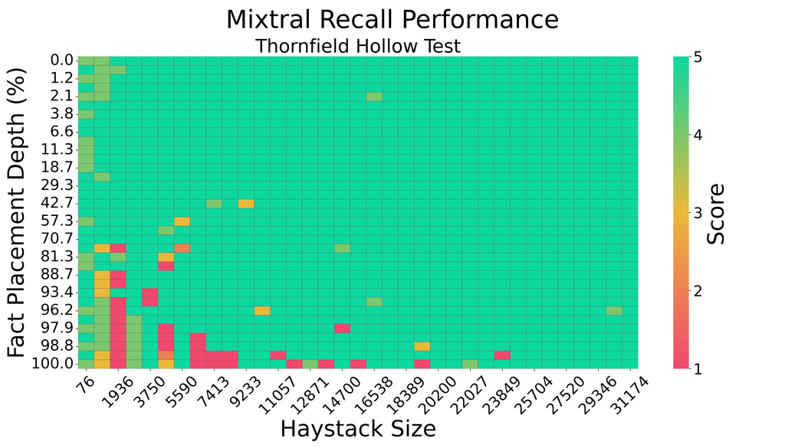

# 在大型语言模型中，上下文记忆的召回效果与提示密切相关。

发布时间：2024年04月12日

`LLM理论` `语言模型` `评估方法`

> LLM In-Context Recall is Prompt Dependent

# 摘要

> 随着大型语言模型（LLMs）的兴起，深入评估它们的优势、局限和适用场景变得尤为关键。关键在于检验它们精确提取特定提示信息的能力，因为这直接影响了模型在实际应用中的有效性和可信度。本研究采用大海捞针法，对不同LLM的上下文记忆表现进行了分析。所谓大海捞针，即将一条信息（“针”）隐藏在一段文字（“干草堆”）中，让模型尝试找出。我们通过改变干草堆的长度和针的位置，评估了各模型的回忆表现，揭示了它们的表现规律。研究发现，LLM的记忆能力不仅受提示内容的影响，还可能受到训练数据偏见的干扰。然而，通过调整模型结构、训练方法或进行微调，可以提升其表现。这一分析为我们提供了对LLM行为的深刻理解，并指引我们更有效地开发LLM应用。

> The proliferation of Large Language Models (LLMs) highlights the critical importance of conducting thorough evaluations to discern their comparative advantages, limitations, and optimal use cases. Particularly important is assessing their capacity to accurately retrieve information included in a given prompt. A model's ability to do this significantly influences how effectively it can utilize contextual details, thus impacting its practical efficacy and dependability in real-world applications.
  Our research analyzes the in-context recall performance of various LLMs using the needle-in-a-haystack method. In this approach, a factoid (the "needle") is embedded within a block of filler text (the "haystack"), which the model is asked to retrieve. We assess the recall performance of each model across various haystack lengths and with varying needle placements to identify performance patterns. This study demonstrates that an LLM's recall capability is not only contingent upon the prompt's content but also may be compromised by biases in its training data. Conversely, adjustments to model architecture, training strategy, or fine-tuning can improve performance. Our analysis provides insight into LLM behavior, offering direction for the development of more effective applications of LLMs.

[Arxiv](https://arxiv.org/abs/2404.08865)