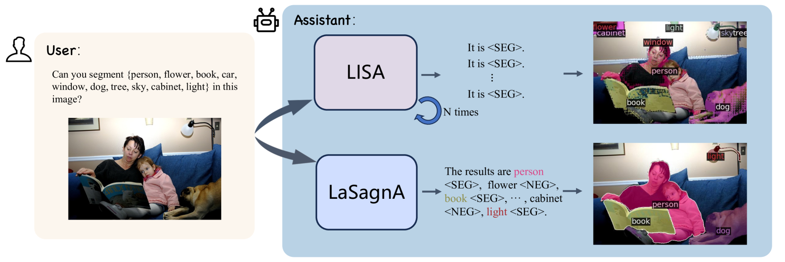
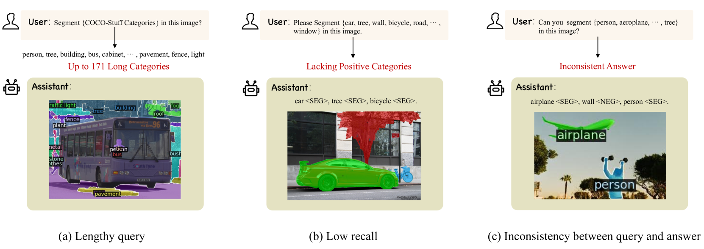
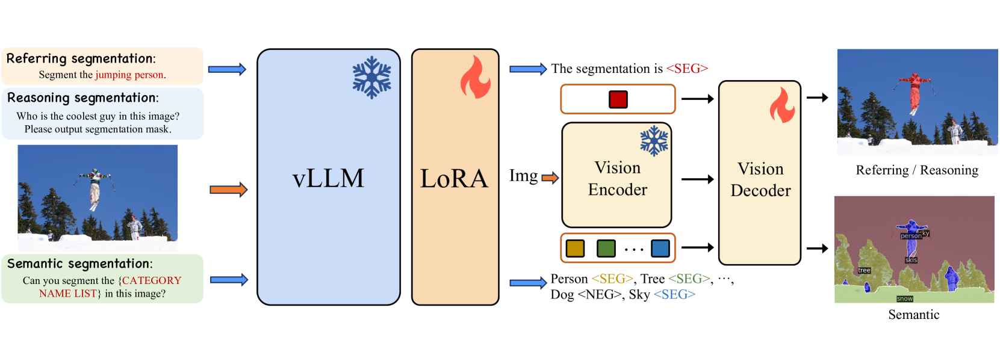
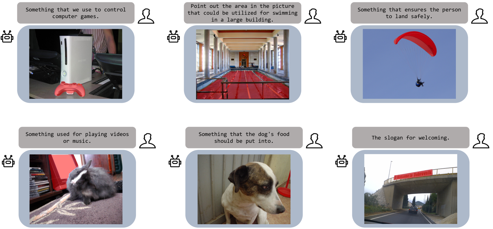

# LaSagnA：复杂查询的语言分割助理

发布时间：2024年04月12日

`RAG` `计算机视觉` `语义分割`

> LaSagnA: Language-based Segmentation Assistant for Complex Queries

# 摘要

> 近期技术的发展让大型视觉语言模型（vLLMs）能够生成精细的感知结果，例如边界框和遮罩。尽管如此，它们在处理每个查询中的多个目标和识别图像中缺失的查询对象时仍显不足。本研究指出，这些问题的根本原因在于训练查询的复杂性不够。为此，我们确立了一套复杂的查询序列格式，并在现有流程中加入了语义分割任务，以满足训练数据的需求。我们还提出了三种创新策略，有效应对直接整合新格式所带来的挑战。在封闭集和开放集语义分割数据集上，我们的模型展现出与传统方法相媲美的处理复杂查询的能力。此外，我们在推理和引用分割方面超越了众多vLLMs，证明了我们模型的卓越性能。代码已在 https://github.com/congvvc/LaSagnA 上发布。

> Recent advancements have empowered Large Language Models for Vision (vLLMs) to generate detailed perceptual outcomes, including bounding boxes and masks. Nonetheless, there are two constraints that restrict the further application of these vLLMs: the incapability of handling multiple targets per query and the failure to identify the absence of query objects in the image. In this study, we acknowledge that the main cause of these problems is the insufficient complexity of training queries. Consequently, we define the general sequence format for complex queries. Then we incorporate a semantic segmentation task in the current pipeline to fulfill the requirements of training data. Furthermore, we present three novel strategies to effectively handle the challenges arising from the direct integration of the proposed format. The effectiveness of our model in processing complex queries is validated by the comparable results with conventional methods on both close-set and open-set semantic segmentation datasets. Additionally, we outperform a series of vLLMs in reasoning and referring segmentation, showcasing our model's remarkable capabilities. We release the code at https://github.com/congvvc/LaSagnA.

[Arxiv](https://arxiv.org/abs/2404.08506)