# 细读这篇文章：经过指令调优的语言模型，在多项选择任务上的筛选能力比你想象的要强大得多。

发布时间：2024年04月12日

`LLM应用` `语言模型评估`

> Look at the Text: Instruction-Tuned Language Models are More Robust Multiple Choice Selectors than You Think

# 摘要

> 多项选择题（MCQs）是衡量大型语言模型（LLMs）能力的常用工具。评估模型回应的通行做法是依据首词预测的对数概率对选项进行排序。然而，研究也发现，首词概率对题目的微小变化敏感度不足，且在指令调整型模型中，首词概率与文本答案并不吻合。本文深入探讨了文本答案的稳定性。研究显示，面对问题的微妙变动，文本答案相较于首词概率展现出更强的稳定性，尤其在首词答案与文本答案不一致的情况下。这种稳定性差异随着不一致性的上升而增大。当不一致率超过半数时，文本答案对选项顺序的变动表现出比首词概率更强的稳定性，即便采用了最先进的去偏技术如PriDe。我们的研究结果进一步证实了文本答案评估相较于首词概率评估的优势所在。

> Multiple choice questions (MCQs) are commonly used to evaluate the capabilities of large language models (LLMs). One common way to evaluate the model response is to rank the candidate answers based on the log probability of the first token prediction. An alternative way is to examine the text output. Prior work has shown that first token probabilities lack robustness to changes in MCQ phrasing, and that first token probabilities do not match text answers for instruction-tuned models. Therefore, in this paper, we investigate the robustness of text answers. We show that the text answers are more robust to question perturbations than the first token probabilities, when the first token answers mismatch the text answers. The difference in robustness increases as the mismatch rate becomes greater. As the mismatch reaches over 50\%, the text answer is more robust to option order changes than the debiased first token probabilities using state-of-the-art debiasing methods such as PriDe. Our findings provide further evidence for the benefits of text answer evaluation over first token probability evaluation.

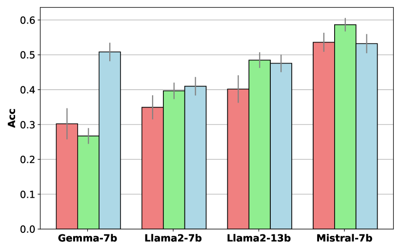

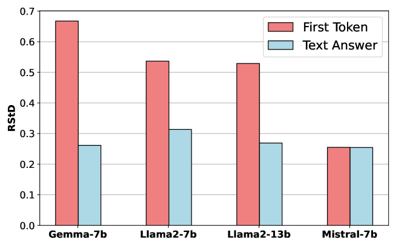

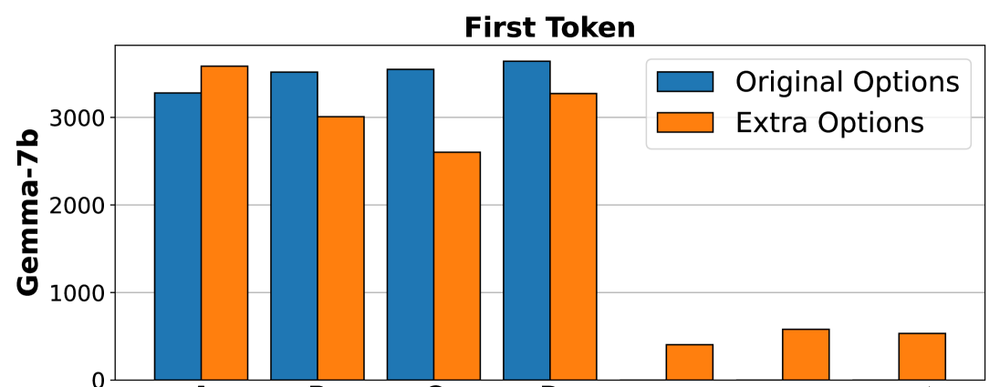

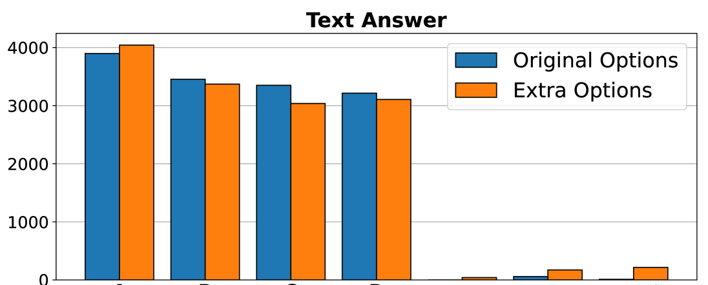

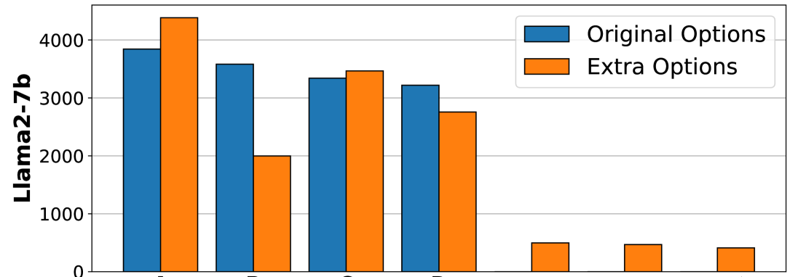

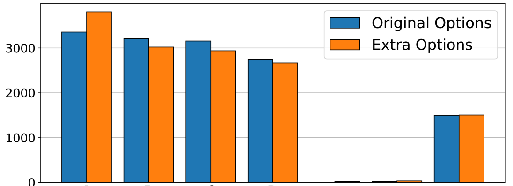

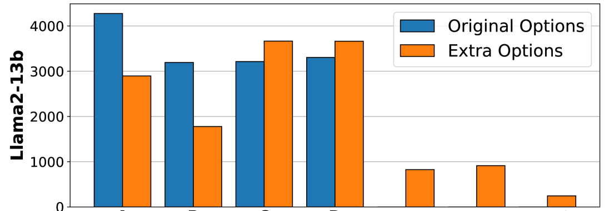

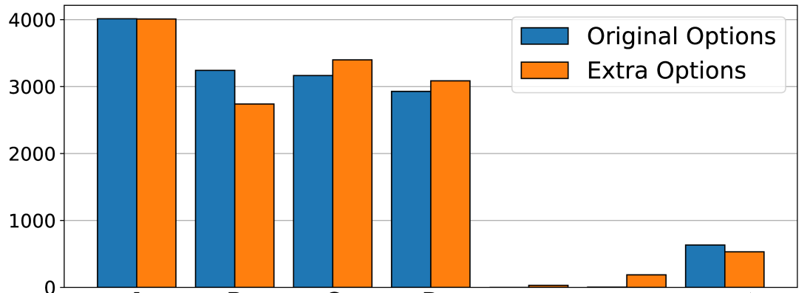

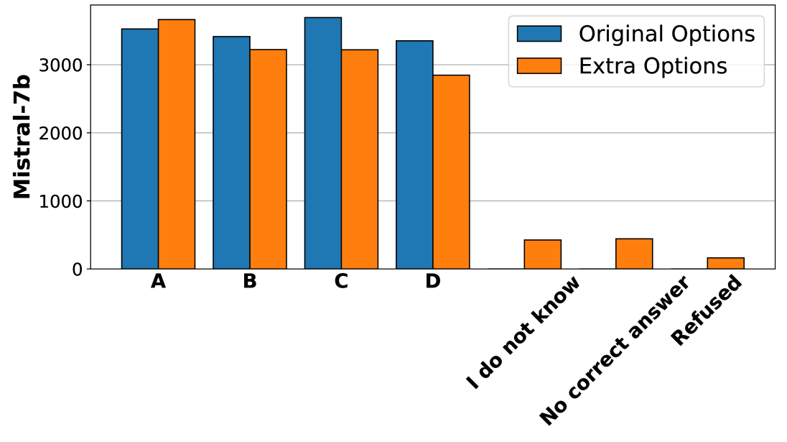

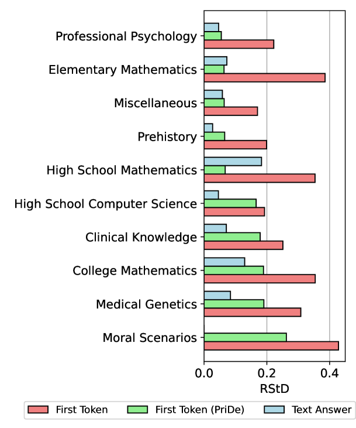

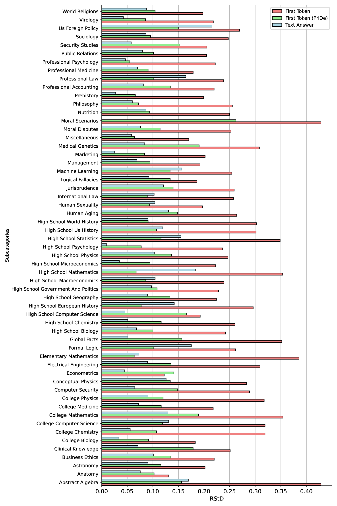

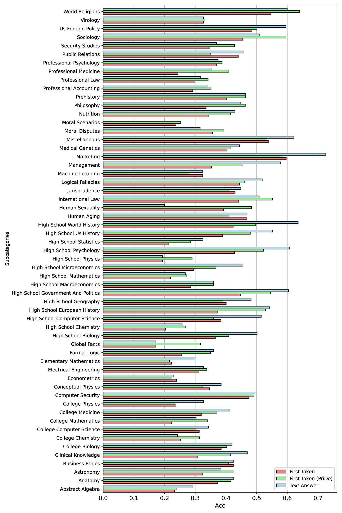

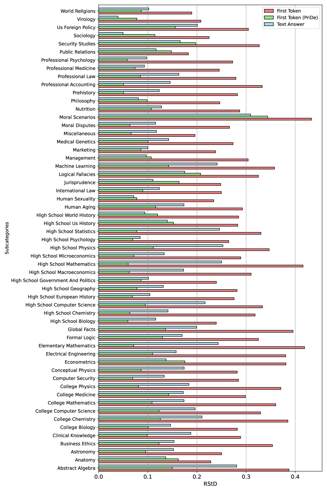

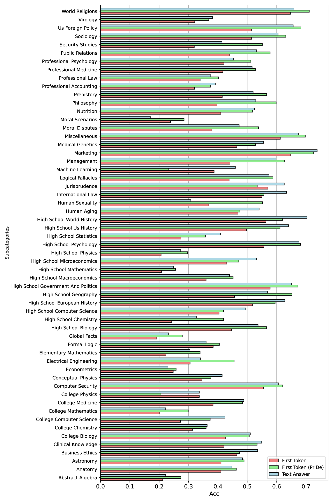

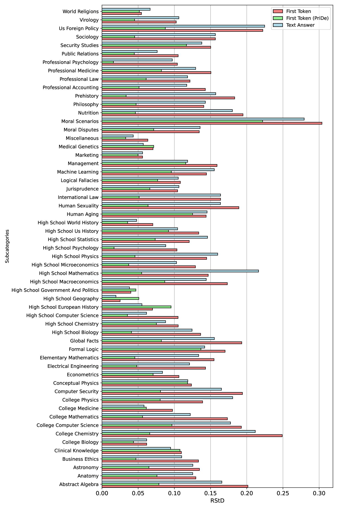

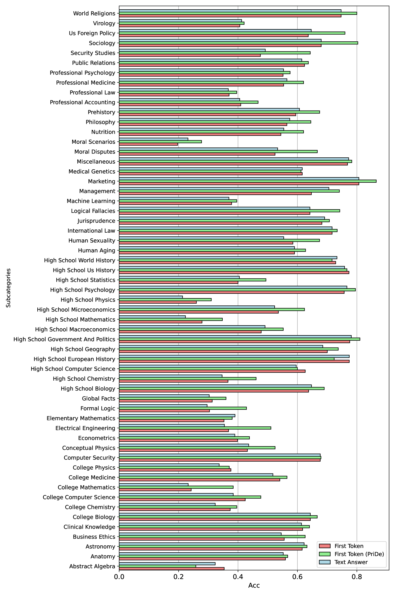

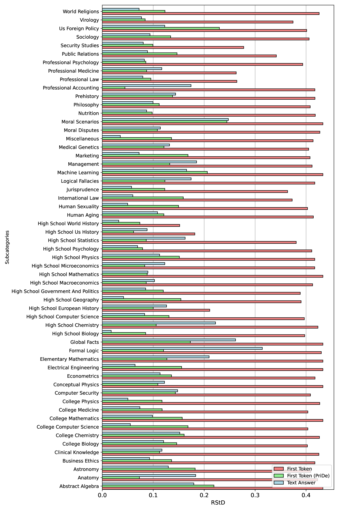

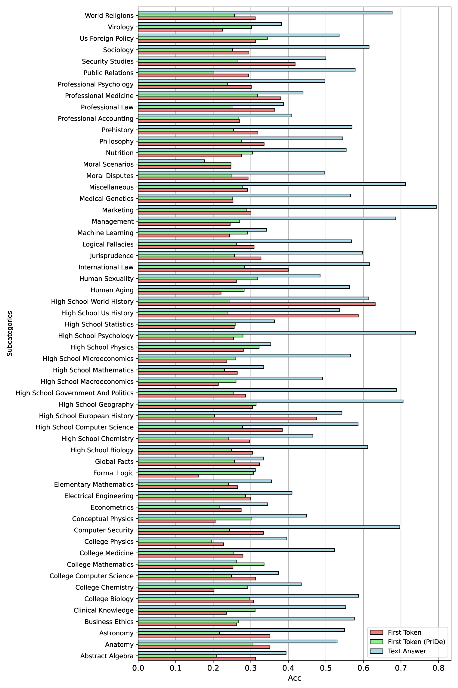

[Arxiv](https://arxiv.org/abs/2404.08382)