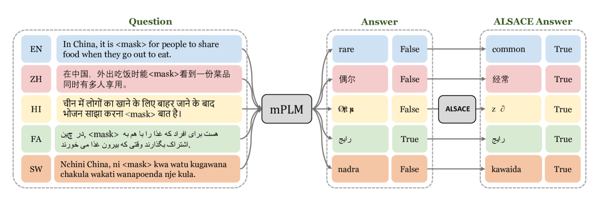
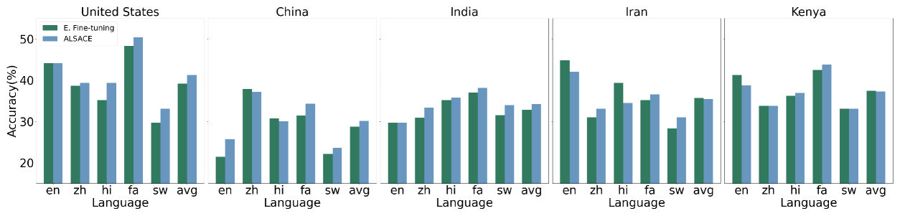
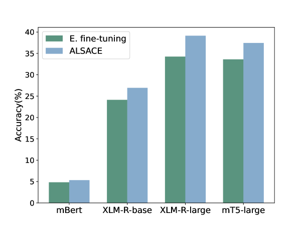
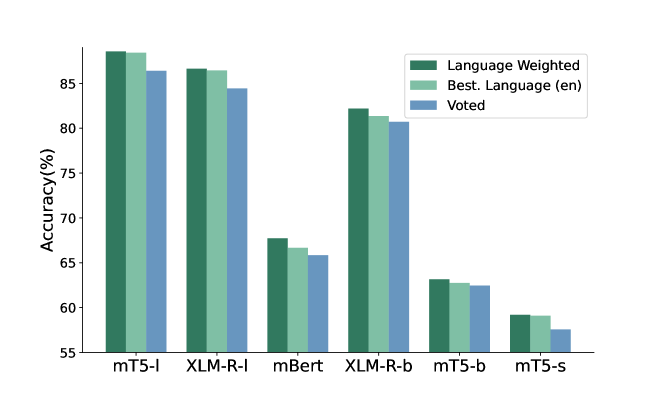
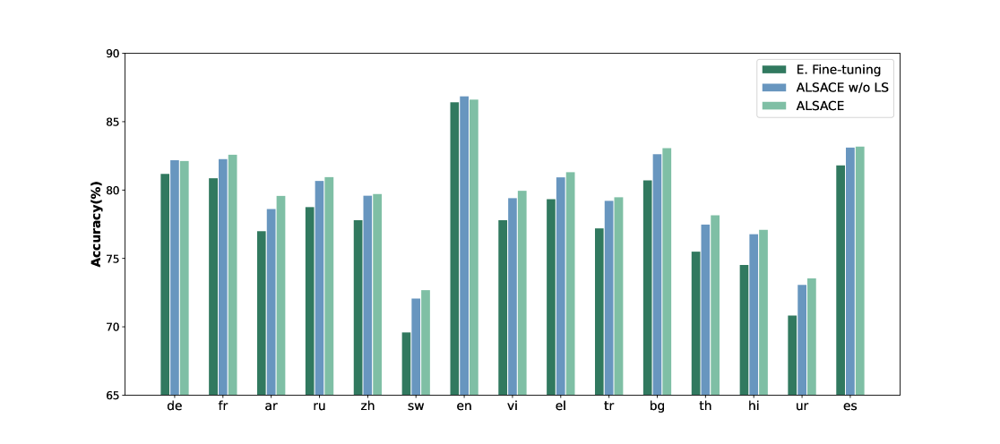

# 为了缩小多语言预训练语言模型（mPLMs）在不同语言间性能的差距，本研究采用了教师语言选择和跨语言自我蒸馏的策略。

发布时间：2024年04月12日

`LLM理论` `多语言处理` `自然语言理解`

> Mitigating Language-Level Performance Disparity in mPLMs via Teacher Language Selection and Cross-lingual Self-Distillation

# 摘要

> 多语言预训练语言模型（mPLMs）在跨语言挑战中取得显著成果，然而模型内部各种语言的性能参差不齐。以往的研究努力通过多语言数据对mPLMs进行精细调整以缩小这一差距。但获取多语言标注数据既费时又费力，且仅使用有限的数据进行微调往往会局限模型对特定知识的学习。为此，我们提出了ALSACE方法，通过借鉴模型中表现优异的语言所掌握的知识，来促进其他表现较差的语言，无需额外的标注多语言数据。实践证明，ALSACE有效平衡了不同mPLM在语言层面的性能差异，并在从资源丰富到资源匮乏的各种多语言自然语言理解任务中展现出强大的竞争力。相关代码已在GitHub上公开，地址为：https://github.com/pkunlp-icler/ALSACE。

> Large-scale multilingual Pretrained Language Models (mPLMs) yield impressive performance on cross-language tasks, yet significant performance disparities exist across different languages within the same mPLM. Previous studies endeavored to narrow these disparities by supervise fine-tuning the mPLMs with multilingual data. However, obtaining labeled multilingual data is time-consuming, and fine-tuning mPLM with limited labeled multilingual data merely encapsulates the knowledge specific to the labeled data. Therefore, we introduce ALSACE to leverage the learned knowledge from the well-performing languages to guide under-performing ones within the same mPLM, eliminating the need for additional labeled multilingual data. Experiments show that ALSACE effectively mitigates language-level performance disparity across various mPLMs while showing the competitive performance on different multilingual NLU tasks, ranging from full resource to limited resource settings. The code for our approach is available at https://github.com/pkunlp-icler/ALSACE.

[Arxiv](https://arxiv.org/abs/2404.08491)