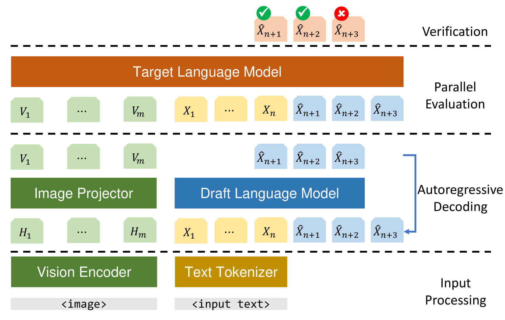
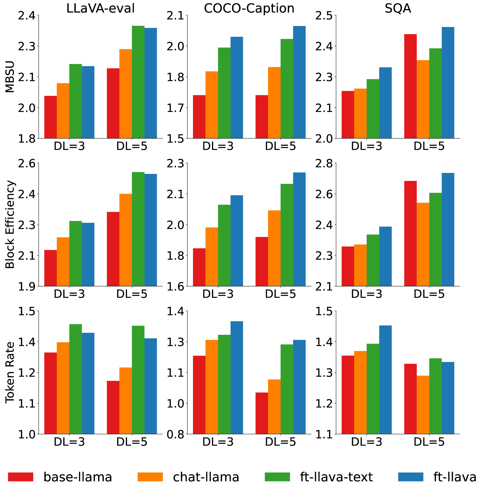
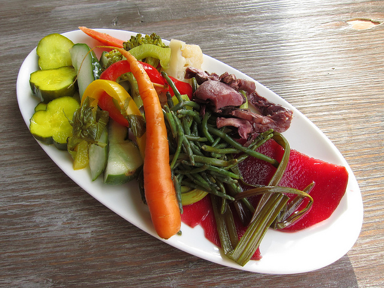

# 探索多模态大型语言模型的推测性解码技术

发布时间：2024年04月12日

`LLM应用` `多模态` `推理加速`

> On Speculative Decoding for Multimodal Large Language Models

# 摘要

> 多模态大型语言模型（MLLMs）的推理过程缓慢，原因在于其庞大的语言模型结构受限于内存带宽，并且按顺序生成标记。本文探讨了推测解码技术在加速MLLMs，尤其是LLaVA 7B模型的推理效率方面的潜力。我们发现，仅含语言信息的模型足以作为LLaVA 7B的推测解码草稿模型，无需依赖图像标记及其处理组件。通过三项不同任务的实验验证，推测解码技术能够带来最高达2.37倍的速度提升，使用的是我们全新训练的1150M参数的语言模型。同时，我们还提出了一个精简版的LLaVA草稿模型，集成了图像适配器，在图像描述任务中取得了轻微的性能提升，同时在其他任务中保持了一致的成效。

> Inference with Multimodal Large Language Models (MLLMs) is slow due to their large-language-model backbone which suffers from memory bandwidth bottleneck and generates tokens auto-regressively. In this paper, we explore the application of speculative decoding to enhance the inference efficiency of MLLMs, specifically the LLaVA 7B model. We show that a language-only model can serve as a good draft model for speculative decoding with LLaVA 7B, bypassing the need for image tokens and their associated processing components from the draft model. Our experiments across three different tasks show that speculative decoding can achieve a memory-bound speedup of up to 2.37$\times$ using a 115M parameter language model that we trained from scratch. Additionally, we introduce a compact LLaVA draft model incorporating an image adapter, which shows marginal performance gains in image captioning while maintaining comparable results in other tasks.

[Arxiv](https://arxiv.org/abs/2404.08856)