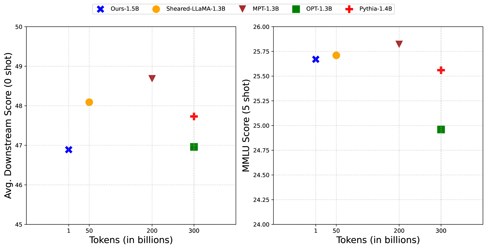
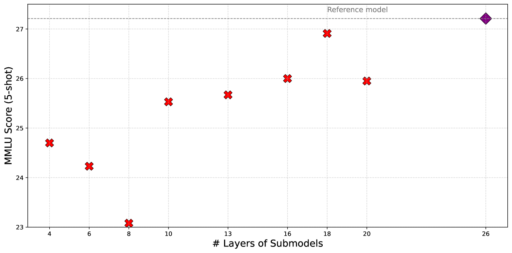
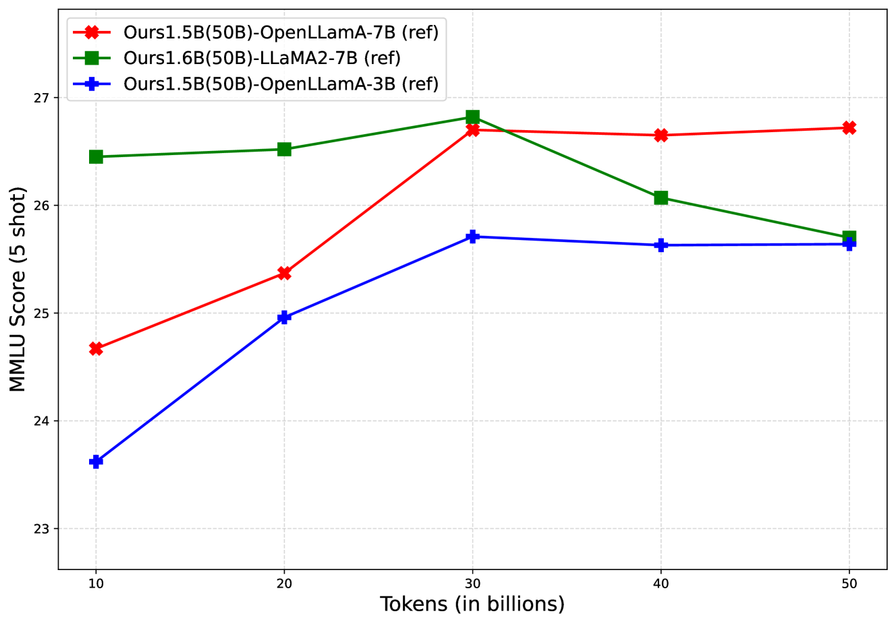
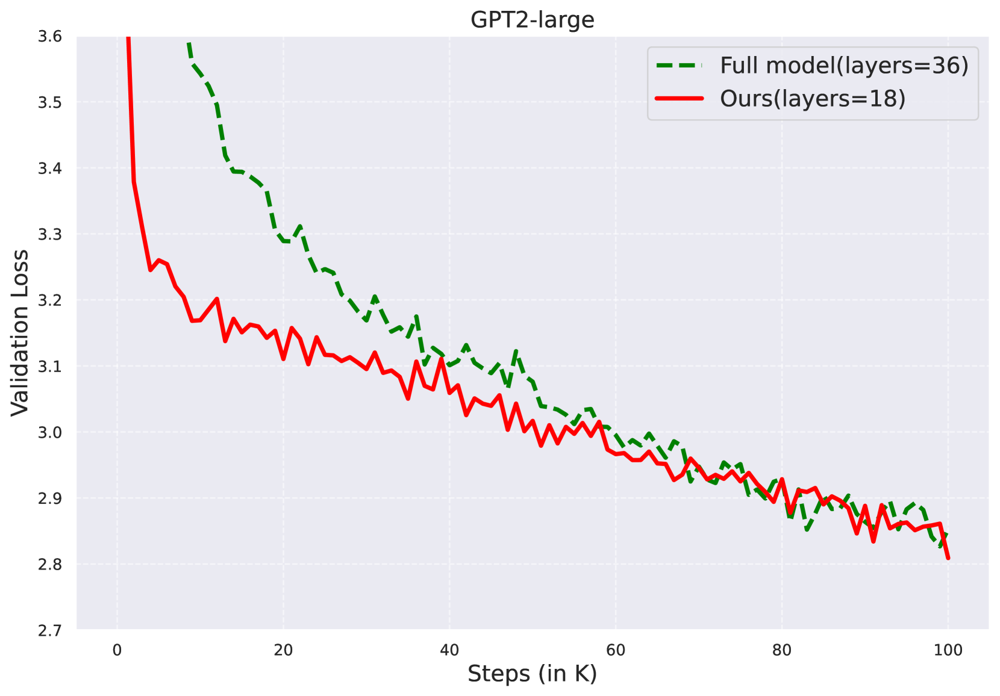
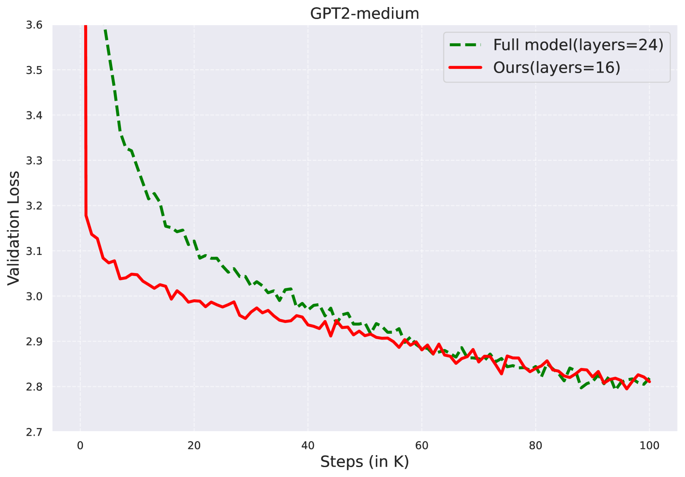
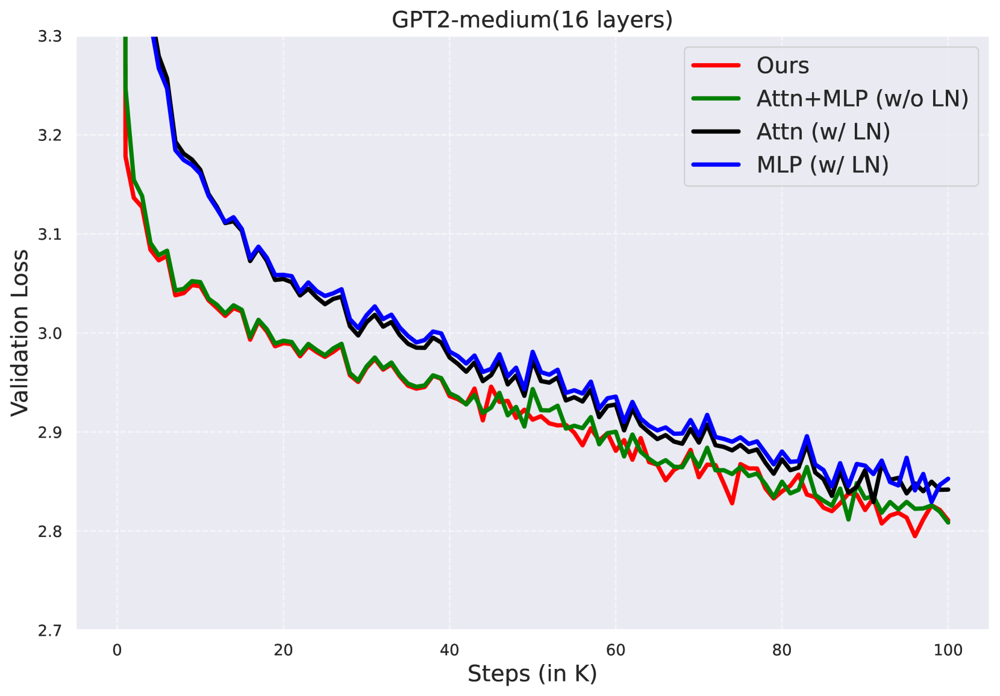

# 在预训练小型基础语言模型时，采用更少的标记。

发布时间：2024年04月12日

`LLM理论` `基础语言模型` `模型压缩`

> Pre-training Small Base LMs with Fewer Tokens

# 摘要

> 本研究探讨了一种创新方法——Inheritune，通过继承大型基础语言模型的部分变换器模块，并在极小比例（0.1%）的原始预训练数据上进行训练，从而高效地构建小型基础语言模型。通过不到半天的时间和单个A6000 GPU，我们成功构建了一个1.5B参数的小型模型，并在多个评估数据集上取得了与市面上1B-2B参数模型相媲美的结果。此外，我们还发现，利用GPT-2系列模型的部分层进行训练的小型模型，在OpenWebText数据集上的表现与从头开始训练的大型模型相当。我们的实验结果充分证明了Inheritune方法的多样性和有效性，相关代码已在GitHub上公开。

> We study the effectiveness of a simple approach to develop a small base language model (LM) starting from an existing large base LM: first inherit a few transformer blocks from the larger LM, and then train this smaller model on a very small subset (0.1\%) of the raw pretraining data of the larger model. We call our simple recipe Inheritune and first demonstrate it for building a small base LM with 1.5B parameters using 1B tokens (and a starting few layers of larger LM of 3B parameters); we do this using a single A6000 GPU for less than half a day. Across 9 diverse evaluation datasets as well as the MMLU benchmark, the resulting model compares favorably to publicly available base models of 1B-2B size, some of which have been trained using 50-1000 times more tokens.
  We investigate Inheritune in a slightly different setting where we train small LMs utilizing larger LMs and their full pre-training dataset. Here we show that smaller LMs trained utilizing some of the layers of GPT2-medium (355M) and GPT-2-large (770M) can effectively match the val loss of their bigger counterparts when trained from scratch for the same number of training steps on OpenWebText dataset with 9B tokens. We analyze our recipe with extensive experiments and demonstrate it efficacy on diverse settings. Our code is available at https://github.com/sanyalsunny111/LLM-Inheritune.

[Arxiv](https://arxiv.org/abs/2404.08634)