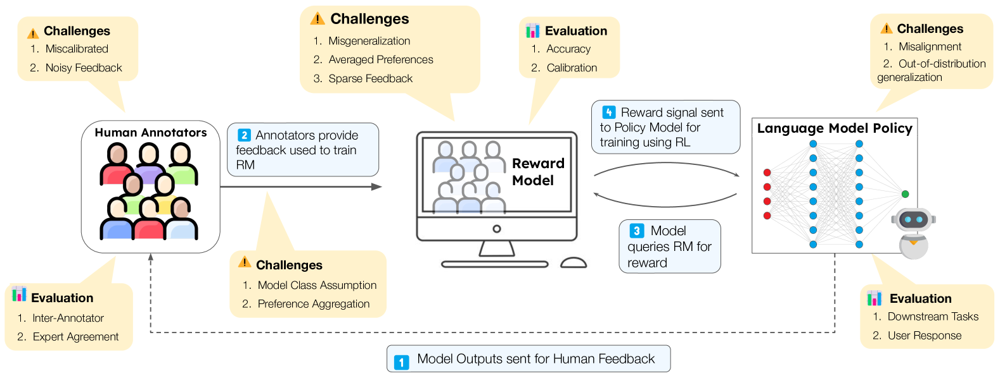

# 深度剖析RLHF：揭秘人类反馈在大型语言模型强化学习中的作用

发布时间：2024年04月12日

`LLM理论` `人工智能`

> RLHF Deciphered: A Critical Analysis of Reinforcement Learning from Human Feedback for LLMs

# 摘要

> 当前的大型语言模型（LLMs）已成为众多任务的关键工具，但要将其训练成人类的得力助手，还需细致考量。一种充满希望的方法是利用人类反馈进行强化学习（RLHF），通过这种方式，模型能够依据人类的反馈进行调整，以减少不良内容和幻觉等现象。然而，对于LLMs的RLHF理解往往与最初推广该方法的设计决策紧密相连，而目前的研究更多是在这些决策基础上进行拓展，而非彻底改进整个框架。本文通过强化学习的原则来剖析RLHF，深入探讨其基本原理，尤其关注RLHF的核心要素——奖励模型。研究深入探讨了模型构建的选择、函数逼近的局限性以及它们对RLHF训练算法的影响，并指出了关于奖励表达性的一些基本假设。通过分析，我们增进了对奖励模型作用及其训练方法的认识，并揭示了现有方法的不足之处。本文详细描述了这些限制，包括泛化不准确、模型设定失误和反馈过于稀疏等问题，以及它们对语言模型效能的影响。通过系统地回顾现有文献，本文为研究人员和实践者提供了一个参考，帮助他们理解RLHF面临的挑战，并在现有成果上进一步发展。

> State-of-the-art large language models (LLMs) have become indispensable tools for various tasks. However, training LLMs to serve as effective assistants for humans requires careful consideration. A promising approach is reinforcement learning from human feedback (RLHF), which leverages human feedback to update the model in accordance with human preferences and mitigate issues like toxicity and hallucinations. Yet, an understanding of RLHF for LLMs is largely entangled with initial design choices that popularized the method and current research focuses on augmenting those choices rather than fundamentally improving the framework. In this paper, we analyze RLHF through the lens of reinforcement learning principles to develop an understanding of its fundamentals, dedicating substantial focus to the core component of RLHF -- the reward model. Our study investigates modeling choices, caveats of function approximation, and their implications on RLHF training algorithms, highlighting the underlying assumptions made about the expressivity of reward. Our analysis improves the understanding of the role of reward models and methods for their training, concurrently revealing limitations of the current methodology. We characterize these limitations, including incorrect generalization, model misspecification, and the sparsity of feedback, along with their impact on the performance of a language model. The discussion and analysis are substantiated by a categorical review of current literature, serving as a reference for researchers and practitioners to understand the challenges of RLHF and build upon existing efforts.

[Arxiv](https://arxiv.org/abs/2404.08555)