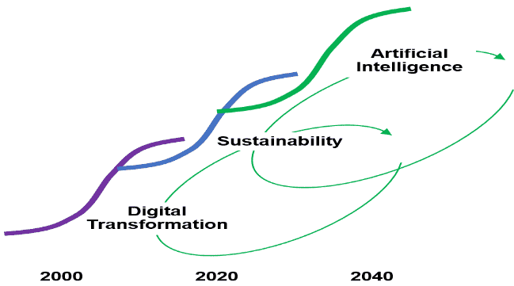
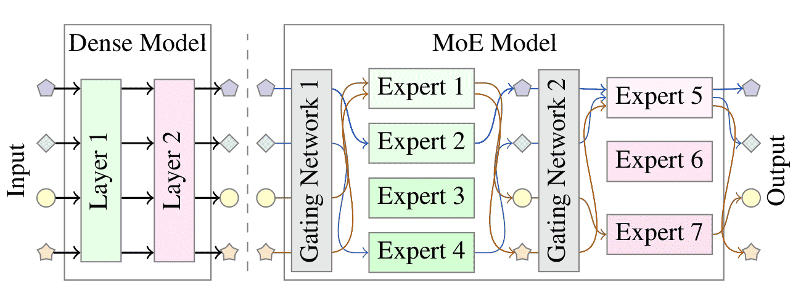
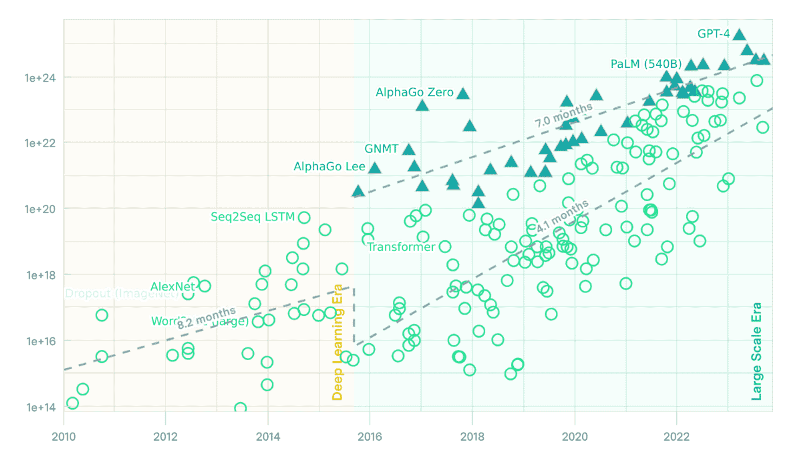
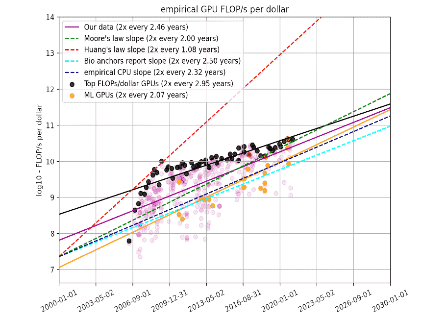
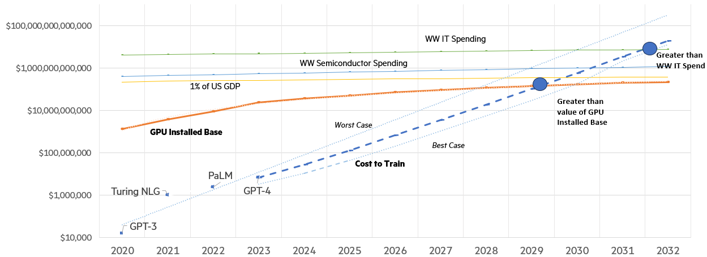
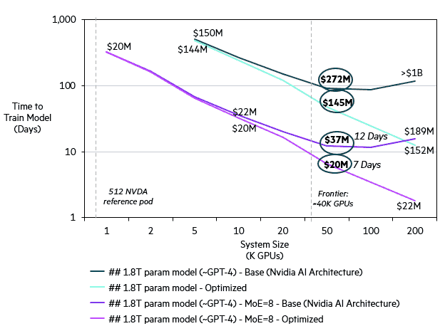
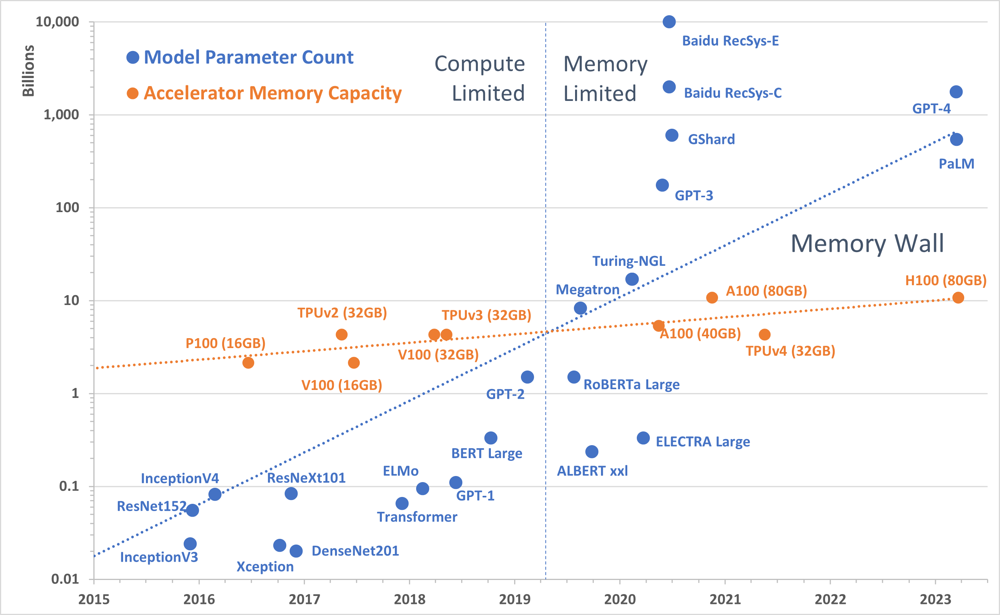
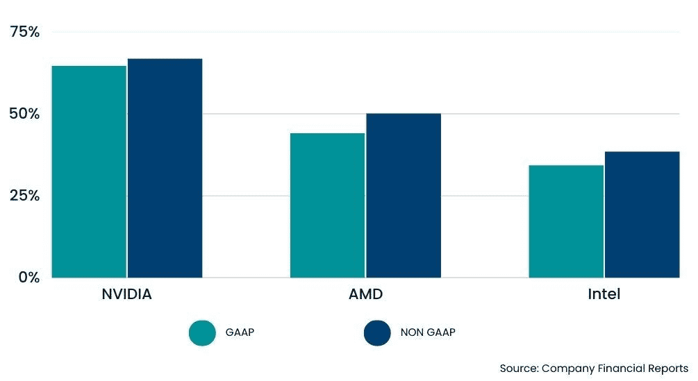

# 本文旨在探讨如何减少进入基础模型训练领域的障碍，以便更多的研究人员和开发者能够参与并推动这一领域的进步。

发布时间：2024年04月12日

`RAG` `技术基础设施` `能源效率`

> Reducing the Barriers to Entry for Foundation Model Training

# 摘要

> 近期，全球对机器学习和人工智能应用的渴求呈爆炸式增长，给技术基础设施带来了前所未有的压力。若继续沿着现有技术路径发展，未来的消费趋势将难以承受，这将限制市场参与者的活力，抑制创新，并加剧技术鸿沟。为应对这些挑战，我们提倡在整个技术生态系统中对AI训练基础设施进行根本性的改革。这需要从高端软件到基础硬件、微处理器和芯片设计等各个方面的创新，同时提升对可持续基础设施至关重要的能源效率。本文提出了一个分析框架，量化地揭示了挑战所在，并指引我们发现降低大型语言模型训练门槛的机遇。

> The world has recently witnessed an unprecedented acceleration in demands for Machine Learning and Artificial Intelligence applications. This spike in demand has imposed tremendous strain on the underlying technology stack in supply chain, GPU-accelerated hardware, software, datacenter power density, and energy consumption. If left on the current technological trajectory, future demands show insurmountable spending trends, further limiting market players, stifling innovation, and widening the technology gap. To address these challenges, we propose a fundamental change in the AI training infrastructure throughout the technology ecosystem. The changes require advancements in supercomputing and novel AI training approaches, from high-end software to low-level hardware, microprocessor, and chip design, while advancing the energy efficiency required by a sustainable infrastructure. This paper presents the analytical framework that quantitatively highlights the challenges and points to the opportunities to reduce the barriers to entry for training large language models.

[Arxiv](https://arxiv.org/abs/2404.08811)