# 探究大型语言模型中的年龄偏见：揭秘生成差距

发布时间：2024年04月12日

`LLM应用` `社会学` `心理学`

> The Generation Gap:Exploring Age Bias in Large Language Models

# 摘要

> 本文研究了大型语言模型（LLMs）的价值观与不同年龄段的契合度，依据世界价值观调查的十三个领域数据进行分析。我们设计了多种针对性的提示，确保结果的可靠性，发现LLM的价值观趋向于年轻化。同时，我们考察了在提示中加入年龄信息对价值观差异的缓解作用，发现在缩小不同年龄段间的差异上存在一定难度。研究揭示了LLM中的年龄倾向性，并为后续研究提供了宝贵的见解。

> In this paper, we explore the alignment of values in Large Language Models (LLMs) with specific age groups, leveraging data from the World Value Survey across thirteen categories. Through a diverse set of prompts tailored to ensure response robustness, we find a general inclination of LLM values towards younger demographics. Additionally, we explore the impact of incorporating age identity information in prompts and observe challenges in mitigating value discrepancies with different age cohorts. Our findings highlight the age bias in LLMs and provide insights for future work.

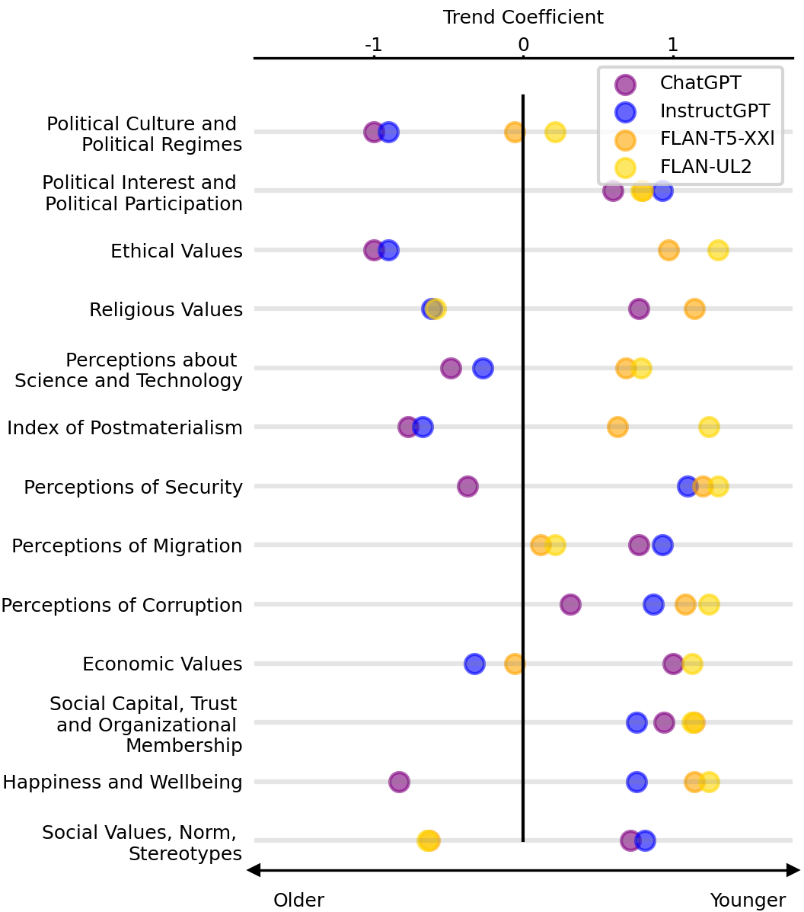

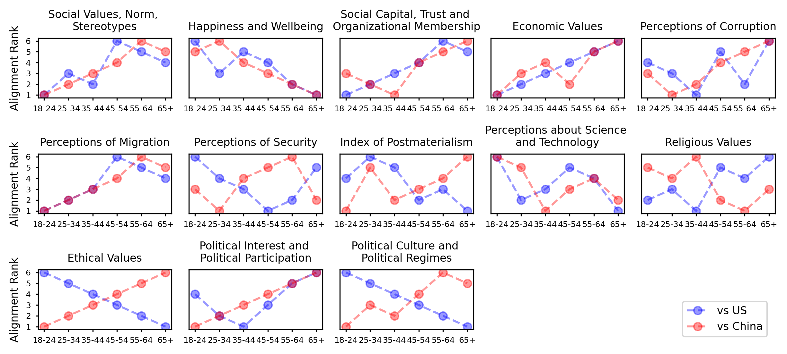

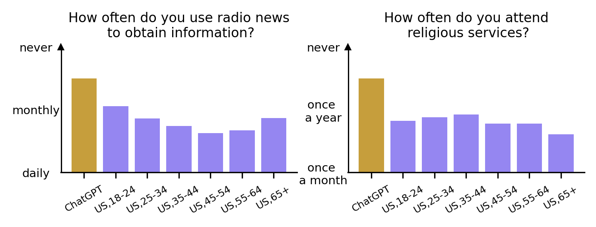

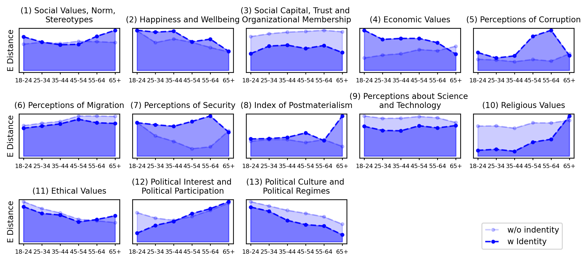

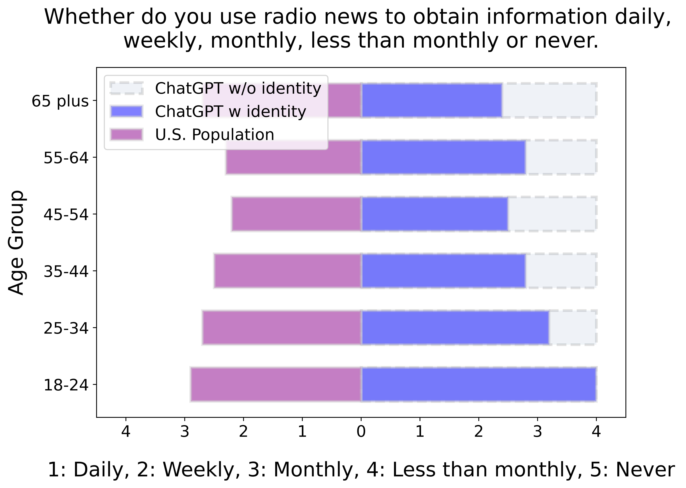

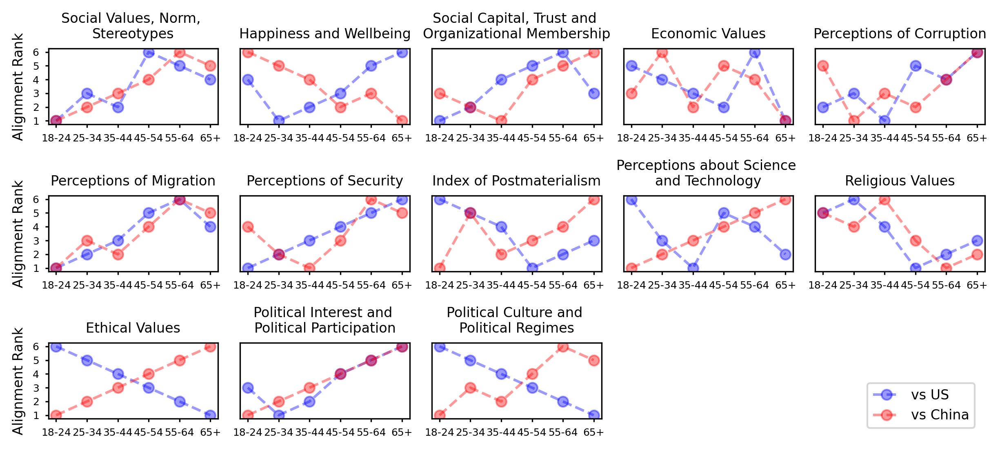

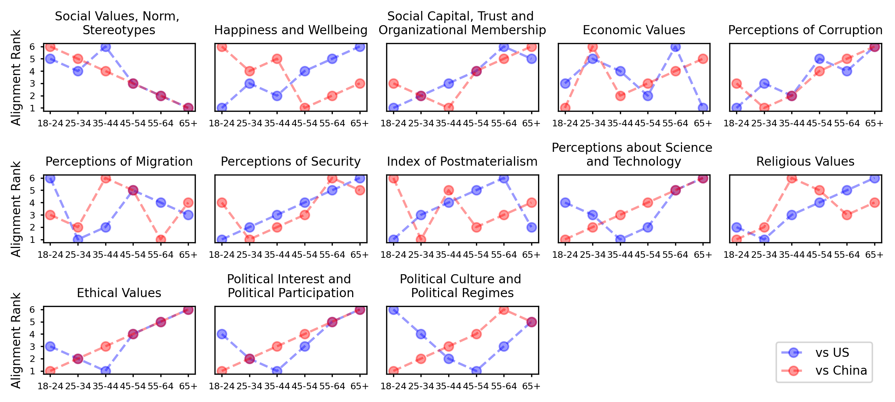

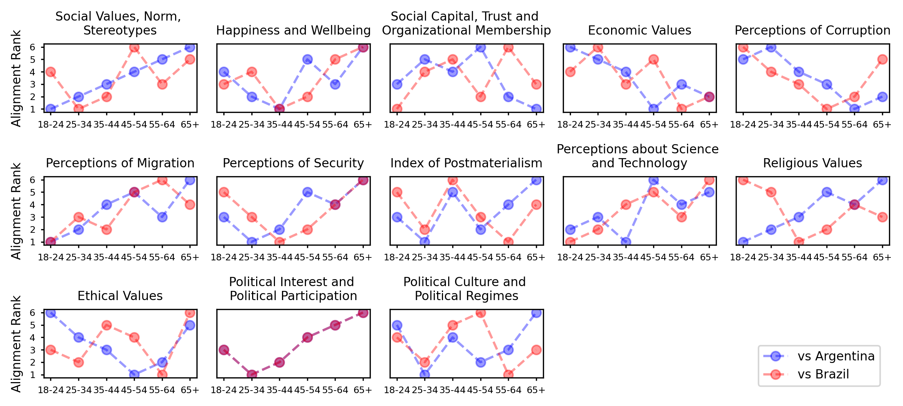

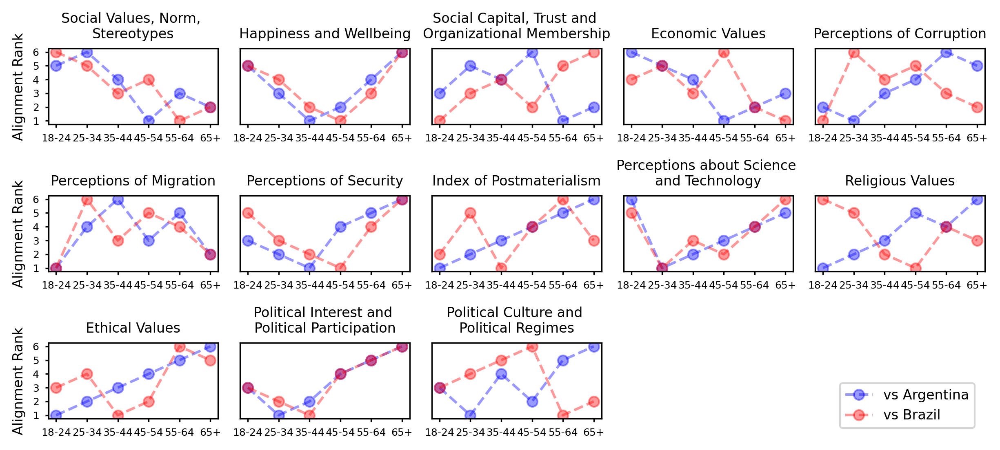

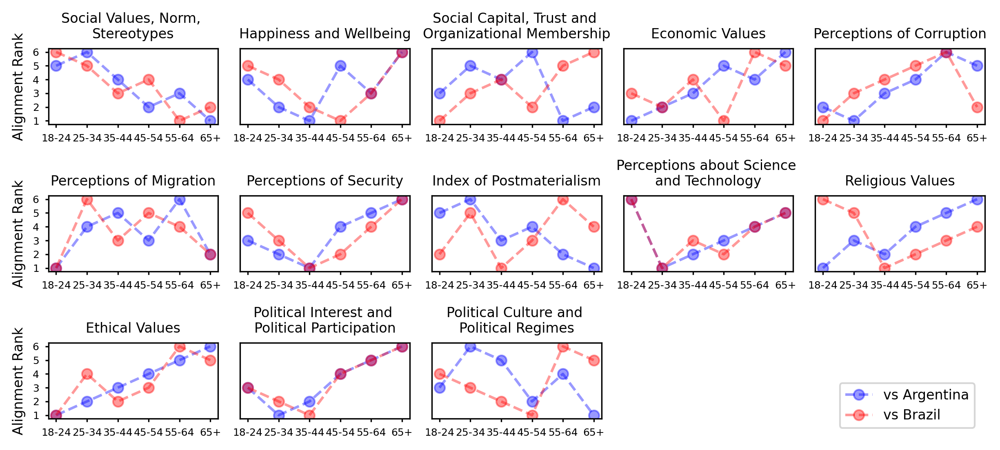

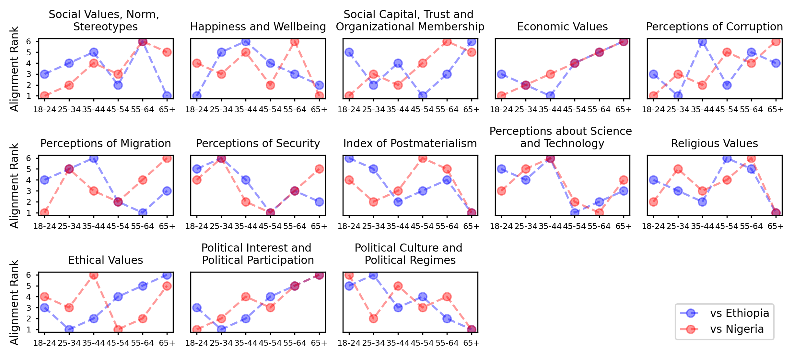

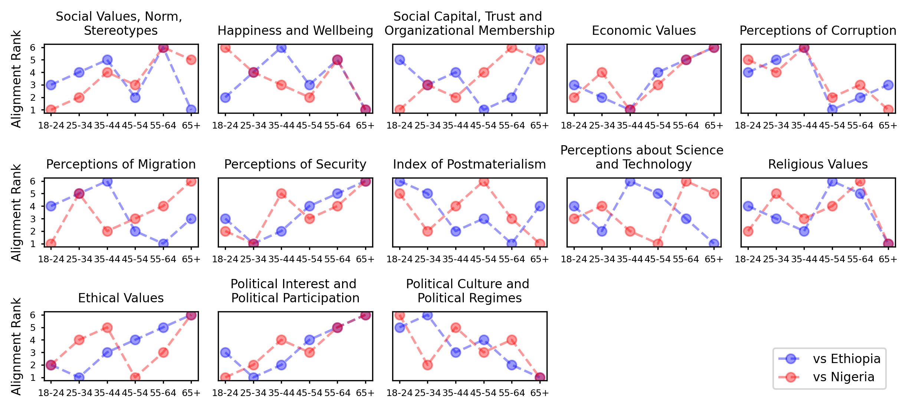

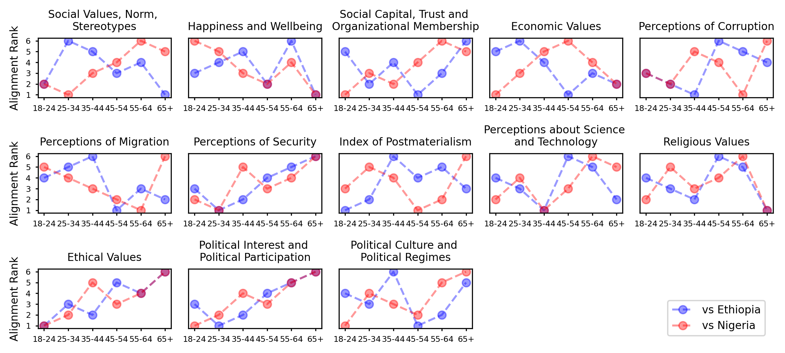

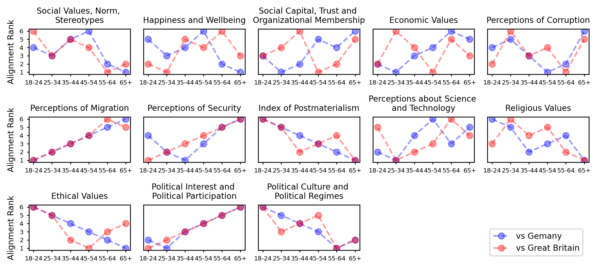

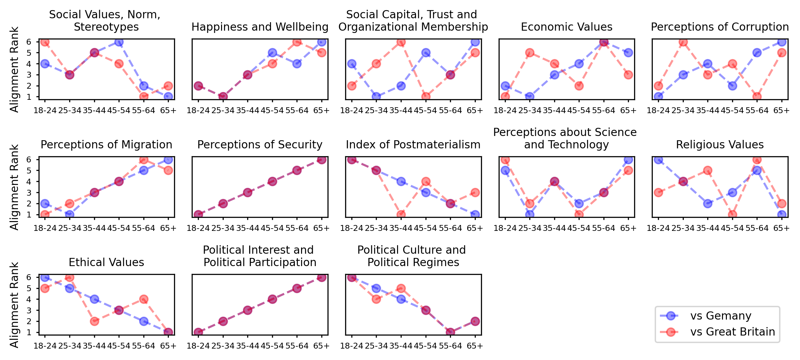

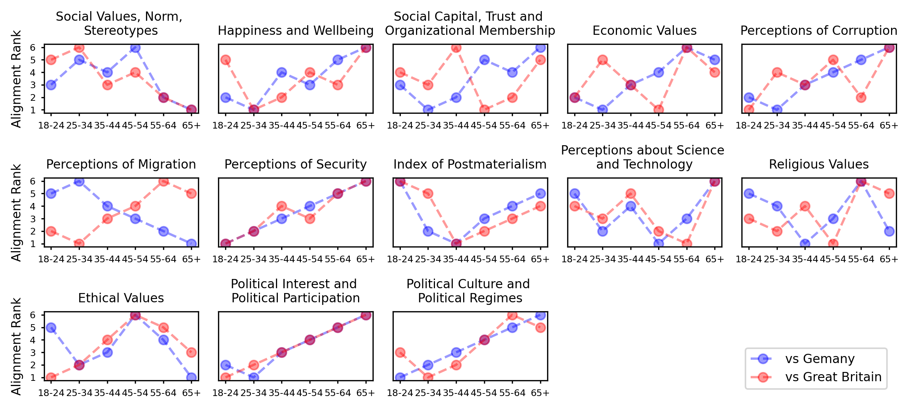

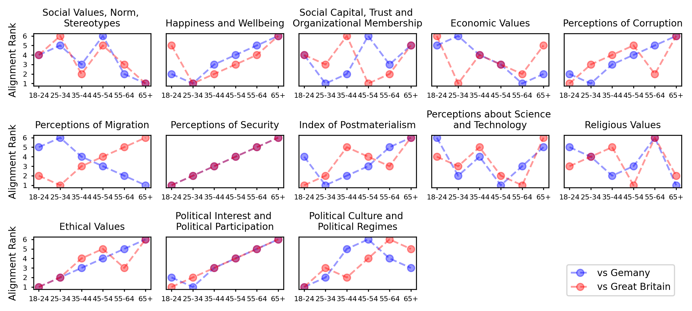

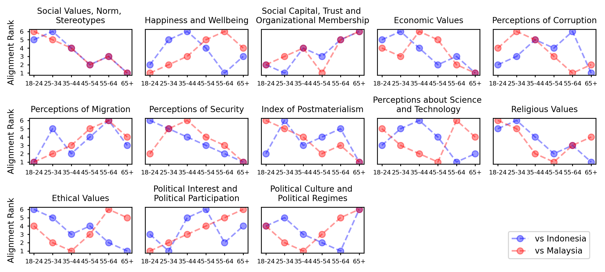

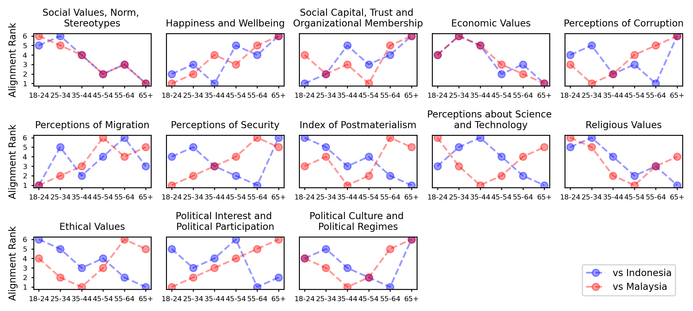

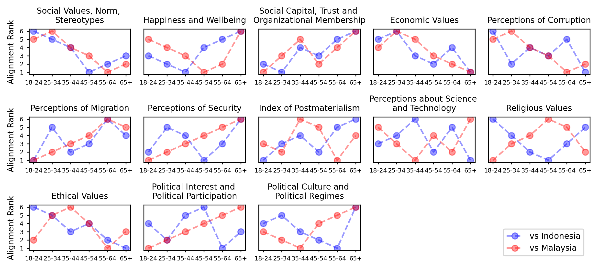

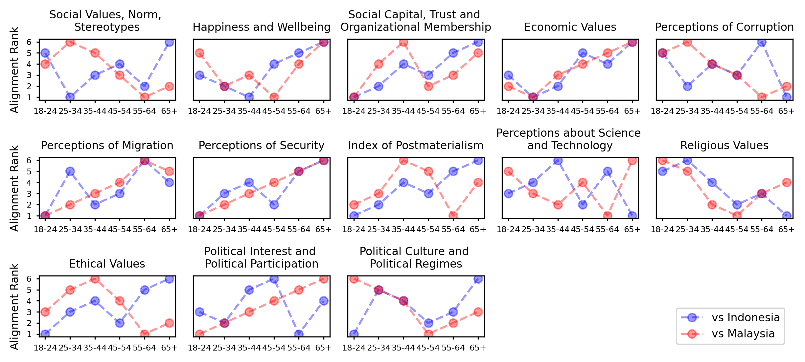

[Arxiv](https://arxiv.org/abs/2404.08760)