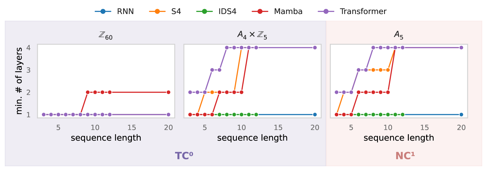

# 状态空间模型中的状态幻觉

发布时间：2024年04月12日

`LLM理论` `语言模型` `理论分析`

> The Illusion of State in State-Space Models

# 摘要

> 状态空间模型（SSMs）正逐渐成为大型语言模型（LLMs）的新兴架构，挑战之前普遍采用的变换器架构。变换器的一个理论短板在于其无法处理某些序列计算和状态追踪任务，而SSMs则因其与循环神经网络（RNNs）的高度相似性而专门设计来弥补这一点。然而，SSMs在状态追踪的表达力上真的超越了变换器吗？出乎意料，答案是并不见得。我们的分析揭示，SSMs的表达力受限程度与变换器如出一辙：它们同样无法处理超出$\mathsf{TC}^0$复杂度类的计算。具体来说，SSMs在处理简单的状态追踪问题，如排列组合时，显得无能为力。这意味着SSMs在精确追踪特定记号的国际象棋走法、评估代码或追踪长篇故事中的实体等方面，确实力不从心。通过实验验证，我们发现Mamba风格的SSMs在状态追踪方面确实遇到了挑战。由此可见，SSMs中的“状态”概念不过是一种幻象，其表达能力的限制与非循环的变换器模型相差无几，这可能在根本上限制了它们解决现实世界中的复杂状态追踪问题。

> State-space models (SSMs) have emerged as a potential alternative architecture for building large language models (LLMs) compared to the previously ubiquitous transformer architecture. One theoretical weakness of transformers is that they cannot express certain kinds of sequential computation and state tracking (Merrill and Sabharwal, 2023), which SSMs are explicitly designed to address via their close architectural similarity to recurrent neural networks (RNNs). But do SSMs truly have an advantage (over transformers) in expressive power for state tracking? Surprisingly, the answer is no. Our analysis reveals that the expressive power of SSMs is limited very similarly to transformers: SSMs cannot express computation outside the complexity class $\mathsf{TC}^0$. In particular, this means they cannot solve simple state-tracking problems like permutation composition. It follows that SSMs are provably unable to accurately track chess moves with certain notation, evaluate code, or track entities in a long narrative. To supplement our formal analysis, we report experiments showing that Mamba-style SSMs indeed struggle with state tracking. Thus, despite its recurrent formulation, the "state" in an SSM is an illusion: SSMs have similar expressiveness limitations to non-recurrent models like transformers, which may fundamentally limit their ability to solve real-world state-tracking problems.

[Arxiv](https://arxiv.org/abs/2404.08819)