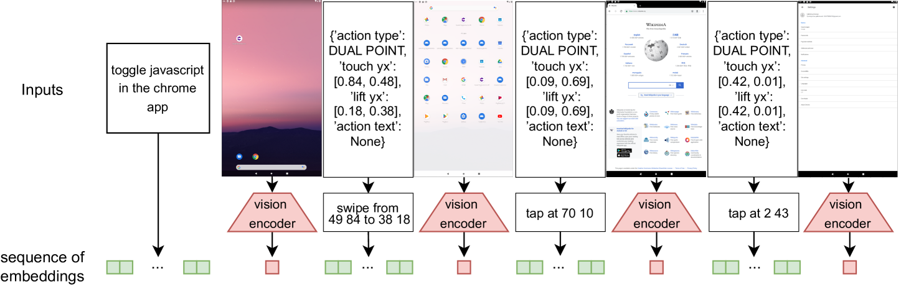

# 打造一款视觉语言模型，助力智能手机成为你的得力助手。

发布时间：2024年04月12日

`Agent` `移动设备控制` `人工智能`

> Training a Vision Language Model as Smartphone Assistant

# 摘要

> 本研究旨在解决数字助手执行多种用户任务的挑战，特别是在基于指令的移动设备控制方面。借助大型语言模型（LLMs）的最新进展，我们推出了一款视觉语言模型（VLM），能够应对移动设备上的多样化任务。该模型通过与用户界面（UI）的互动来执行操作，利用设备屏幕的视觉输入，模拟人类的交互方式，如轻触和滑动等。这种设计使得我们的模型能够与设备上的所有应用程序进行互动。与传统方法相比，我们的模型不仅处理单个屏幕图像，还能处理由连续的屏幕截图序列及其对应动作生成的视觉-语言句子。在Android in the Wild这一具有挑战性的基准测试中，我们的方法展现了其显著的效率和潜力。

> Addressing the challenge of a digital assistant capable of executing a wide array of user tasks, our research focuses on the realm of instruction-based mobile device control. We leverage recent advancements in large language models (LLMs) and present a visual language model (VLM) that can fulfill diverse tasks on mobile devices. Our model functions by interacting solely with the user interface (UI). It uses the visual input from the device screen and mimics human-like interactions, encompassing gestures such as tapping and swiping. This generality in the input and output space allows our agent to interact with any application on the device. Unlike previous methods, our model operates not only on a single screen image but on vision-language sentences created from sequences of past screenshots along with corresponding actions. Evaluating our method on the challenging Android in the Wild benchmark demonstrates its promising efficacy and potential.

[Arxiv](https://arxiv.org/abs/2404.08755)