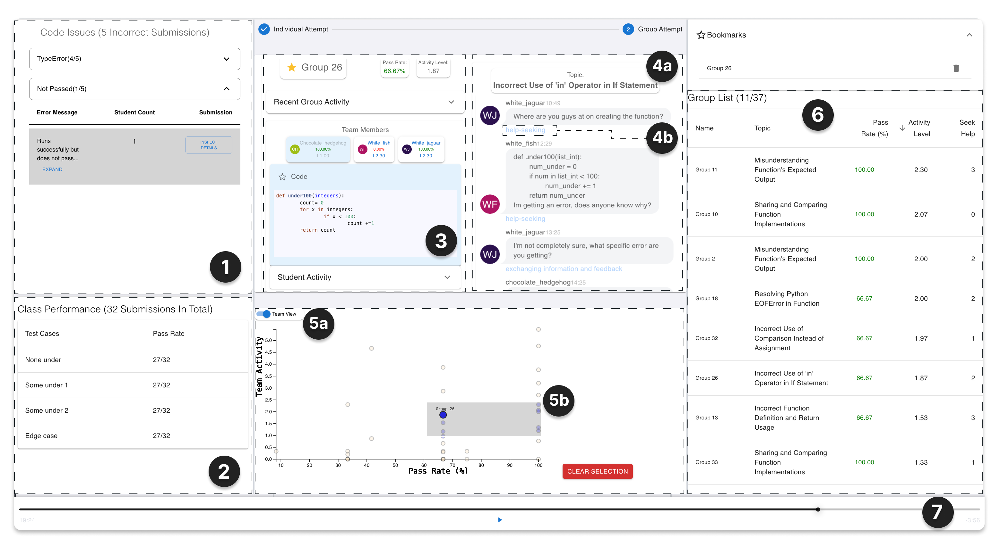
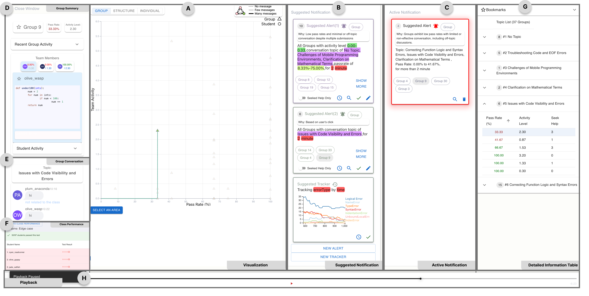
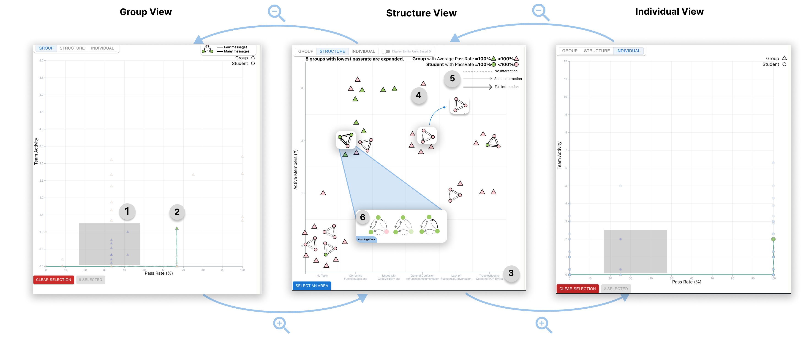
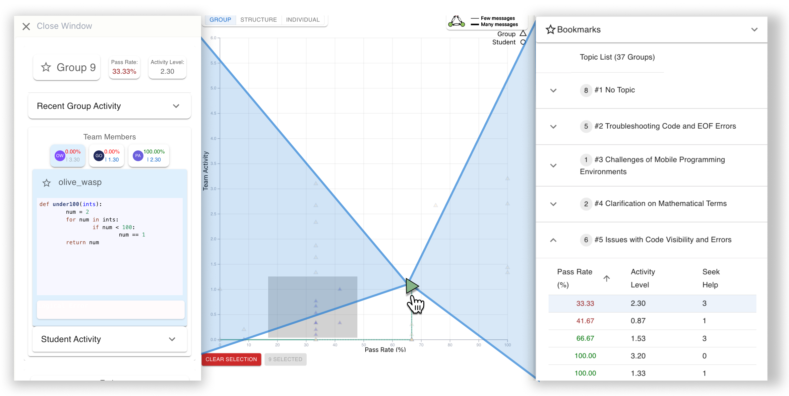
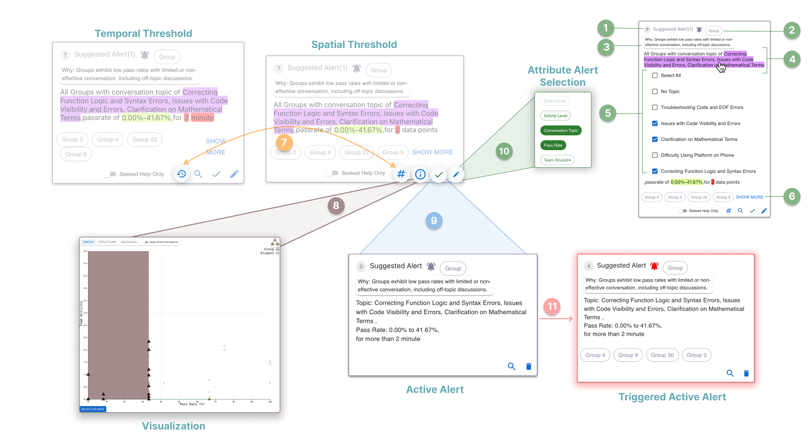
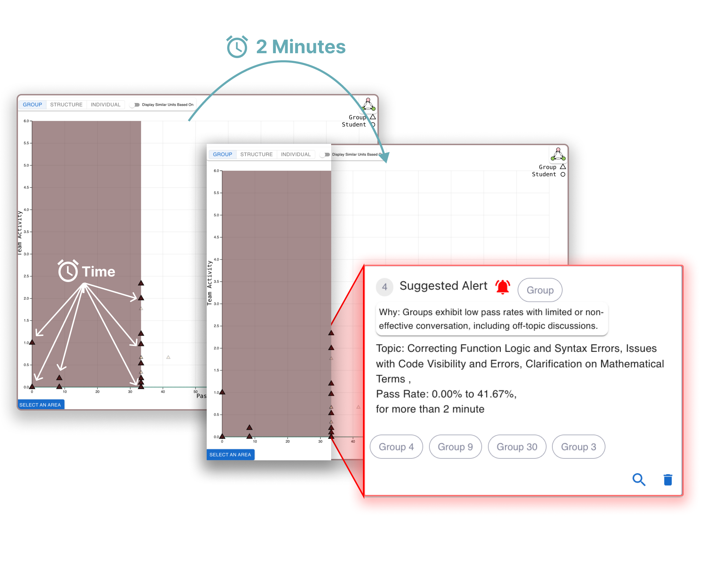
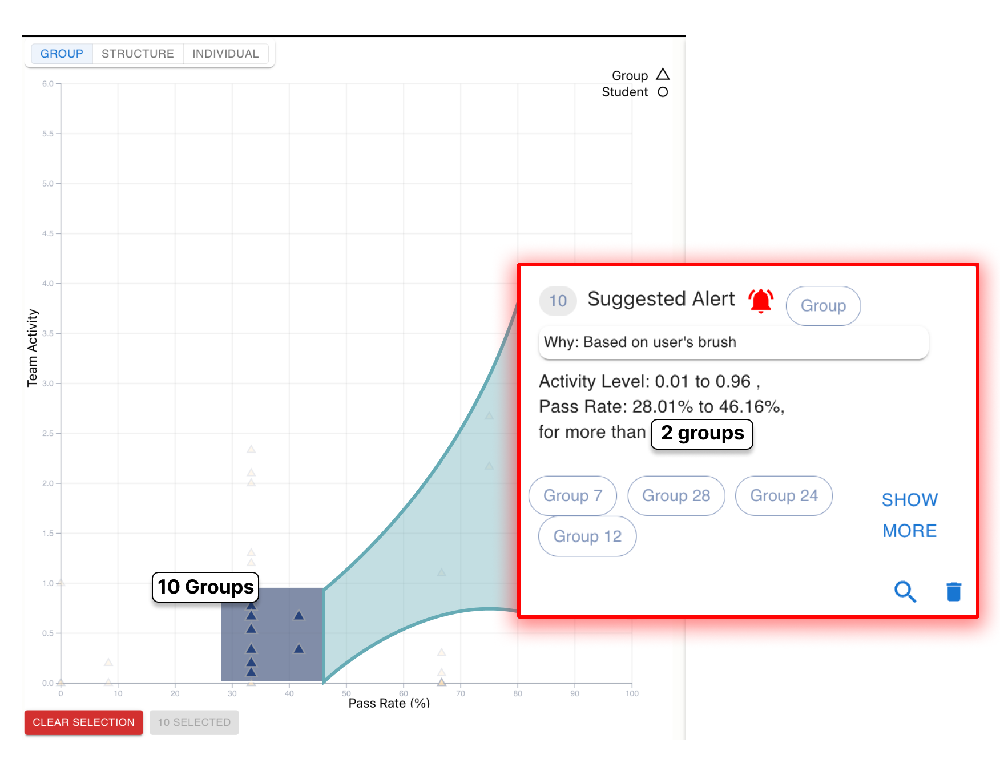
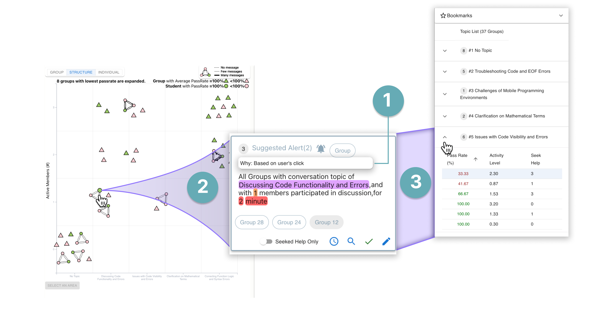
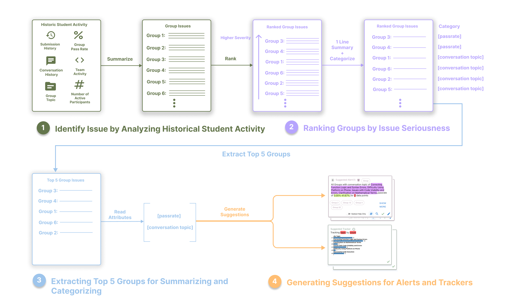

# VizGroup：一款人工智能驱动的实时协作编程学习分析系统，采用事件触发机制。

发布时间：2024年04月12日

`Agent` `人工智能`

> VizGroup: An AI-Assisted Event-Driven System for Real-Time Collaborative Programming Learning Analytics

# 摘要

> 编程导师常通过同伴指导等协作学习活动，深化学生理解并提升学习热情。但因为学生思维模式各异、协作不尽人意，效果常常不尽如人意。本研究提出了VizGroup——一款AI辅助系统，它让编程导师在大型编程课上轻松监控学生的实时协作行为。VizGroup借助大型语言模型（LLMs），为教师提供事件规范建议，使他们能够同时跟踪关键协作指标与实时编程任务间的重要相关性模式，并得到警报。通过在一次大型编程讲座中的同伴指导活动中收集的数据，我们对12位导师使用VizGroup进行了评估。结果表明，与没有建议单元的VizGroup相比，建议单元的加入帮助导师自行发现新的监控模式，拓宽了监控指标的多样性，并促进了参与者在通知创建策略上的改进。

> Programming instructors often conduct collaborative learning activities, like Peer Instruction, to foster a deeper understanding in students and enhance their engagement with learning. These activities, however, may not always yield productive outcomes due to the diversity of student mental models and their ineffective collaboration. In this work, we introduce VizGroup, an AI-assisted system that enables programming instructors to easily oversee students' real-time collaborative learning behaviors during large programming courses. VizGroup leverages Large Language Models (LLMs) to recommend event specifications for instructors so that they can simultaneously track and receive alerts about key correlation patterns between various collaboration metrics and ongoing coding tasks. We evaluated VizGroup with 12 instructors using a dataset collected from a Peer Instruction activity that was conducted in a large programming lecture. The results showed that compared to a version of VizGroup without the suggested units, VizGroup with suggested units helped instructors create additional monitoring units on previously undetected patterns on their own, covered a more diverse range of metrics, and influenced the participants' following notification creation strategies.

[Arxiv](https://arxiv.org/abs/2404.08743)