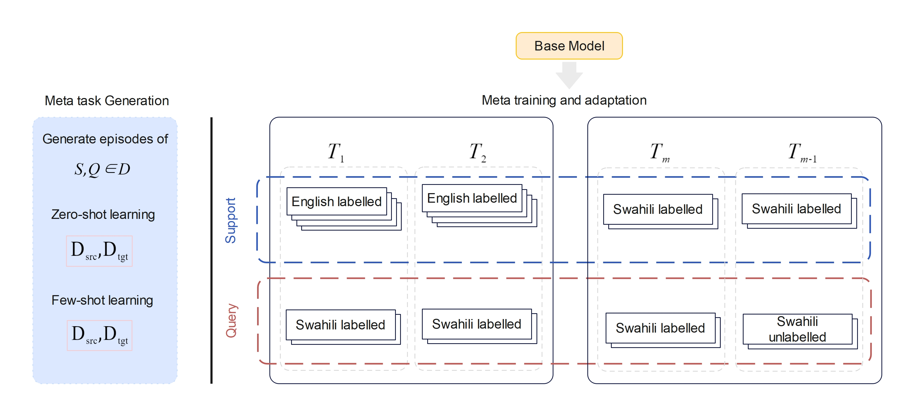
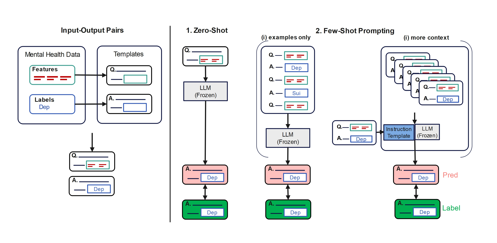
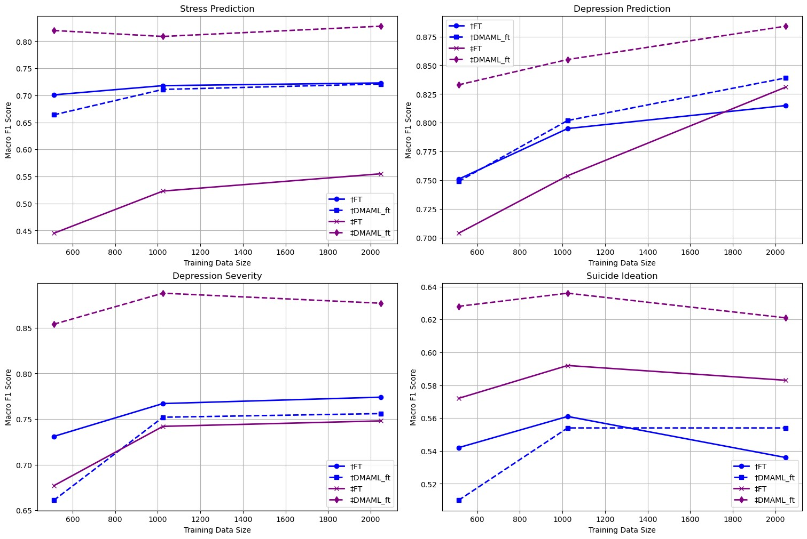
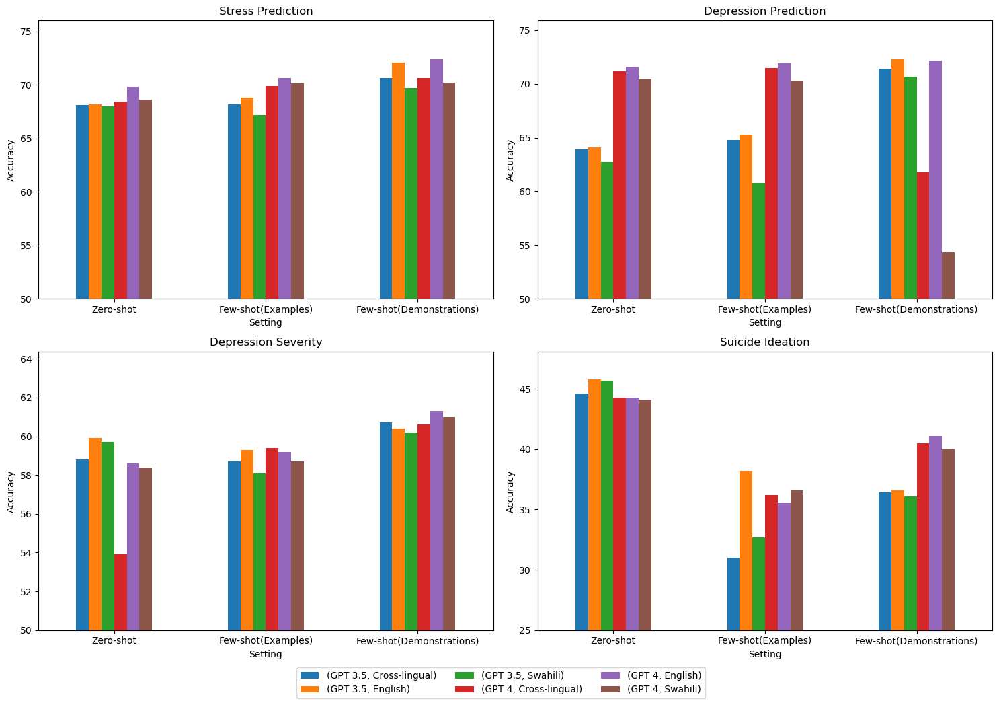

# 通过利用大型语言模型的元训练和上下文学习，我们调整心理健康预测任务，以便在跨语言学习中取得更好的效果。

发布时间：2024年04月13日

`LLM应用` `心理健康` `社交媒体分析`

> Adapting Mental Health Prediction Tasks for Cross-lingual Learning via Meta-Training and In-context Learning with Large Language Model

# 摘要

> 及时识别心理健康问题，如抑郁症，对有效应对至关重要。然而，现有研究在利用社交媒体数据预测斯瓦希里等非洲低资源语言区的心理健康状态方面尚显不足。本研究提出了两种创新方法，一是运用模型无关的元学习，二是发挥大型语言模型（LLMs）的优势，以弥补这一研究空缺。我们在三个翻译成低资源语言的数据集上开展实验，并针对压力、抑郁、抑郁程度及自杀倾向等四项心理健康任务进行应用。首先，我们采用自我监督的元学习模型，显著提升了模型初始化效果，加快了适应和跨语言迁移的速度。实验结果显示，相较于传统微调方法，我们的元训练模型在宏观F1分数上取得了18%和0.8%的显著提升，超过了XLM-R和mBERT的基线。同时，我们通过分析不同的跨语言提示策略，评估LLMs在斯瓦希里心理健康预测任务中的准确性。分析发现，斯瓦希里语提示效果优于跨语言提示，但仍不及英语提示。研究证实，通过精心设计的提示模板、示例和指导，可以实现跨语言的上下文学习。

> Timely identification is essential for the efficient handling of mental health illnesses such as depression. However, the current research fails to adequately address the prediction of mental health conditions from social media data in low-resource African languages like Swahili. This study introduces two distinct approaches utilising model-agnostic meta-learning and leveraging large language models (LLMs) to address this gap. Experiments are conducted on three datasets translated to low-resource language and applied to four mental health tasks, which include stress, depression, depression severity and suicidal ideation prediction. we first apply a meta-learning model with self-supervision, which results in improved model initialisation for rapid adaptation and cross-lingual transfer. The results show that our meta-trained model performs significantly better than standard fine-tuning methods, outperforming the baseline fine-tuning in macro F1 score with 18\% and 0.8\% over XLM-R and mBERT. In parallel, we use LLMs' in-context learning capabilities to assess their performance accuracy across the Swahili mental health prediction tasks by analysing different cross-lingual prompting approaches. Our analysis showed that Swahili prompts performed better than cross-lingual prompts but less than English prompts. Our findings show that in-context learning can be achieved through cross-lingual transfer through carefully crafted prompt templates with examples and instructions.

[Arxiv](https://arxiv.org/abs/2404.09045)