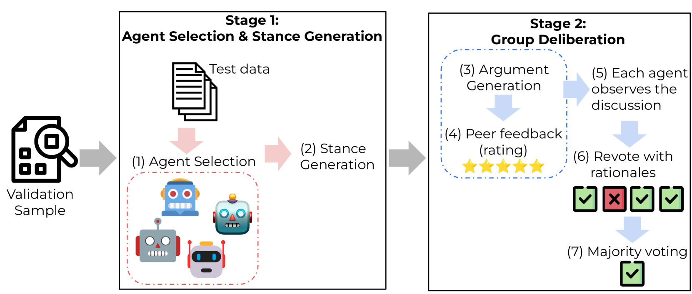
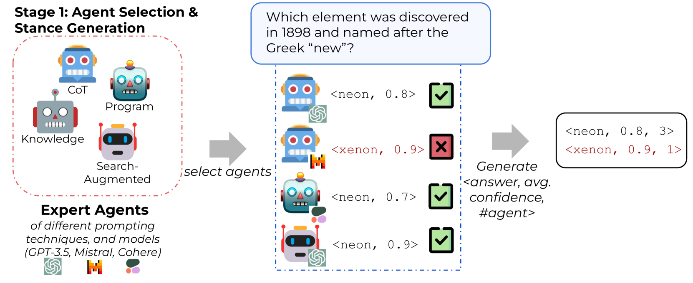
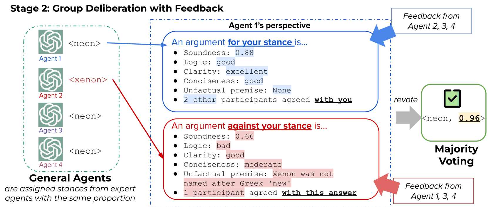
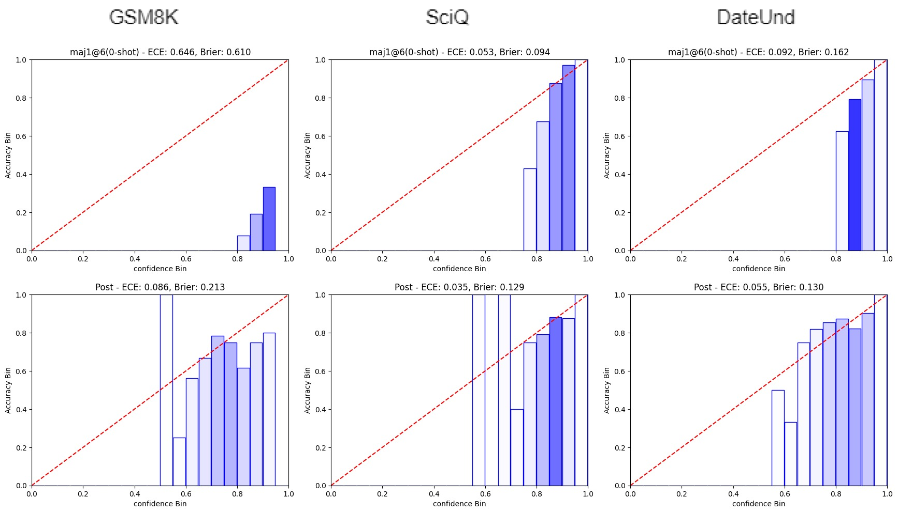
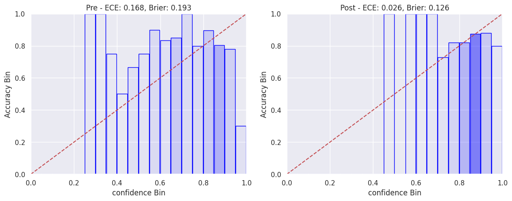

# 本研究通过多智能体协商机制，对大型语言模型（LLM）的置信度进行校准与合理化，以提升模型的预测准确性和解释性。

发布时间：2024年04月13日

`LLM理论` `人工智能` `问答系统`

> Confidence Calibration and Rationalization for LLMs via Multi-Agent Deliberation

# 摘要

> 当前大型语言模型（LLMs）面临的不确定性估计问题不容忽视，这些模型往往过于自信，特别是在接受了人类反馈的强化学习（RLHF）之后。与人类能够根据日常经验调整信念和信心水平不同，LLMs的传统校准方法仅仅关注个体信心的估计，未能充分发挥多个LLMs相互协作的“集体智慧”优势。我们提出了一种名为“协作校准”的新颖方法，它无需额外训练，通过模拟群体讨论过程，充分发挥多个工具辅助LLM代理的协作与表达能力，以提升整体的准确性和校准度。我们在多个领域的生成性问答任务中验证了协作校准的有效性，证明了其在整合集体智慧、提高模型预测可靠性方面的巨大潜力。

> Uncertainty estimation is a significant issue for current large language models (LLMs) that are generally poorly calibrated and over-confident, especially with reinforcement learning from human feedback (RLHF). Unlike humans, whose decisions and confidences not only stem from intrinsic beliefs but can also be adjusted through daily observations, existing calibration methods for LLMs focus on estimating or eliciting individual confidence without taking full advantage of the "Collective Wisdom": the interaction among multiple LLMs that can collectively improve both accuracy and calibration. In this work, we propose Collaborative Calibration, a post-hoc training-free calibration strategy that leverages the collaborative and expressive capabilities of multiple tool-augmented LLM agents in a simulated group deliberation process. We demonstrate the effectiveness of Collaborative Calibration on generative QA tasks across various domains, showing its potential in harnessing the rationalization of collectively calibrated confidence assessments and improving the reliability of model predictions.

[Arxiv](https://arxiv.org/abs/2404.09127)