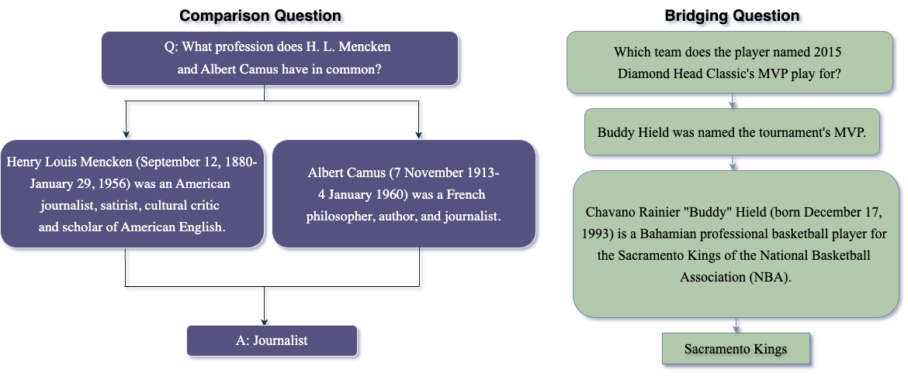
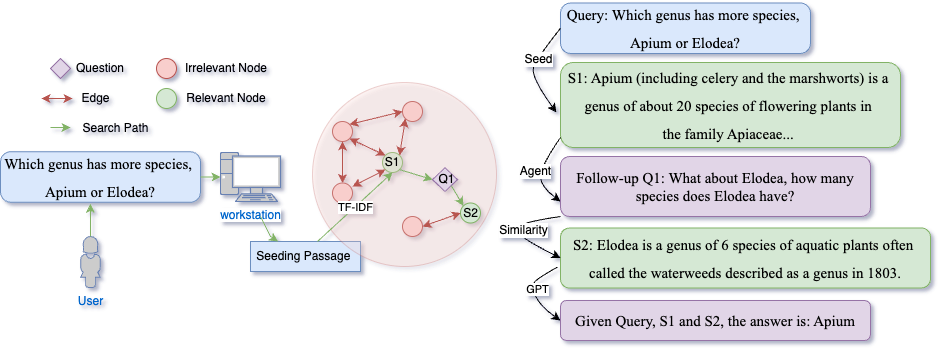
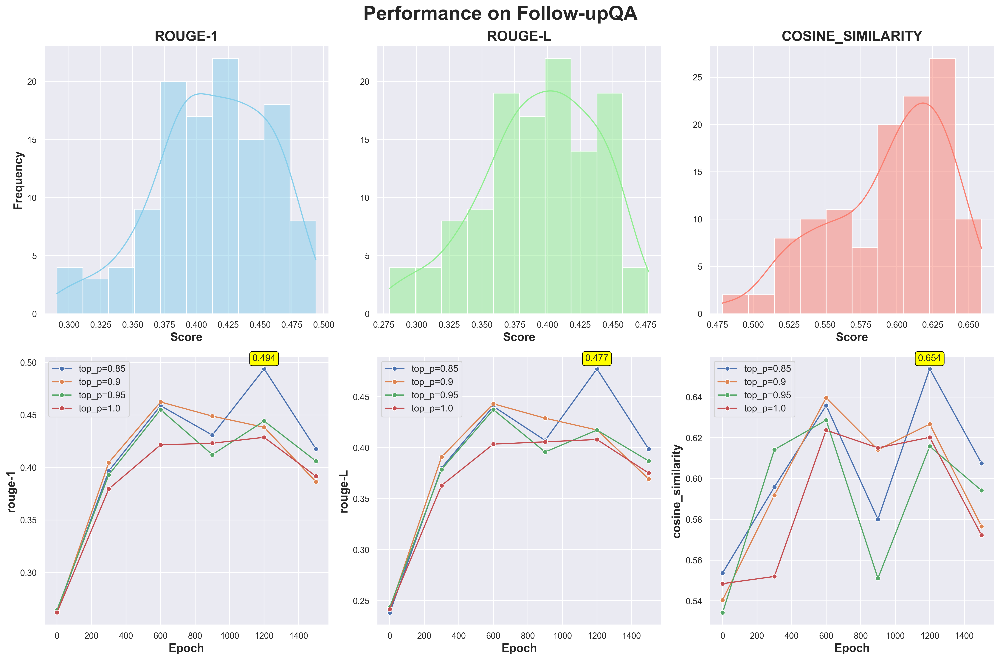

# CuriousLLM 通过结合推理知识图谱的提示，提升了多文档问答的能力。

发布时间：2024年04月13日

`Agent` `问答系统` `知识图谱`

> CuriousLLM: Elevating Multi-Document QA with Reasoning-Infused Knowledge Graph Prompting

# 摘要

> 在问答系统领域，结合大型语言模型和外部数据库的尝试已取得显著成效。但这些方法在处理复杂问答任务时，往往缺乏必要的深度推理能力。为克服这一难题，我们对名为“知识图谱提示”的创新方法进行了优化，该方法通过结合知识图谱与基于大型语言模型的智能体，提升了推理与搜索的精确度。然而，传统的KGP框架不仅需要大量数据集进行昂贵的微调，还难以避免模型产生幻觉。因此，我们设计了一个能够模拟人类好奇心的智能体，通过提出深入问题，更高效地引导搜索过程。这一小小的改变，使得大型语言模型在问答任务上的表现大幅提升，且避免了初始KGP框架的高昂成本和延迟。我们的目标是继续完善这一方法，以期在问答系统领域带来更精确、更迅捷、更经济的解决方案。

> In the field of Question Answering (QA), unifying large language models (LLMs) with external databases has shown great success. However, these methods often fall short in providing the advanced reasoning needed for complex QA tasks. To address these issues, we improve over a novel approach called Knowledge Graph Prompting (KGP), which combines knowledge graphs with a LLM-based agent to improve reasoning and search accuracy. Nevertheless, the original KGP framework necessitates costly fine-tuning with large datasets yet still suffers from LLM hallucination. Therefore, we propose a reasoning-infused LLM agent to enhance this framework. This agent mimics human curiosity to ask follow-up questions to more efficiently navigate the search. This simple modification significantly boosts the LLM performance in QA tasks without the high costs and latency associated with the initial KGP framework. Our ultimate goal is to further develop this approach, leading to more accurate, faster, and cost-effective solutions in the QA domain.

[Arxiv](https://arxiv.org/abs/2404.09077)