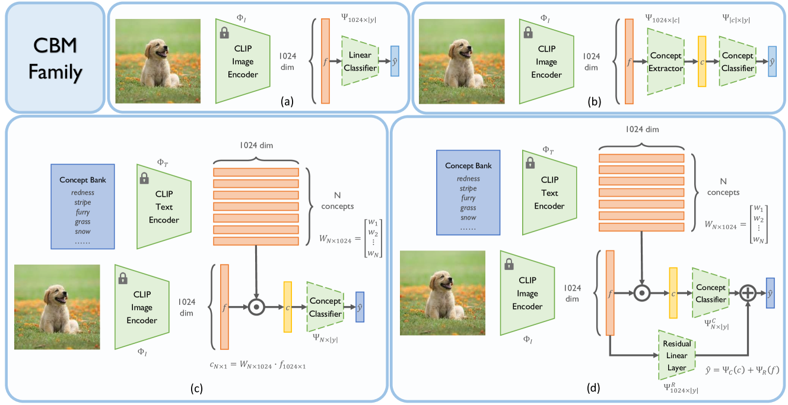
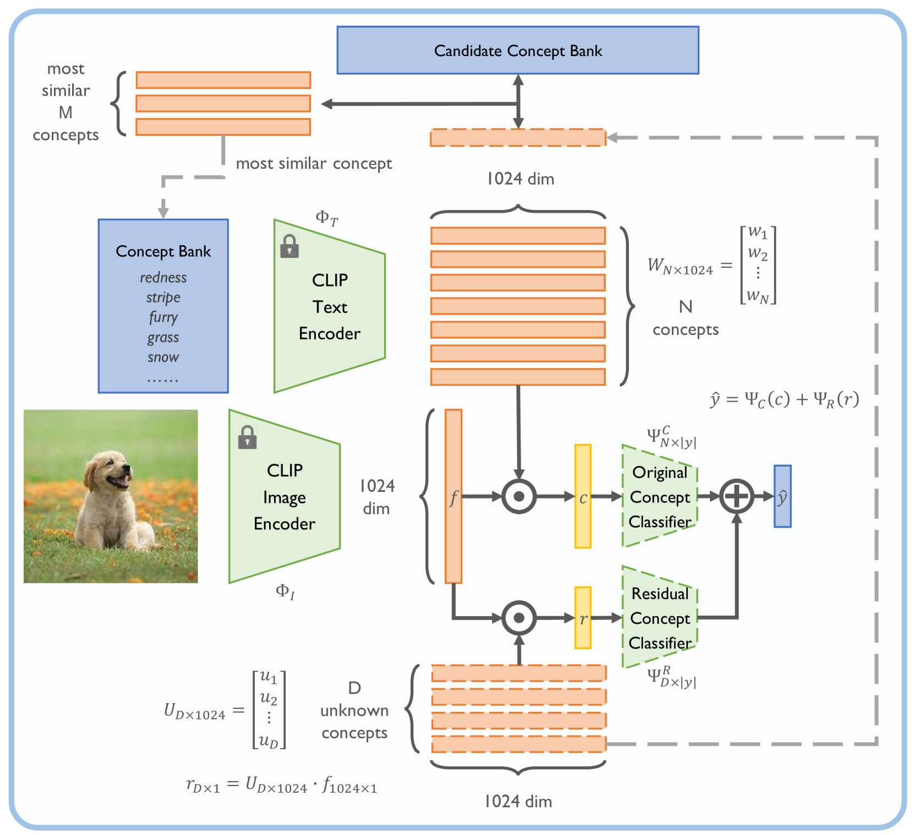
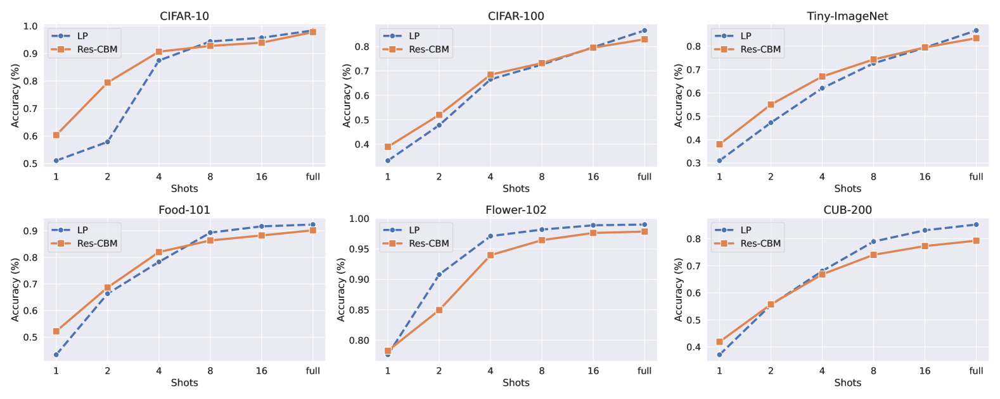
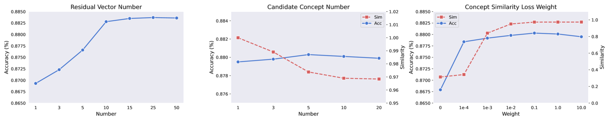
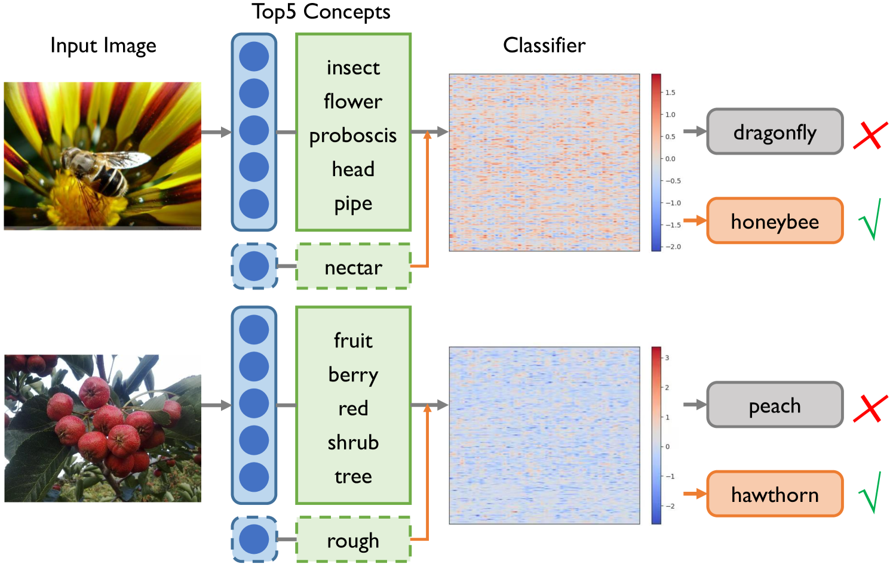

# 逐步深入的残差概念瓶颈模型

发布时间：2024年04月13日

`LLM理论` `计算机视觉`

> Incremental Residual Concept Bottleneck Models

# 摘要

> 概念瓶颈模型（CBMs）通过将深度神经网络提取的视觉信息映射到易于理解的概念上，并利用这些概念进行预测，提高了决策过程的透明度。多模态预训练模型能够将视觉信息与文本概念相结合，无需专家注释即可提炼出清晰的概念瓶颈。尽管如此，构建一个全面的概念库仍然充满挑战，这限制了CBMs的性能发挥。为此，我们提出了一种新的模型——增量残差概念瓶颈模型（Res-CBM），以解决概念完整性的问题。该模型利用可优化的向量补全缺失概念，并通过增量概念发现模块，将含义不清的向量转化为潜在的有效概念。这种方法适用于任何用户自定义的概念库，作为提升CBMs性能的后期处理手段。此外，我们还引入了概念利用效率（CUE）这一新指标，用以衡量CBMs的表现。实验结果显示，Res-CBM在准确率和效率上均超越了现有技术，并在多个数据集上与黑盒模型的表现不相上下。

> Concept Bottleneck Models (CBMs) map the black-box visual representations extracted by deep neural networks onto a set of interpretable concepts and use the concepts to make predictions, enhancing the transparency of the decision-making process. Multimodal pre-trained models can match visual representations with textual concept embeddings, allowing for obtaining the interpretable concept bottleneck without the expertise concept annotations. Recent research has focused on the concept bank establishment and the high-quality concept selection. However, it is challenging to construct a comprehensive concept bank through humans or large language models, which severely limits the performance of CBMs. In this work, we propose the Incremental Residual Concept Bottleneck Model (Res-CBM) to address the challenge of concept completeness. Specifically, the residual concept bottleneck model employs a set of optimizable vectors to complete missing concepts, then the incremental concept discovery module converts the complemented vectors with unclear meanings into potential concepts in the candidate concept bank. Our approach can be applied to any user-defined concept bank, as a post-hoc processing method to enhance the performance of any CBMs. Furthermore, to measure the descriptive efficiency of CBMs, the Concept Utilization Efficiency (CUE) metric is proposed. Experiments show that the Res-CBM outperforms the current state-of-the-art methods in terms of both accuracy and efficiency and achieves comparable performance to black-box models across multiple datasets.

[Arxiv](https://arxiv.org/abs/2404.08978)