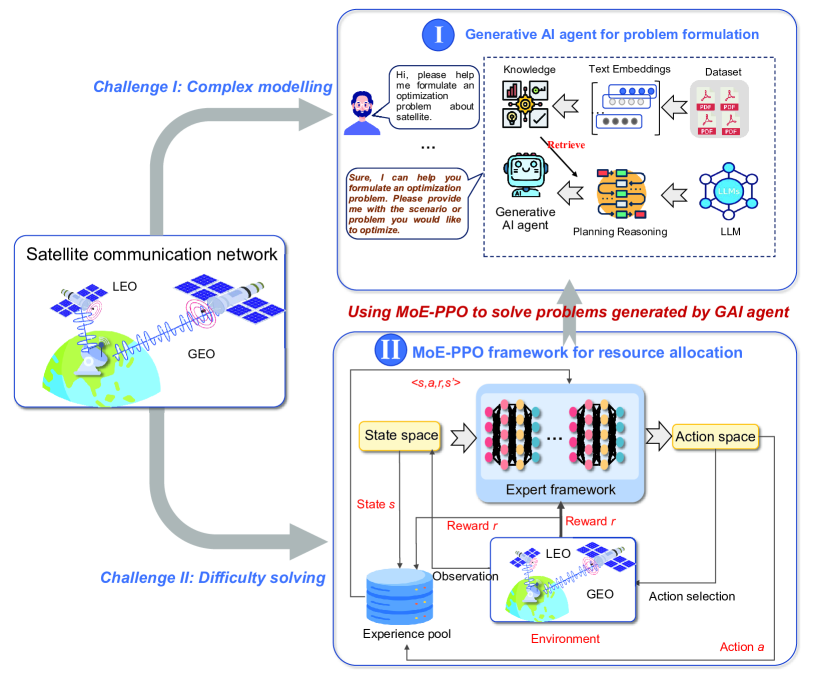
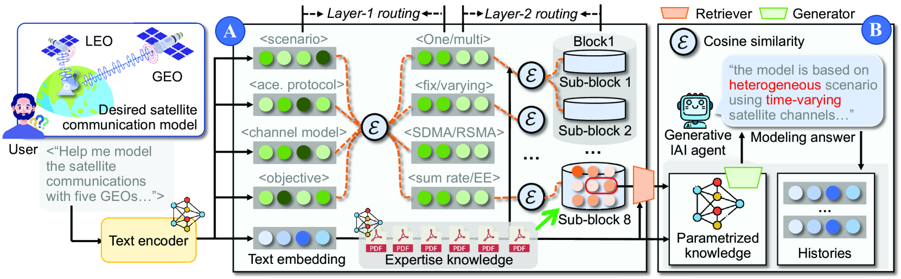
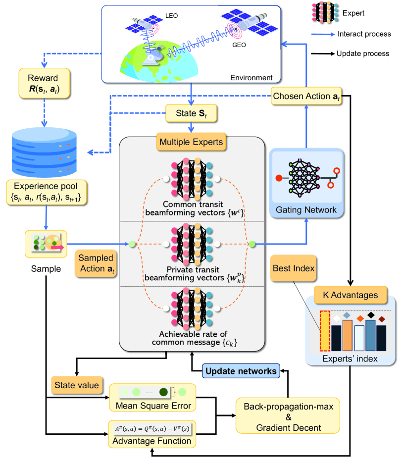
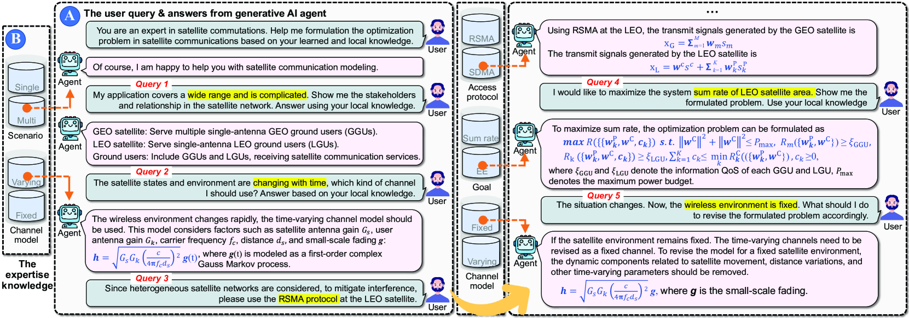
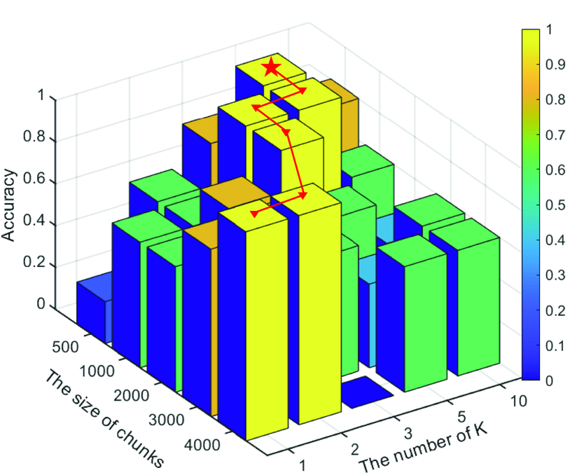
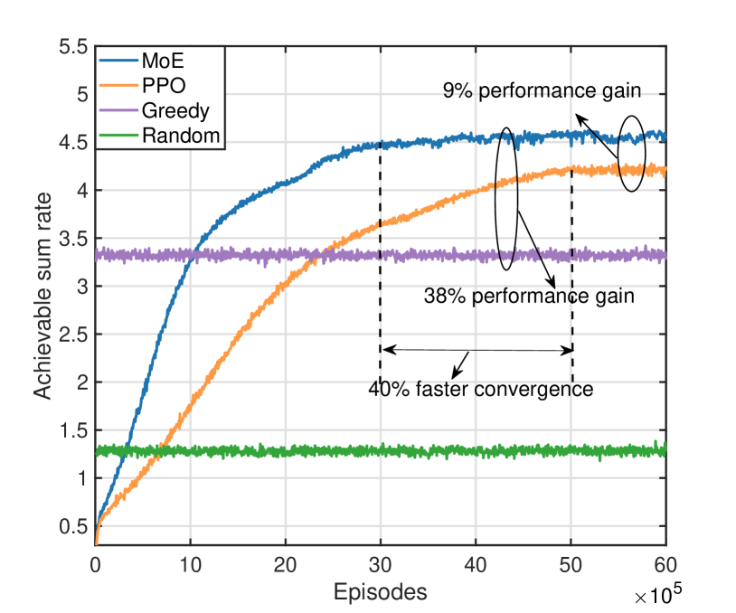
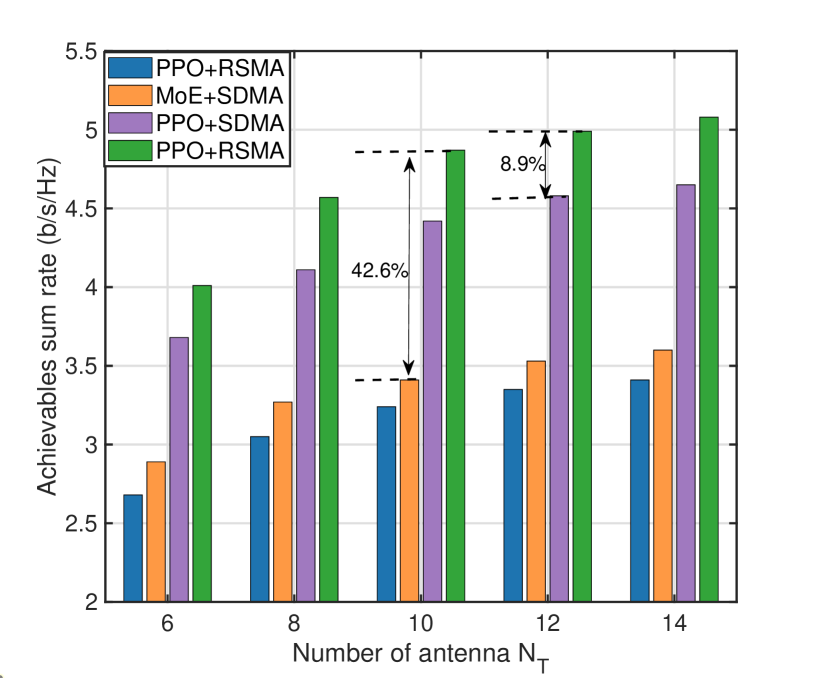
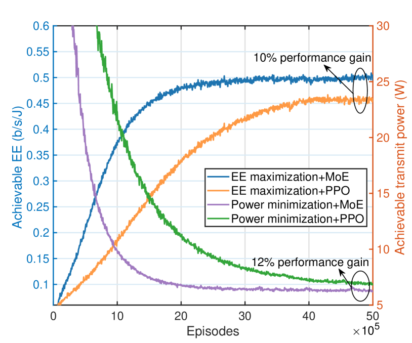

# 本研究探讨了通过专家混合传输技术实现卫星网络中的交互式生成性人工智能代理，旨在提高通信效率和性能。

发布时间：2024年04月13日

`Agent` `人工智能`

> Interactive Generative AI Agents for Satellite Networks through a Mixture of Experts Transmission

# 摘要

> 应对6G通信的挑战，卫星网络成为解决方案的新星。但复杂的系统模型和卫星与用户间的传输干扰仍是发展难题。本文提出一种新策略：运用生成性AI代理进行模型构建，并结合专家混合（MoE）技术制定传输策略。通过大型语言模型（LLMs）打造互动建模新模式，并借助检索增强生成（RAG）技术提取关键的卫星知识，助力数学建模。我们进一步提出MoE-近端策略优化（PPO）方案，让各专家在自己的领域内进行优化，再通过门控网络实现整体优化。模拟表明，我们的方案在问题构建和解决上均展现出准确性与高效性，MoE-PPO方法在多种定制建模问题中表现出色，其适应性得到了验证。

> In response to the needs of 6G global communications, satellite communication networks have emerged as a key solution. However, the large-scale development of satellite communication networks is constrained by the complex system models, whose modeling is challenging for massive users. Moreover, transmission interference between satellites and users seriously affects communication performance. To solve these problems, this paper develops generative artificial intelligence (AI) agents for model formulation and then applies a mixture of experts (MoE) approach to design transmission strategies. Specifically, we leverage large language models (LLMs) to build an interactive modeling paradigm and utilize retrieval-augmented generation (RAG) to extract satellite expert knowledge that supports mathematical modeling. Afterward, by integrating the expertise of multiple specialized components, we propose an MoE-proximal policy optimization (PPO) approach to solve the formulated problem. Each expert can optimize the optimization variables at which it excels through specialized training through its own network and then aggregates them through the gating network to perform joint optimization. The simulation results validate the accuracy and effectiveness of employing a generative agent for problem formulation. Furthermore, the superiority of the proposed MoE-ppo approach over other benchmarks is confirmed in solving the formulated problem. The adaptability of MoE-PPO to various customized modeling problems has also been demonstrated.

[Arxiv](https://arxiv.org/abs/2404.09134)