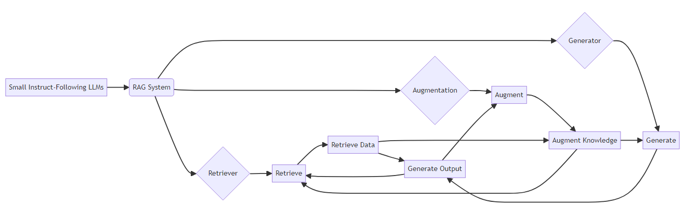
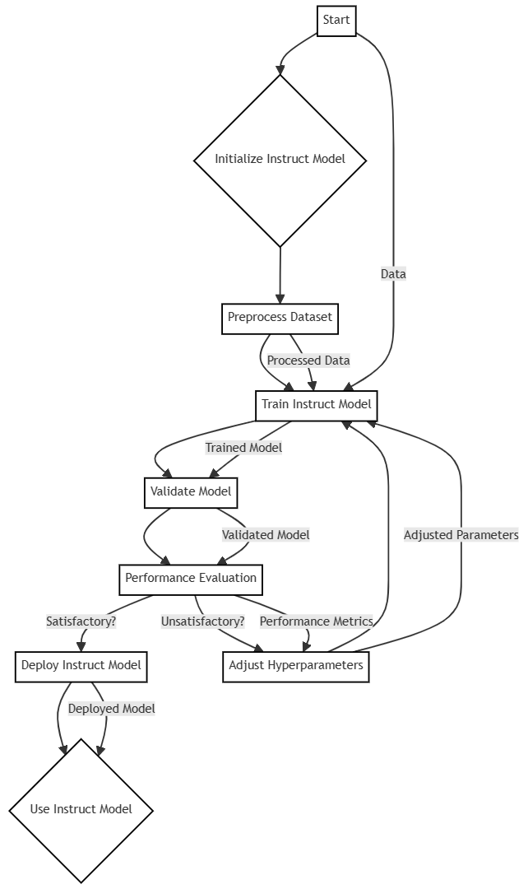
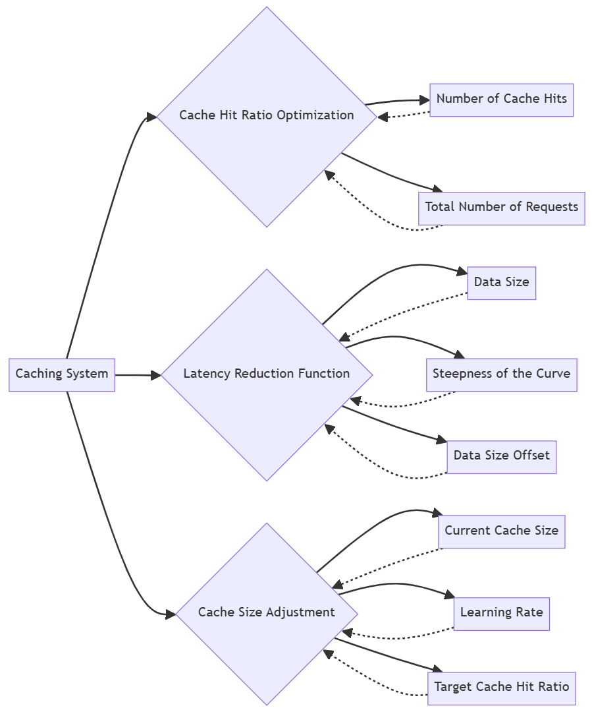

# Mistral 8x7B-v1 版本中，我们迎来了超级 RAGs 的加入。

发布时间：2024年04月13日

`LLM应用` `人工智能`

> Introducing Super RAGs in Mistral 8x7B-v1

# 摘要

> 不断追求提升大型语言模型（LLMs）性能，催生了一种创新方法——超级检索增强生成（Super RAGs），它通过最小化结构改动，整合外部知识库以增强LLMs的能力。本文探讨了将Super RAGs集成至尖端的Mistral 8x7B v1 LLM，并评估了其在提升精确度、速度和用户满意度方面的成效。我们采用了微调指令模型和缓存优化系统，以确保数据检索的高效性和相关性。经过多轮测试，我们在所有评估指标上都观察到了显著的进步。研究结果揭示了Super RAGs在增强LLMs方面的潜力，为构建更高级、更可靠的人工智能系统提供了新途径。本研究通过实证数据证明了Super RAGs的优势，并对其可能的应用场景提供了深入见解，为该领域的发展做出了贡献。

> The relentless pursuit of enhancing Large Language Models (LLMs) has led to the advent of Super Retrieval-Augmented Generation (Super RAGs), a novel approach designed to elevate the performance of LLMs by integrating external knowledge sources with minimal structural modifications. This paper presents the integration of Super RAGs into the Mistral 8x7B v1, a state-of-the-art LLM, and examines the resultant improvements in accuracy, speed, and user satisfaction. Our methodology uses a fine-tuned instruct model setup and a cache tuning fork system, ensuring efficient and relevant data retrieval. The evaluation, conducted over several epochs, demonstrates significant enhancements across all metrics. The findings suggest that Super RAGs can effectively augment LLMs, paving the way for more sophisticated and reliable AI systems. This research contributes to the field by providing empirical evidence of the benefits of Super RAGs and offering insights into their potential applications.

[Arxiv](https://arxiv.org/abs/2404.08940)