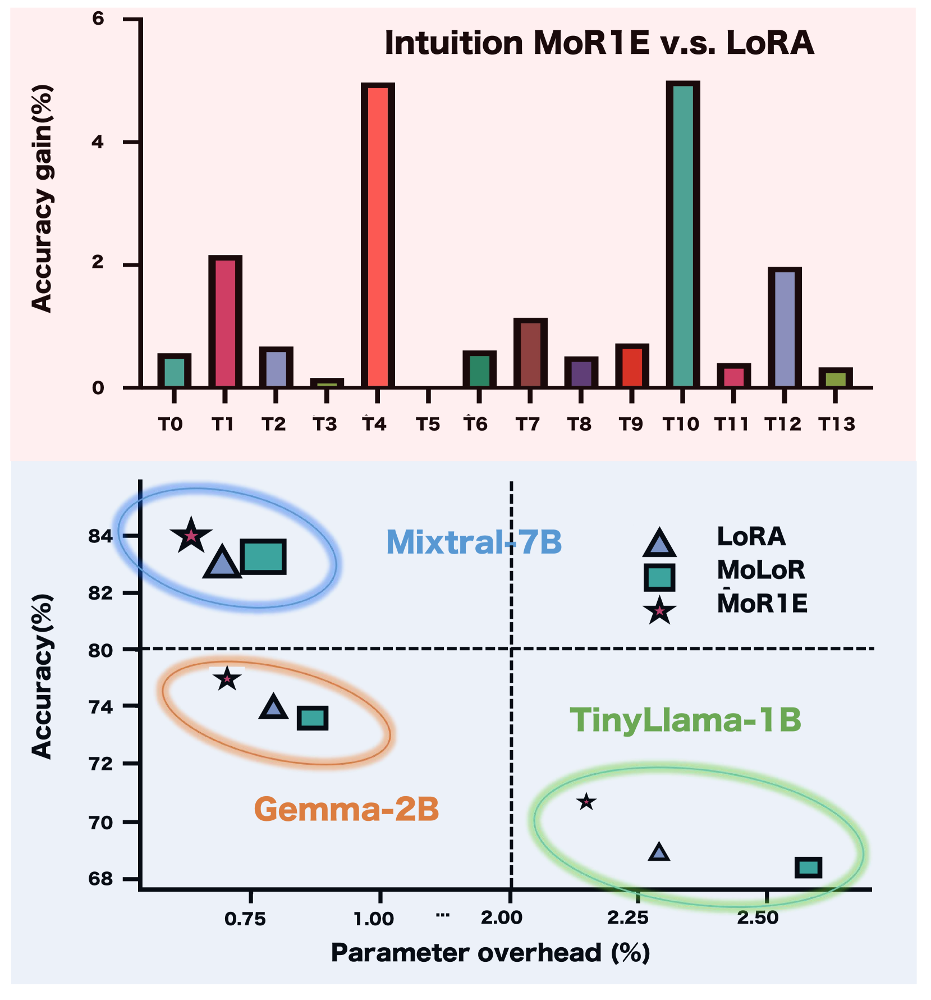
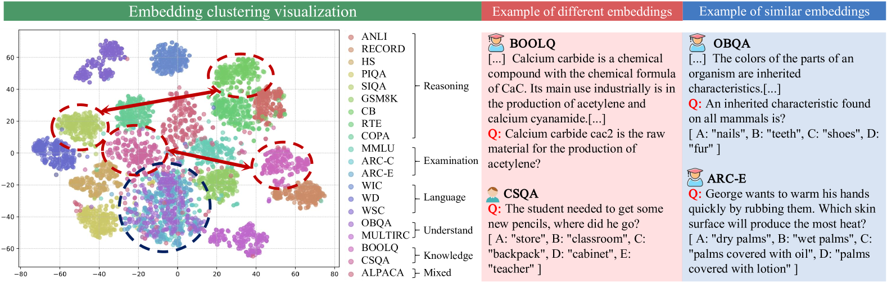
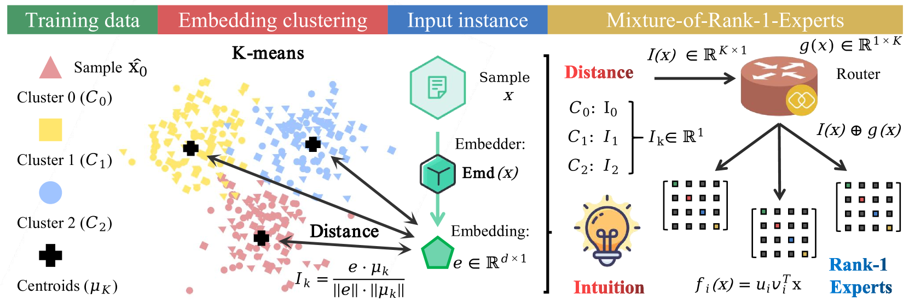
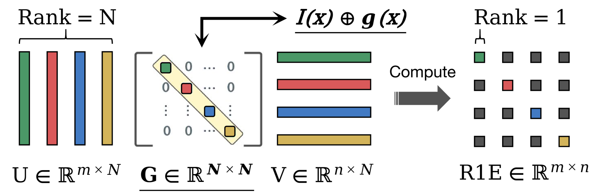
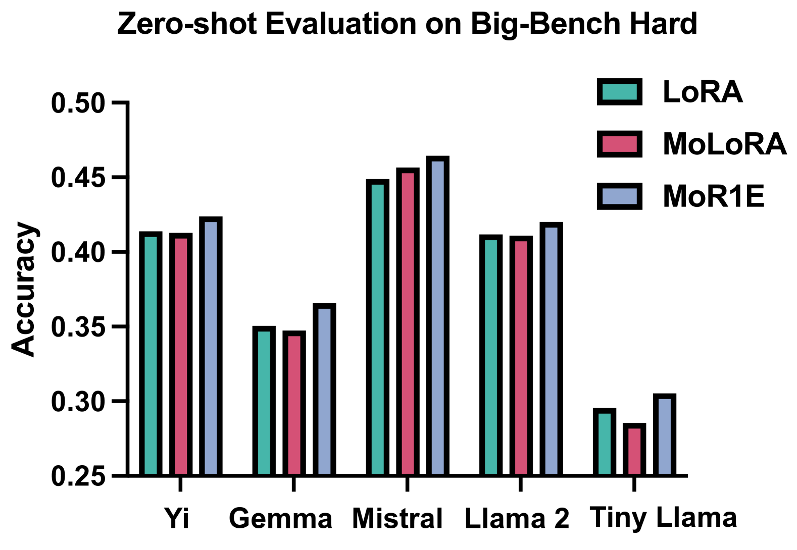

# 在参数高效微调中，我们引入了一种直觉感知的混合Rank-1专家模型，旨在通过熵正则化来优化模型性能。

发布时间：2024年04月13日

`LLM理论` `多媒体` `人工智能`

> Intuition-aware Mixture-of-Rank-1-Experts for Parameter Efficient Finetuning

# 摘要

> 大型语言模型（LLMs）在多媒体领域的多样化任务中展现出巨大潜力，从内容创作到互动娱乐，再到艺术创作，无所不包。然而，多任务环境下任务的多样性对LLMs构成了严峻的适应挑战。传统方法在单一密集模型上常遭遇知识混淆的问题，而专家混合（MoE）架构以其稀疏性有效实现了任务解耦，成为一大突破。我们借鉴人类认知神经科学的原理，构建了\texttt{Intuition-MoR1E}这一创新框架，通过实例的语义聚类模拟人脑处理多任务的机制，为特征分配的优化提供隐式指导。我们还引入了先进的Rank-1 Experts模型，有效管理多样直觉，提升了多任务LLM微调的参数效率和效果。经过广泛测试，Intuition-MoR1E在14个公共数据集上相较于其他先进方法，实现了更佳的效率和2.15%的准确率提升。

> Large Language Models (LLMs) have demonstrated significant potential in performing multiple tasks in multimedia applications, ranging from content generation to interactive entertainment, and artistic creation. However, the diversity of downstream tasks in multitask scenarios presents substantial adaptation challenges for LLMs. While traditional methods often succumb to knowledge confusion on their monolithic dense models, Mixture-of-Experts (MoE) has been emerged as a promising solution with its sparse architecture for effective task decoupling. Inspired by the principles of human cognitive neuroscience, we design a novel framework \texttt{Intuition-MoR1E} that leverages the inherent semantic clustering of instances to mimic the human brain to deal with multitask, offering implicit guidance to router for optimized feature allocation. Moreover, we introduce cutting-edge Rank-1 Experts formulation designed to manage a spectrum of intuitions, demonstrating enhanced parameter efficiency and effectiveness in multitask LLM finetuning. Extensive experiments demonstrate that Intuition-MoR1E achieves superior efficiency and 2.15\% overall accuracy improvement across 14 public datasets against other state-of-the-art baselines.

[Arxiv](https://arxiv.org/abs/2404.08985)