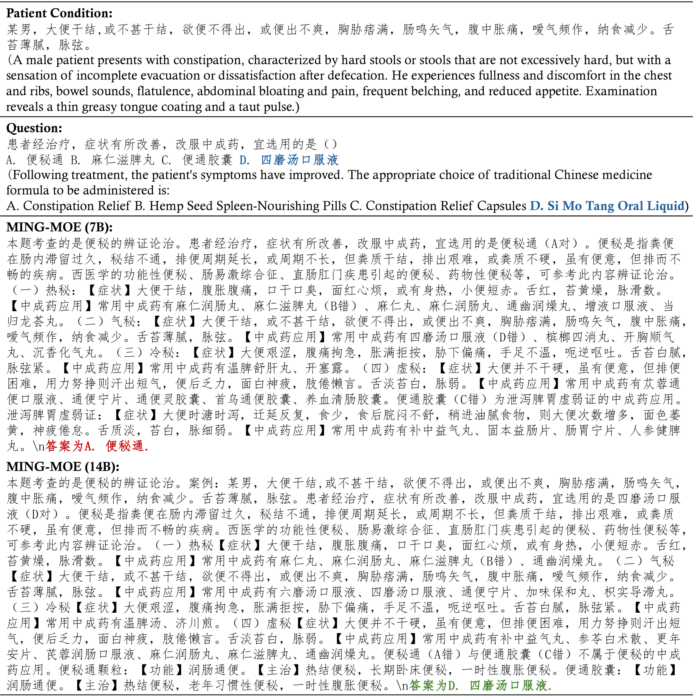

# MING-MOE 通过引入稀疏的低秩适配器专家混合技术，旨在提升大型语言模型在医学多任务学习领域的性能。

发布时间：2024年04月13日

`LLM应用` `语言模型`

> MING-MOE: Enhancing Medical Multi-Task Learning in Large Language Models with Sparse Mixture of Low-Rank Adapter Experts

# 摘要

> 像 ChatGPT 这样的大型语言模型在理解和生成自然语言方面取得了巨大进步，尤其在医学领域显示出其重要价值。然而，医学任务的复杂性和多样性带来了挑战，这些任务往往需要处理多种问题。以往的解决方案虽然有所帮助，但在现实应用中因为需要特定任务的注释而受到限制，这影响了模型的广泛应用。本文提出了 MING-MOE，这是一种创新的基于专家混合（MOE）技术的医学大型语言模型，它能够处理各种复杂的医学任务，而无需任何特定任务的注释，极大地提升了模型的实用性。MING-MOE 运用了低秩适应（MoLoRA）技术，通过保持基础模型参数不变，仅调整一小部分可训练参数，实现了参数的高效利用。实验证明，MING-MOE 在超过 20 个医学相关任务上达到了业界领先水平，相比现有模型有了显著提升。这一方法不仅推动了医学语言模型的发展，还提高了模型的推理效率。

> Large language models like ChatGPT have shown substantial progress in natural language understanding and generation, proving valuable across various disciplines, including the medical field. Despite advancements, challenges persist due to the complexity and diversity inherent in medical tasks which often require multi-task learning capabilities. Previous approaches, although beneficial, fall short in real-world applications because they necessitate task-specific annotations at inference time, limiting broader generalization. This paper introduces MING-MOE, a novel Mixture-of-Expert~(MOE)-based medical large language model designed to manage diverse and complex medical tasks without requiring task-specific annotations, thus enhancing its usability across extensive datasets. MING-MOE employs a Mixture of Low-Rank Adaptation (MoLoRA) technique, allowing for efficient parameter usage by maintaining base model parameters static while adapting through a minimal set of trainable parameters. We demonstrate that MING-MOE achieves state-of-the-art (SOTA) performance on over 20 medical tasks, illustrating a significant improvement over existing models. This approach not only extends the capabilities of medical language models but also improves inference efficiency.

[Arxiv](https://arxiv.org/abs/2404.09027)