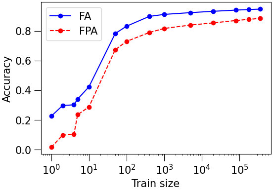
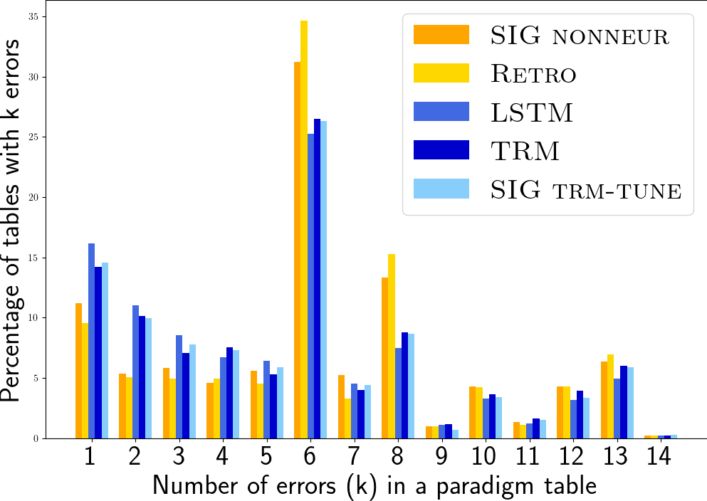

# 词汇表之外的词汇（OOVs）备受关注：我们该如何调整它们呢？

发布时间：2024年04月13日

`Agent` `形态分析`

> OOVs in the Spotlight: How to Inflect them?

# 摘要

> 我们专注于形态变化在词汇表之外（OOV）的情况，这一领域尚未得到充分研究，现有顶尖系统的表现也不理想。我们构建了三种系统：一个逆向模型和两个基于LSTM与Transformer的序列到序列（seq2seq）模型。为了测试OOV条件下的表现，我们自动搜集了形态丰富的捷克语名词的庞大数据集，并进行了词形不重叠的数据划分，同时手动为现实世界中的新词创建了OOV注释数据集。在典型的OOV条件下，Transformer模型展现出最佳性能，并且与LSTM、逆向模型以及SIGMORPHON基准线的集成进一步提升了性能。在现实世界的新词OOV数据集测试中，逆向模型超越了所有神经网络模型。此外，我们的seq2seq模型在SIGMORPHON 2022共享任务的16种语言中的9种达到了最新水平（在大型数据条件下的OOV评估中存在特征重叠）。我们发布了捷克语OOV变形数据集，用于在OOV条件下进行严谨的评估。同时，我们将seq2seq模型的变形系统作为一个方便使用的Python库对外发布。

> We focus on morphological inflection in out-of-vocabulary (OOV) conditions, an under-researched subtask in which state-of-the-art systems usually are less effective. We developed three systems: a retrograde model and two sequence-to-sequence (seq2seq) models based on LSTM and Transformer. For testing in OOV conditions, we automatically extracted a large dataset of nouns in the morphologically rich Czech language, with lemma-disjoint data splits, and we further manually annotated a real-world OOV dataset of neologisms. In the standard OOV conditions, Transformer achieves the best results, with increasing performance in ensemble with LSTM, the retrograde model and SIGMORPHON baselines. On the real-world OOV dataset of neologisms, the retrograde model outperforms all neural models. Finally, our seq2seq models achieve state-of-the-art results in 9 out of 16 languages from SIGMORPHON 2022 shared task data in the OOV evaluation (feature overlap) in the large data condition. We release the Czech OOV Inflection Dataset for rigorous evaluation in OOV conditions. Further, we release the inflection system with the seq2seq models as a ready-to-use Python library.

[Arxiv](https://arxiv.org/abs/2404.08974)