# 实用数字生成（PracticalDG）：通过在视觉-语言模型中应用扰动蒸馏技术，实现跨领域的有效泛化。

发布时间：2024年04月13日

`RAG` `领域泛化` `视觉-语言模型`

> PracticalDG: Perturbation Distillation on Vision-Language Models for Hybrid Domain Generalization

# 摘要

> 领域泛化（DG）致力于缓解不同领域间的数据分布差异，传统方法假设源领域和目标领域数据类别相同。但实际上，目标领域中总有未知类别。为应对这一挑战，开放集领域泛化（OSDG）应势而生，并提出若干专门技术。尽管如此，现有方法多采用复杂结构，相较于DG的提升微乎其微。近期，视觉-语言模型（VLMs）通过微调进入DG领域，却因庞大的训练成本而受限。本研究创新性地将VLMs知识迁移至轻量级视觉模型，并通过引入SCI-PD（从得分、类别、实例三方面进行扰动蒸馏）来增强模型鲁棒性。此外，传统方法忽视了源领域间的差异，仅依赖固定分割的基准测试。我们的新基准HDG和$H^{2}$-CV度量通过构建多样化分割，全面评估算法鲁棒性，揭示了传统方法在性能上的急剧衰退。实验证明，我们的方法在多个数据集上超越了当前最先进的算法，特别是在数据匮乏的情况下，鲁棒性得到了显著提升。

> Domain Generalization (DG) aims to resolve distribution shifts between source and target domains, and current DG methods are default to the setting that data from source and target domains share identical categories. Nevertheless, there exists unseen classes from target domains in practical scenarios. To address this issue, Open Set Domain Generalization (OSDG) has emerged and several methods have been exclusively proposed. However, most existing methods adopt complex architectures with slight improvement compared with DG methods. Recently, vision-language models (VLMs) have been introduced in DG following the fine-tuning paradigm, but consume huge training overhead with large vision models. Therefore, in this paper, we innovate to transfer knowledge from VLMs to lightweight vision models and improve the robustness by introducing Perturbation Distillation (PD) from three perspectives, including Score, Class and Instance (SCI), named SCI-PD. Moreover, previous methods are oriented by the benchmarks with identical and fixed splits, ignoring the divergence between source domains. These methods are revealed to suffer from sharp performance decay with our proposed new benchmark Hybrid Domain Generalization (HDG) and a novel metric $H^{2}$-CV, which construct various splits to comprehensively assess the robustness of algorithms. Extensive experiments demonstrate that our method outperforms state-of-the-art algorithms on multiple datasets, especially improving the robustness when confronting data scarcity.

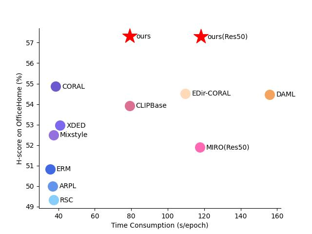

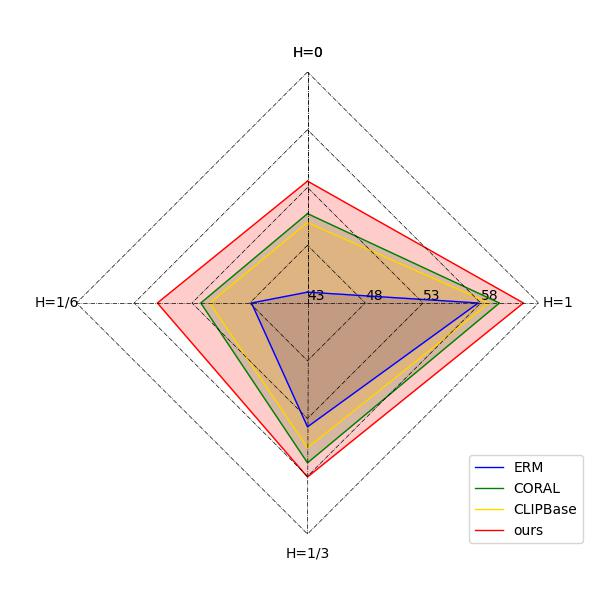

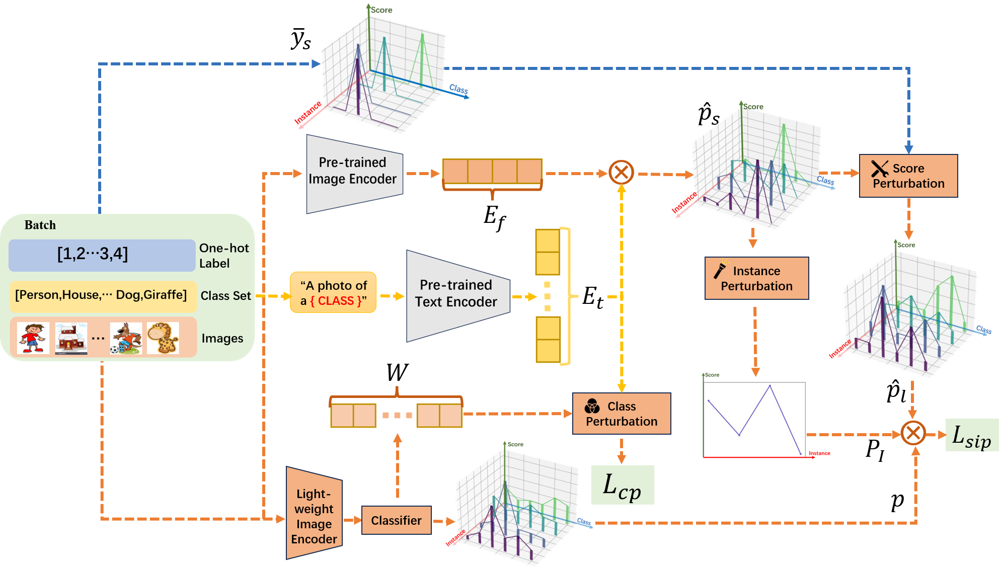

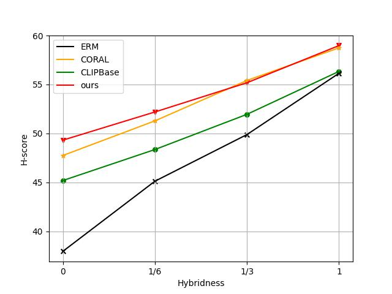

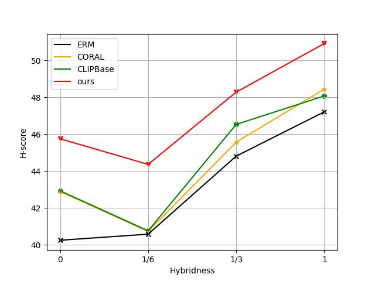

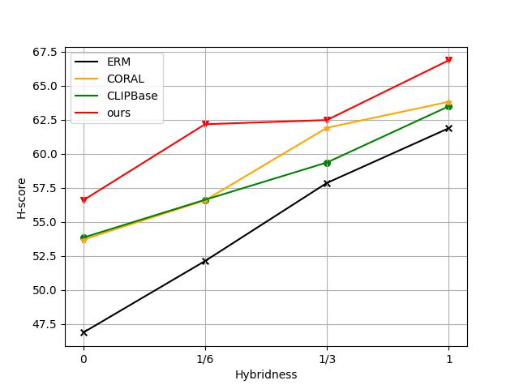

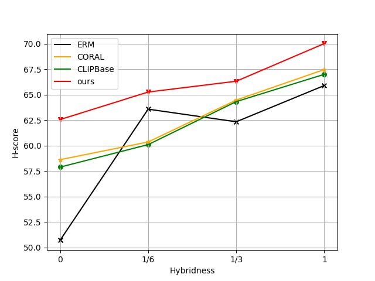

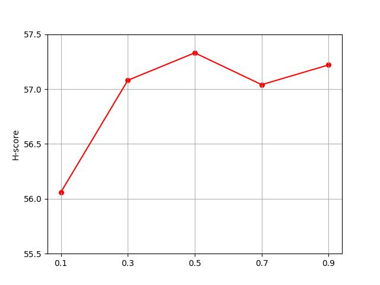

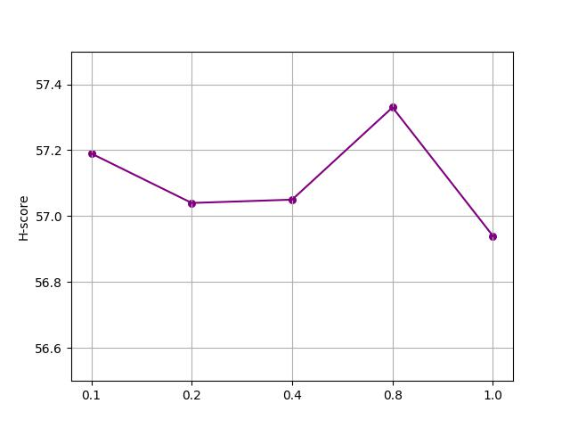

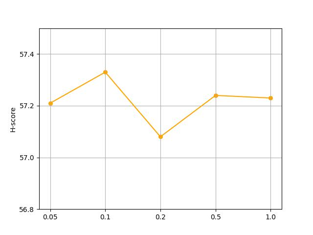

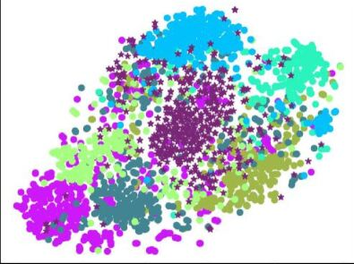

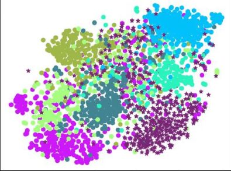

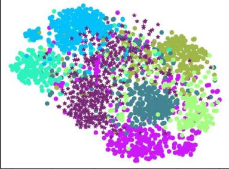

[Arxiv](https://arxiv.org/abs/2404.09011)