# RoNID：探索新意图，借助生成的可靠标签与便于聚类的表示法

发布时间：2024年04月13日

`Agent` `人工智能`

> RoNID: New Intent Discovery with Generated-Reliable Labels and Cluster-friendly Representations

# 摘要

> 新意图发现（NID）力图在不断变化的环境中识别并推断出新的意图群体。然而，现有技术在处理伪标签的准确性和提升表示学习能力方面存在不足，这不仅影响了模型的整体表现，还降低了其准确性和调整兰德指数。为了克服这些难题，我们提出了一种鲁棒新意图发现（RoNID）框架，该框架采用EM算法风格进行优化，专注于打造可信的伪标签和易于聚类的区分性表示。RoNID框架包含两大核心组件：一是生成可信伪标签的模块，它通过解决最优传输问题来提供高质量的监督信号；二是学习集群友好表示的模块，它结合了集群内外的对比学习，以增强模型的区分能力。通过迭代应用RoNID，我们能够构建出一个更为稳健的模型，其在多个标准测试中相较于传统方法取得了显著提升，得分提高了1至4分。

> New Intent Discovery (NID) strives to identify known and reasonably deduce novel intent groups in the open-world scenario. But current methods face issues with inaccurate pseudo-labels and poor representation learning, creating a negative feedback loop that degrades overall model performance, including accuracy and the adjusted rand index. To address the aforementioned challenges, we propose a Robust New Intent Discovery (RoNID) framework optimized by an EM-style method, which focuses on constructing reliable pseudo-labels and obtaining cluster-friendly discriminative representations. RoNID comprises two main modules: reliable pseudo-label generation module and cluster-friendly representation learning module. Specifically, the pseudo-label generation module assigns reliable synthetic labels by solving an optimal transport problem in the E-step, which effectively provides high-quality supervised signals for the input of the cluster-friendly representation learning module. To learn cluster-friendly representation with strong intra-cluster compactness and large inter-cluster separation, the representation learning module combines intra-cluster and inter-cluster contrastive learning in the M-step to feed more discriminative features into the generation module. RoNID can be performed iteratively to ultimately yield a robust model with reliable pseudo-labels and cluster-friendly representations. Experimental results on multiple benchmarks demonstrate our method brings substantial improvements over previous state-of-the-art methods by a large margin of +1~+4 points.

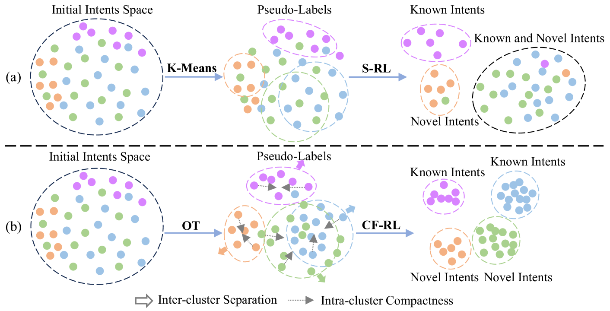

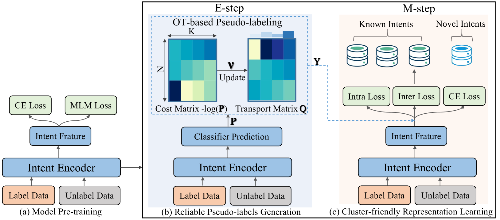

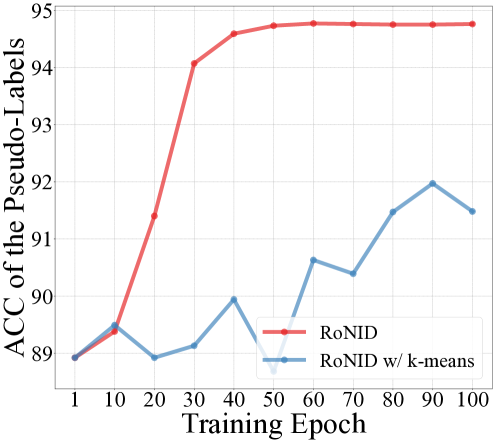

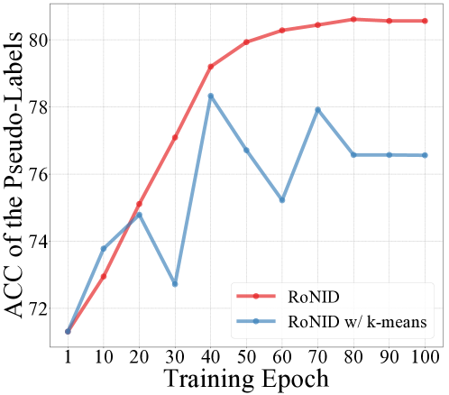

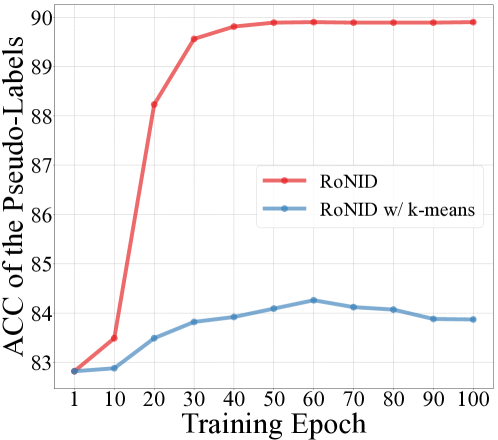

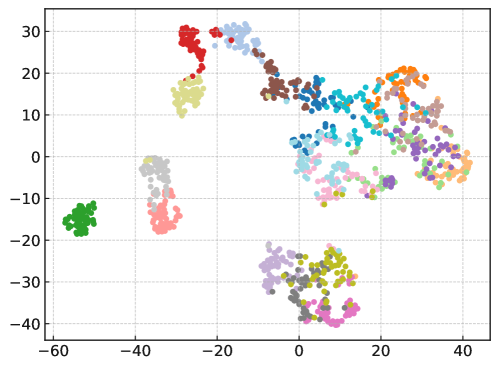

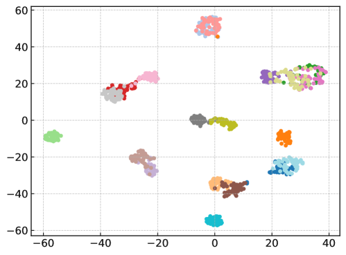

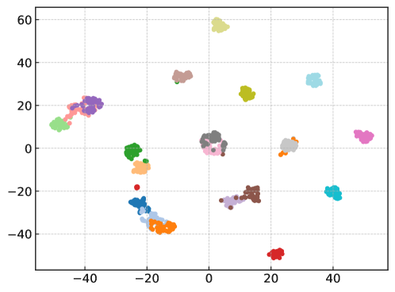

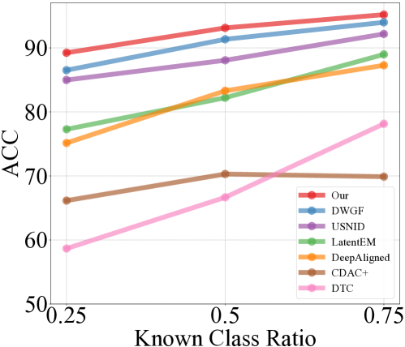

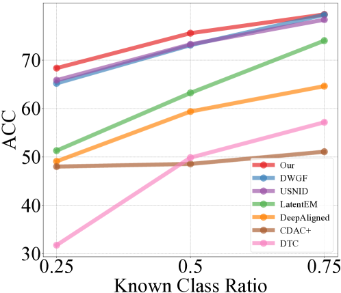

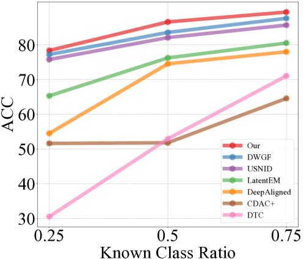

[Arxiv](https://arxiv.org/abs/2404.08977)