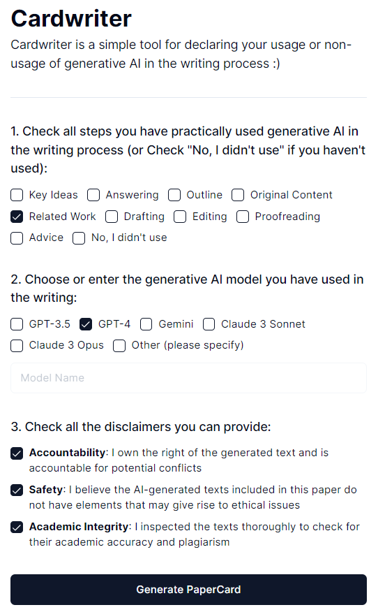

# 写作过程中使用生成型AI需注意三大免责声明：这是一份为报告而生的卡片式指南。

发布时间：2024年04月13日

`LLM应用` `学术写作` `生成式AI`

> Three Disclaimers for Safe Disclosure: A Cardwriter for Reporting the Use of Generative AI in Writing Process

# 摘要

> 生成式AI和大型语言模型在学术写作领域的应用日益广泛，尽管目前尚无统一的标准来记录机器辅助的使用。我们设计了“Cardwriter”，一个用户友好的界面，它能帮助作者快速生成一份简短声明，披露他们在创作过程中对生成式AI的运用。该演示已上线，可通过 https://cardwriter.vercel.app 访问体验。

> Generative artificial intelligence (AI) and large language models (LLMs) are increasingly being used in the academic writing process. This is despite the current lack of unified framework for reporting the use of machine assistance. In this work, we propose "Cardwriter", an intuitive interface that produces a short report for authors to declare their use of generative AI in their writing process. The demo is available online, at https://cardwriter.vercel.app

[Arxiv](https://arxiv.org/abs/2404.09041)