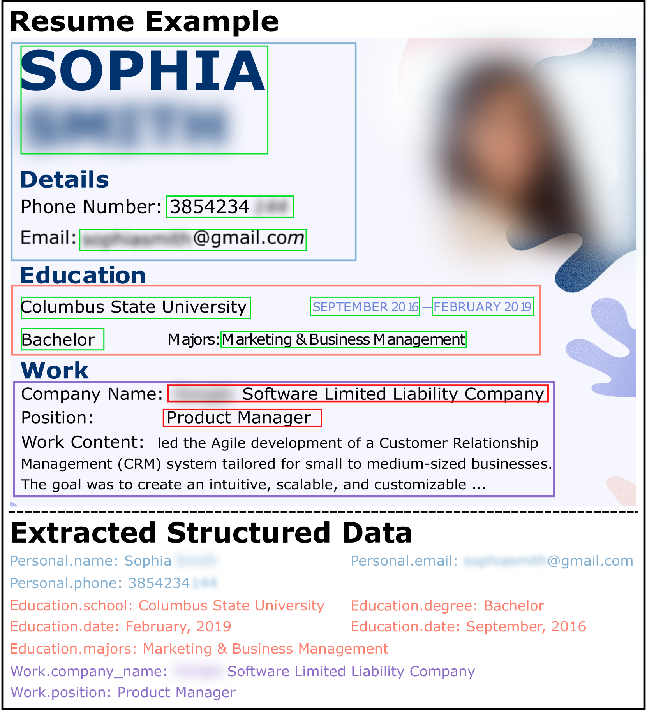
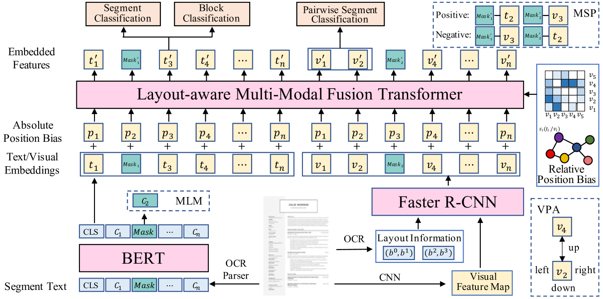

# 迈向高效简历解析：采用多粒度多模态的预训练策略

发布时间：2024年04月13日

`分类：Agent` `自动化信息抽取`

> Towards Efficient Resume Understanding: A Multi-Granularity Multi-Modal Pre-Training Approach

# 摘要

> 在当今数字化招聘盛行的背景下，自动从简历中抽取结构化信息的简历理解任务，已被公认为一项基础而关键的工作。相较于传统的基于规则的方法，采用最新的预训练文档理解模型能显著提升简历理解的效率。尽管如此，现有技术往往忽视了简历中结构化信息的层级关系，导致在解析简历时效率不高。针对这一问题，本文提出了一种创新模型——ERU，以提高简历理解的效率。具体而言，我们首先引入了一个融合文本、视觉和布局信息的布局感知多模态融合变换器，用于编码简历中的各个部分。接着，我们设计了三个自监督学习任务，利用大量未标注的简历数据对这一模块进行预训练。然后，通过多粒度的序列标注任务对模型进行微调，以抽取简历中的结构化信息。最终，我们在真实世界数据集上进行的广泛实验清楚地证明了ERU模型的有效性。

> In the contemporary era of widespread online recruitment, resume understanding has been widely acknowledged as a fundamental and crucial task, which aims to extract structured information from resume documents automatically. Compared to the traditional rule-based approaches, the utilization of recently proposed pre-trained document understanding models can greatly enhance the effectiveness of resume understanding. The present approaches have, however, disregarded the hierarchical relations within the structured information presented in resumes, and have difficulty parsing resumes in an efficient manner. To this end, in this paper, we propose a novel model, namely ERU, to achieve efficient resume understanding. Specifically, we first introduce a layout-aware multi-modal fusion transformer for encoding the segments in the resume with integrated textual, visual, and layout information. Then, we design three self-supervised tasks to pre-train this module via a large number of unlabeled resumes. Next, we fine-tune the model with a multi-granularity sequence labeling task to extract structured information from resumes. Finally, extensive experiments on a real-world dataset clearly demonstrate the effectiveness of ERU.

[Arxiv](https://arxiv.org/abs/2404.13067)