# 后见之明并不总是清晰透彻：探究大型语言模型反思性思维的边界

发布时间：2024年04月13日

`LLM理论` `人工智能`

> When Hindsight is Not 20/20: Testing Limits on Reflective Thinking in Large Language Models

# 摘要

> 最新研究揭示，自我反思式提示能显著增强大型语言模型的推理本领。但以外部反馈为终止标准让人质疑LLMs模拟人类自我反思的真实能力。本文旨在一个不允许外部反馈的严格评估环境中，阐明LLMs的这一能力。研究发现，在TruthfulQA任务中自我反思能提升表现，而在HotpotQA中却适得其反。深入分析这些现象背后的因素，我们发现自我反思的效果受到模型初次回答准确性和问题难度的共同影响：在模型初步正确率较低和问题较难的情况下，自我反思的优势最为明显。此外，自我反思还能减少模型的从众投票趋势。根据研究结果，我们提出了何时采用自我反思的操作建议，并在https://github.com/yanhong-lbh/LLM-SelfReflection-Eval上公开了实验代码。

> Recent studies suggest that self-reflective prompting can significantly enhance the reasoning capabilities of Large Language Models (LLMs). However, the use of external feedback as a stop criterion raises doubts about the true extent of LLMs' ability to emulate human-like self-reflection. In this paper, we set out to clarify these capabilities under a more stringent evaluation setting in which we disallow any kind of external feedback. Our findings under this setting show a split: while self-reflection enhances performance in TruthfulQA, it adversely affects results in HotpotQA. We conduct follow-up analyses to clarify the contributing factors in these patterns, and find that the influence of self-reflection is impacted both by reliability of accuracy in models' initial responses, and by overall question difficulty: specifically, self-reflection shows the most benefit when models are less likely to be correct initially, and when overall question difficulty is higher. We also find that self-reflection reduces tendency toward majority voting. Based on our findings, we propose guidelines for decisions on when to implement self-reflection. We release the codebase for reproducing our experiments at https://github.com/yanhong-lbh/LLM-SelfReflection-Eval.

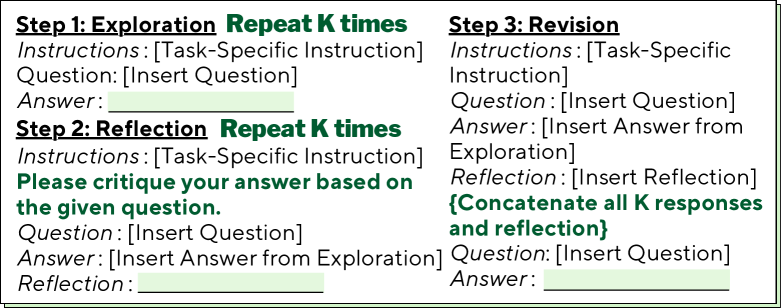

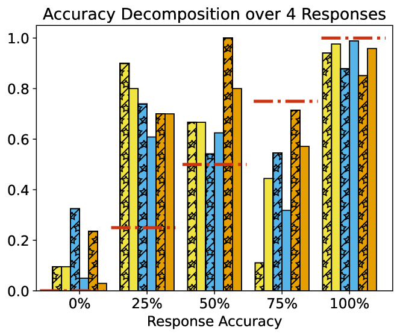

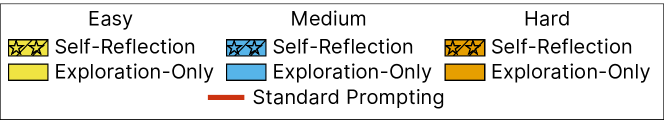

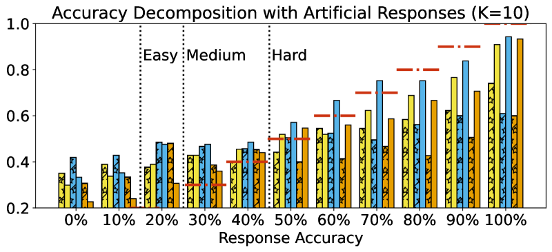

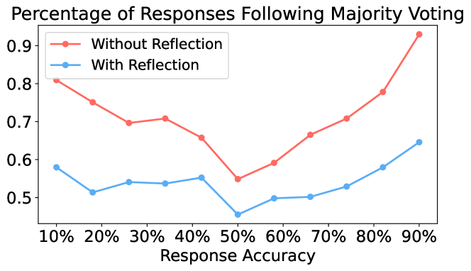

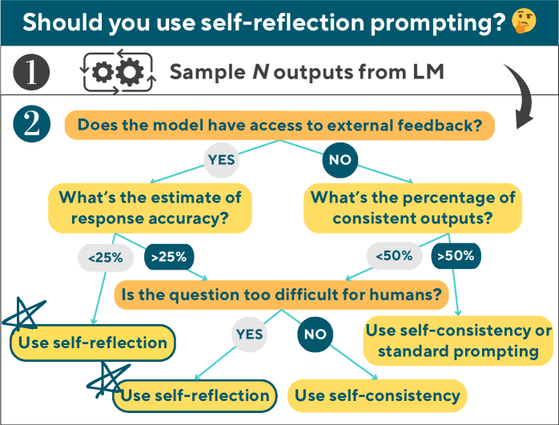

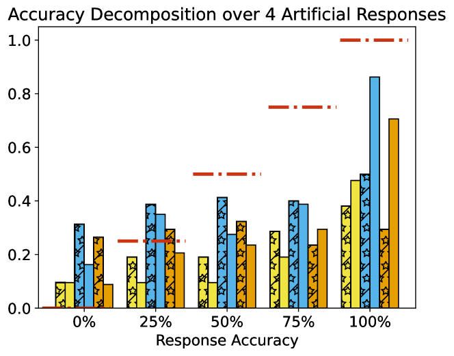

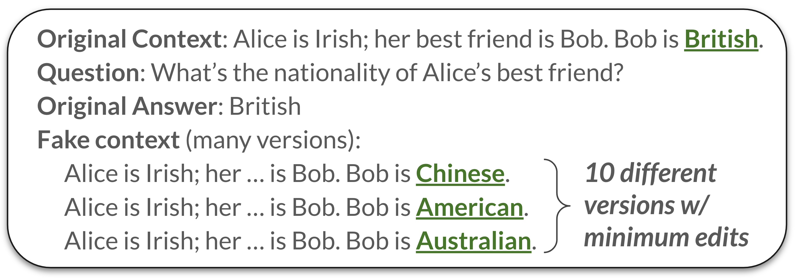

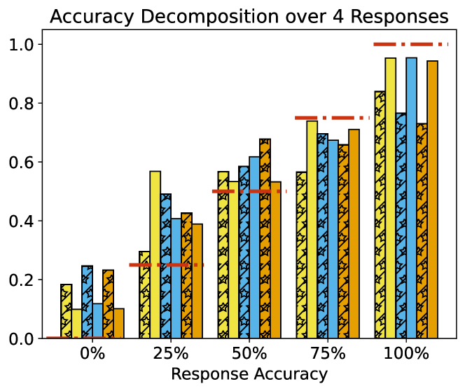

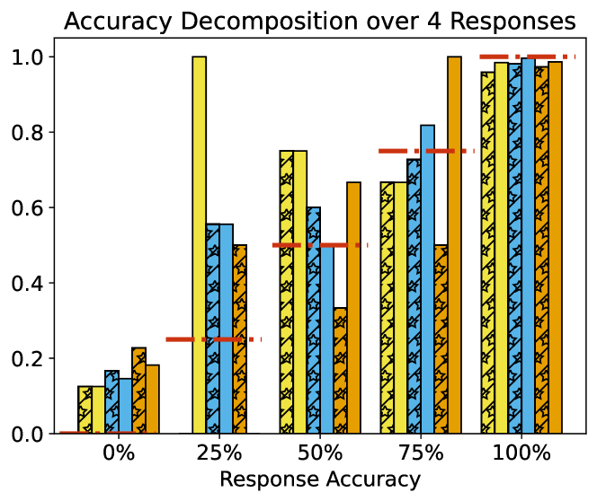

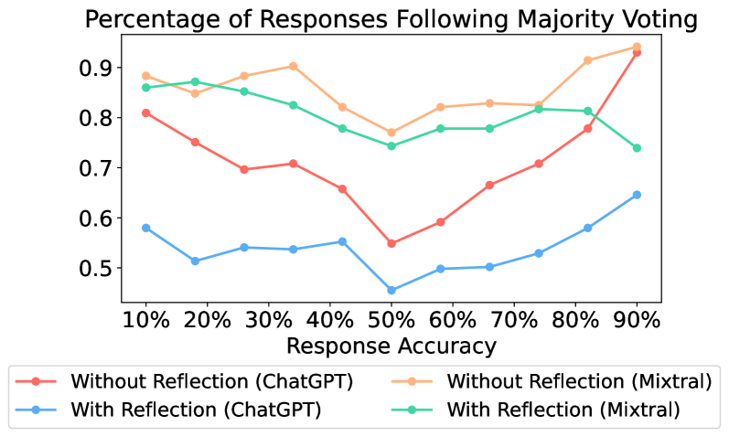

[Arxiv](https://arxiv.org/abs/2404.09129)