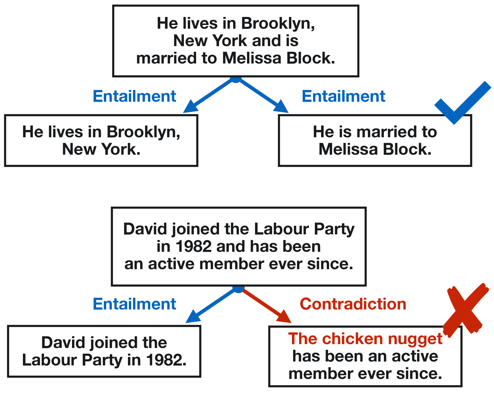

# WikiSplit++：轻松优化数据，让分割与改述更简单

发布时间：2024年04月13日

`RAG` `数据集优化`

> WikiSplit++: Easy Data Refinement for Split and Rephrase

# 摘要

> 通过分割和改述（Split and Rephrase）任务，将复杂句子拆解为多个意义相同的简单句子，能有效提升自然语言处理（NLP）任务的可读性和性能。尽管利用经过大规模数据集优化的编码器-解码器模型的文本生成方法能提升这一任务的效果，但它仍存在产生幻觉和分割不足的问题。为此，本研究提出了一种简洁而有效的数据优化策略。我们通过筛选掉WikiSplit中复杂句子未能至少包含一个简单句子的案例，并对简单句子的引用顺序进行调整，创建了升级版的WikiSplit++。实验结果显示，使用WikiSplit++进行的训练在性能上超越了WikiSplit，特别是在分割数量和避免幻觉方面取得了显著进步。

> The task of Split and Rephrase, which splits a complex sentence into multiple simple sentences with the same meaning, improves readability and enhances the performance of downstream tasks in natural language processing (NLP). However, while Split and Rephrase can be improved using a text-to-text generation approach that applies encoder-decoder models fine-tuned with a large-scale dataset, it still suffers from hallucinations and under-splitting. To address these issues, this paper presents a simple and strong data refinement approach. Here, we create WikiSplit++ by removing instances in WikiSplit where complex sentences do not entail at least one of the simpler sentences and reversing the order of reference simple sentences. Experimental results show that training with WikiSplit++ leads to better performance than training with WikiSplit, even with fewer training instances. In particular, our approach yields significant gains in the number of splits and the entailment ratio, a proxy for measuring hallucinations.

[Arxiv](https://arxiv.org/abs/2404.09002)