# 通过提示调整实现零-shot环境下的代码表示学习。

发布时间：2024年04月13日

`LLM应用` `软件工程` `代码智能分析`

> Zero-Shot Code Representation Learning via Prompt Tuning

# 摘要

> 掌握代码表达的学习是众多软件工程任务如代码克隆检测和生成的关键。目前，我们主要依靠像CodeBERT这样的预训练语言模型（PLMs）来实现。通过在庞大的代码库上预训练Transformer编码器，我们能够掌握源代码的通用知识。之后，针对特定任务，我们会用少量的标注数据对模型进行微调。但对于特定领域的语言或项目特定的任务，收集训练样本既昂贵又不现实。此外，预训练和下游任务的差异性也让我们难以充分利用预训练中学到的知识。为此，我们提出了Zecoler，一种无需额外样本即可学习代码表达的新方法。Zecoler基于预训练的编程语言模型，通过在原始输入中嵌入可训练的提示，将下游任务转化为与预训练目标一致的形式，从而高效地引导PLMs产生更佳成果。我们进一步运用提示调整技术，自动寻找最适合PLMs的提示。这样，表达模型就能通过在源代码领域的数据集上进行微调，高效适配下游任务，并以零样本的方式重用预训练知识于目标领域。在代码克隆检测、代码搜索、方法名预测、代码总结和生成等五个代码智能任务中，Zecoler的表现显著超越了基线模型。

> Learning code representations has been the core prerequisite of many software engineering tasks such as code clone detection and code generation. State-of-the-art program representation techniques mainly utilize pre-trained language models (PLMs) such as CodeBERT. A Transformer encoder is firstly pre-trained on a large-scale code corpus to acquire general knowledge about source code. The pre-trained model is then fine-tuned on specific tasks using an amount of labeled data. However, gathering training samples for the downstream tasks can be prohibitively expensive and impractical for domain-specific languages or project-specific tasks. Besides, pre-training and downstream tasks are usually heterogeneous, which makes it difficult to fully explore the knowledge learned during pre-training. In this paper, we propose Zecoler, a zero-shot approach for learning code representations. Zecoler is built upon a pre-trained programming language model. In order to elicit knowledge from the PLMs efficiently, Zecoler casts the downstream tasks to the same form of pre-training objectives by inserting train-able prompts into the original input. These prompts can guide PLMs on how to generate better results. Subsequently, we employ the prompt tuning technique to search for the optimal prompts for PLMs automatically. This enables the representation model to efficiently fit the downstream tasks through fine-tuning on the dataset in source language domain and then reuse the pre-trained knowledge for the target domain in a zero-shot style. We evaluate Zecoler in five code intelligence tasks including code clone detection, code search, method name prediction, code summarization, and code generation. The results show that our approach significantly outperforms baseline models under the zero-shot setting.

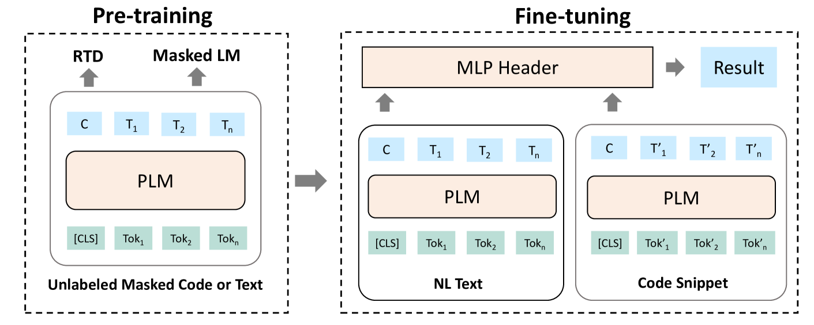

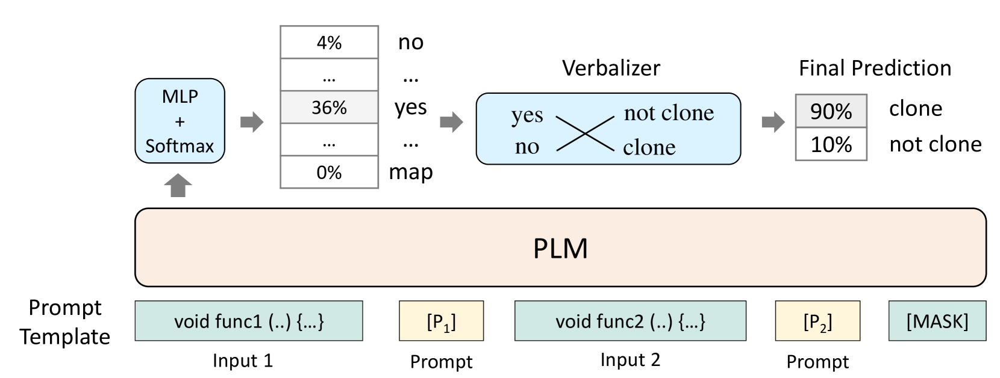

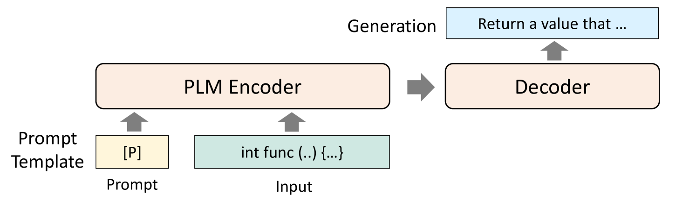

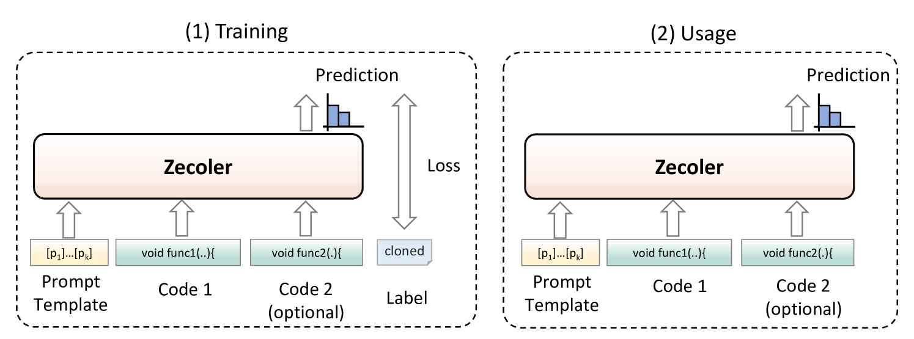

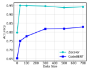

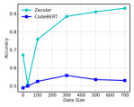

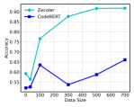

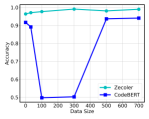

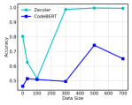

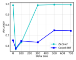

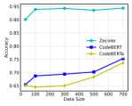

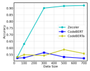

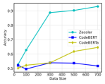

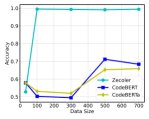

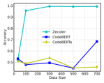

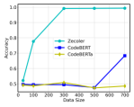

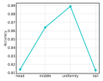

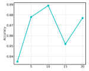

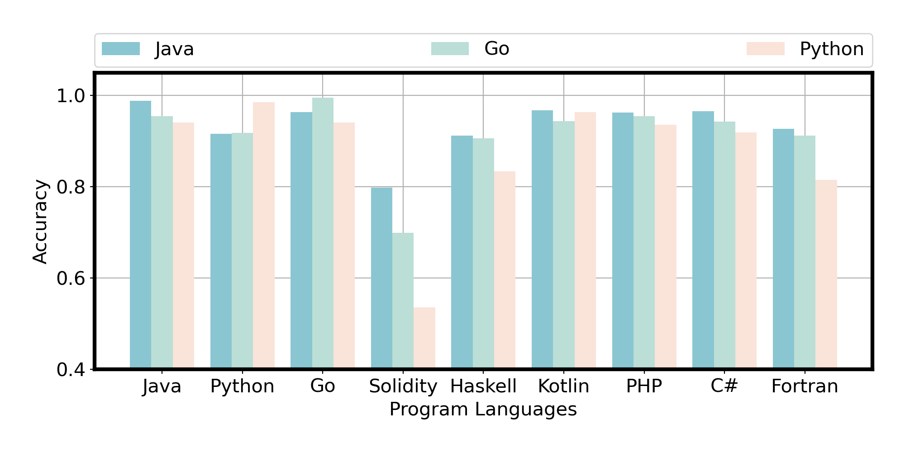

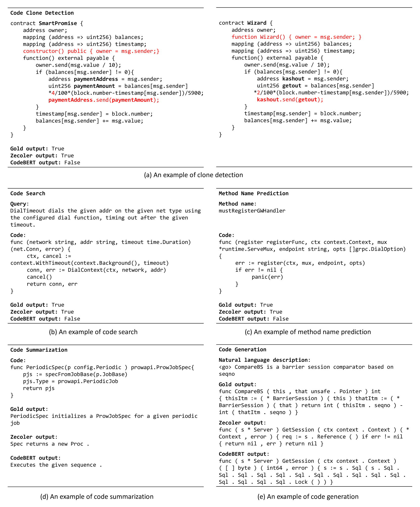

[Arxiv](https://arxiv.org/abs/2404.08947)