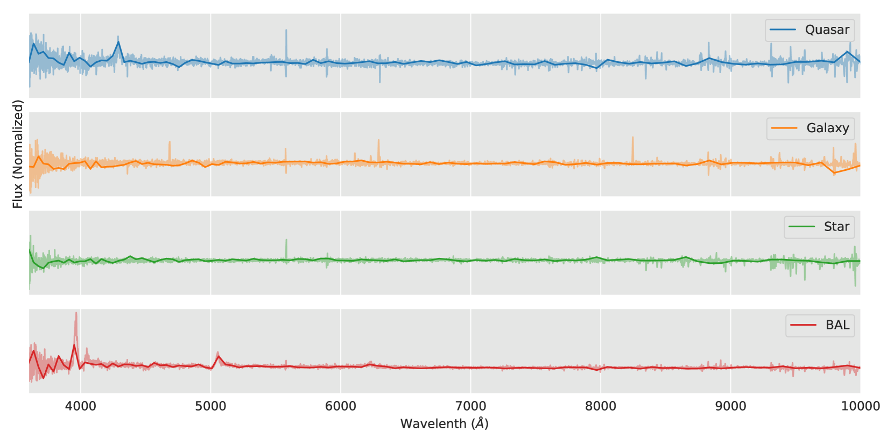
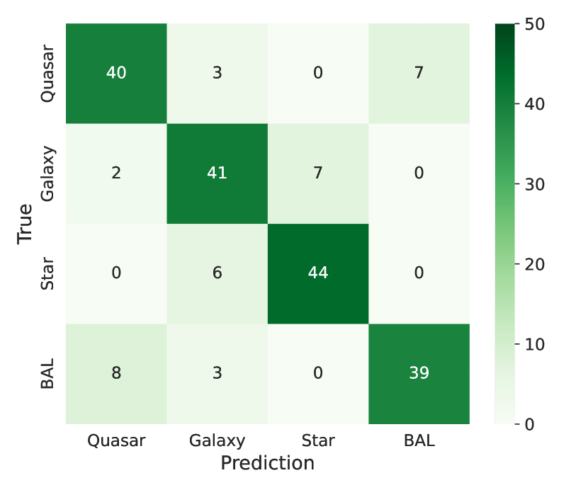
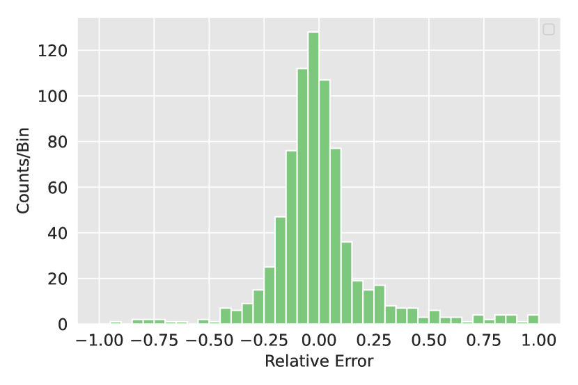
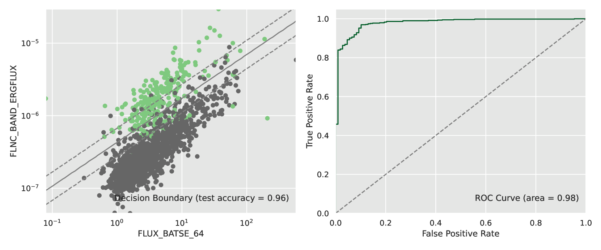
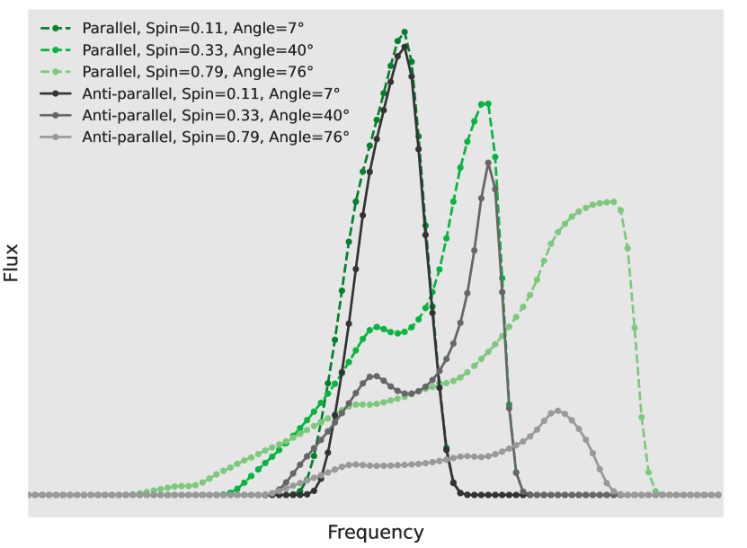
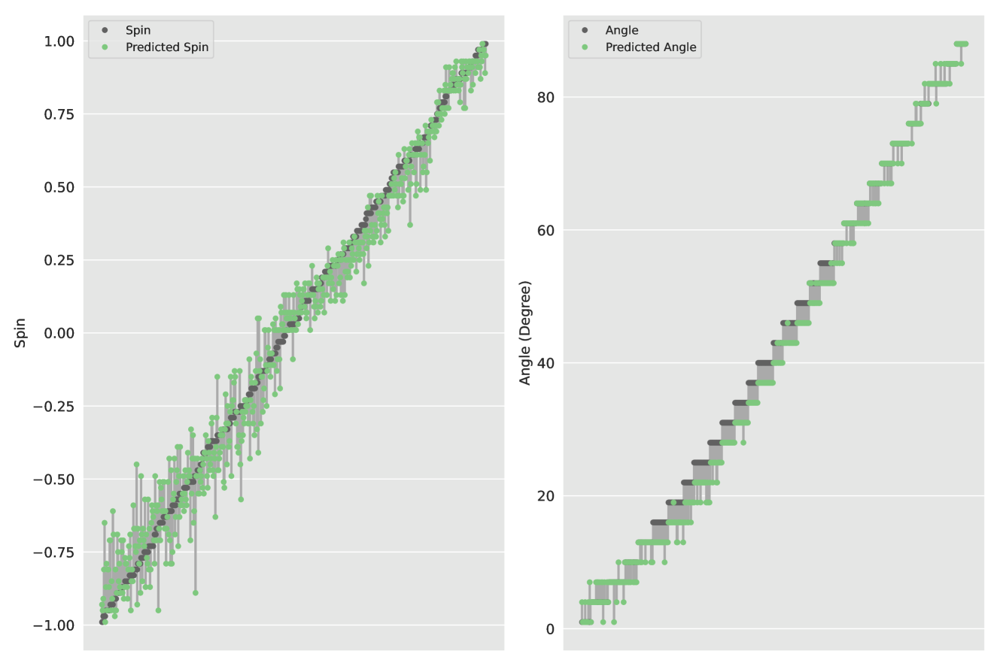
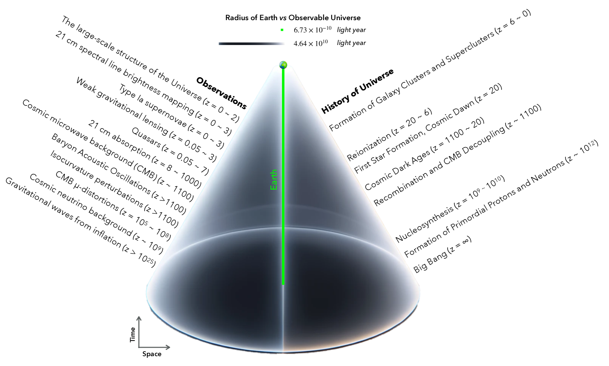

# 人工智能能否洞悉宇宙之谜？本研究通过天体物理数据对GPT模型进行精细调整，以测试其理解宇宙的能力。

发布时间：2024年04月14日

`LLM应用` `天体物理学` `人工智能`

> Can AI Understand Our Universe? Test of Fine-Tuning GPT by Astrophysical Data

# 摘要

> 近期，ChatGPT成为了热议的焦点，不仅专业人士，普通大众也对其充满兴趣，它激发了人们对于人工智能（AI）未来可能带来的变革的讨论。我们作为物理学和天体物理学领域的研究者，对于大型语言模型（LLMs）在科学数据分析方面的准确性和可靠性抱有浓厚兴趣。本文中，我们通过天文观测数据对生成预训练变换器（GPT）模型进行了精细调整，包括星系、类星体、恒星、伽马射线暴（GRBs）以及黑洞（BHs）的模拟数据。经过调整的模型成功地展示了其在天体现象分类、区分GRBs类型、确定类星体红移以及推测黑洞参数方面的能力。我们视此为一次成功的尝试，证明了LLM在科学研究领域的潜力。随着多学科数据量的日益庞大和AI技术的不断进步，我们期待对宇宙有更深层次和全面的认识。文章还探讨了数据采集和AI设计的一些独到见解。我们以探索宇宙为灵感——对外观察数据，对内探索基础元素——提出了一种AI的级数展开策略，探索如何培养和驾驭超越人类智能的AI。

> ChatGPT has been the most talked-about concept in recent months, captivating both professionals and the general public alike, and has sparked discussions about the changes that artificial intelligence (AI) will bring to the world. As physicists and astrophysicists, we are curious about if scientific data can be correctly analyzed by large language models (LLMs) and yield accurate physics. In this article, we fine-tune the generative pre-trained transformer (GPT) model by the astronomical data from the observations of galaxies, quasars, stars, gamma-ray bursts (GRBs), and the simulations of black holes (BHs), the fine-tuned model demonstrates its capability to classify astrophysical phenomena, distinguish between two types of GRBs, deduce the redshift of quasars, and estimate BH parameters. We regard this as a successful test, marking the LLM's proven efficacy in scientific research. With the ever-growing volume of multidisciplinary data and the advancement of AI technology, we look forward to the emergence of a more fundamental and comprehensive understanding of our universe. This article also shares some interesting thoughts on data collection and AI design. Using the approach of understanding the universe - looking outward at data and inward for fundamental building blocks - as a guideline, we propose a method of series expansion for AI, suggesting ways to train and control AI that is smarter than humans.

[Arxiv](https://arxiv.org/abs/2404.10019)