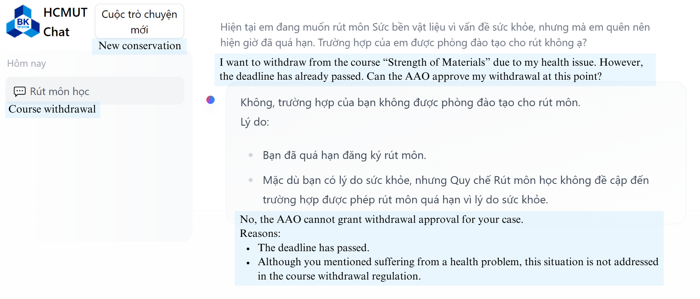

# 构建跨数据知识图谱以赋能大型语言模型（LLM）在教育问答系统中的应用：HCMUT案例研究。

发布时间：2024年04月14日

`分类：RAG` `知识图谱`

> Cross-Data Knowledge Graph Construction for LLM-enabled Educational Question-Answering System: A~Case~Study~at~HCMUT

# 摘要

> 在人工智能迅猛发展的今天，大型语言模型（LLMs）已经成为研究的热点。这些模型在众多领域发挥着重要作用。然而，它们在记忆事件、整合新信息以及处理特定领域的挑战方面，仍面临着与预训练语言模型（PLMs）相似的难题。为解决这些问题，研究者们提出了检索增强生成（RAG）等技术，并探索将LLMs与知识图谱（KGs）结合，以提供准确的事实背景，优化性能并提升对用户查询的反馈精确度。教育对于人类的发展和进步至关重要。随着技术的革新，传统教育正逐渐向数字化或混合式教育转变。在此背景下，高等教育机构中的教育数据日益增长，涵盖了非结构化/结构化文本、关系数据库、网络/应用API接口等多种类型。从这些多样化的数据源中构建知识图谱是一项复杂工作。本文提出了一种自动化构建多源数据知识图谱的方法，并探讨了将知识图谱与LLMs结合在问答任务中的一些初步应用和实验。

> In today's rapidly evolving landscape of Artificial Intelligence, large language models (LLMs) have emerged as a vibrant research topic. LLMs find applications in various fields and contribute significantly. Despite their powerful language capabilities, similar to pre-trained language models (PLMs), LLMs still face challenges in remembering events, incorporating new information, and addressing domain-specific issues or hallucinations. To overcome these limitations, researchers have proposed Retrieval-Augmented Generation (RAG) techniques, some others have proposed the integration of LLMs with Knowledge Graphs (KGs) to provide factual context, thereby improving performance and delivering more accurate feedback to user queries.
  Education plays a crucial role in human development and progress. With the technology transformation, traditional education is being replaced by digital or blended education. Therefore, educational data in the digital environment is increasing day by day. Data in higher education institutions are diverse, comprising various sources such as unstructured/structured text, relational databases, web/app-based API access, etc. Constructing a Knowledge Graph from these cross-data sources is not a simple task. This article proposes a method for automatically constructing a Knowledge Graph from multiple data sources and discusses some initial applications (experimental trials) of KG in conjunction with LLMs for question-answering tasks.

[Arxiv](https://arxiv.org/abs/2404.09296)