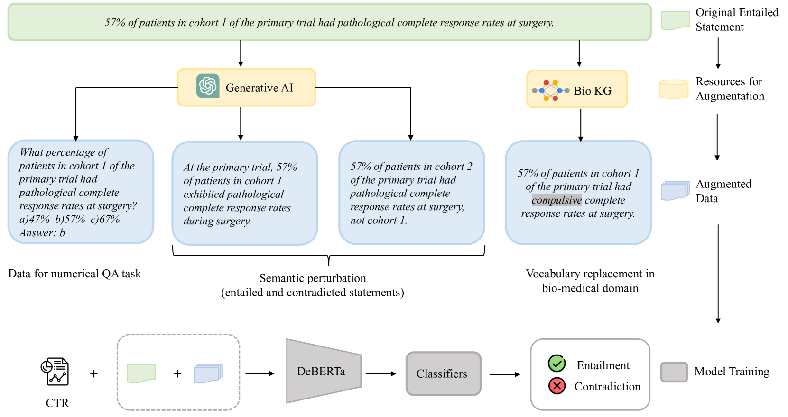

# DKE-Research 参与 SemEval-2024 的第二项任务，通过融合生成模型与生物医学知识进行数据增强，旨在增强推理过程的稳健性。

发布时间：2024年04月14日

`RAG` `临床试验`

> DKE-Research at SemEval-2024 Task 2: Incorporating Data Augmentation with Generative Models and Biomedical Knowledge to Enhance Inference Robustness

# 摘要

> 在临床试验中，准确无误的自然语言推理对于挖掘临床报告的深层信息极为关键，但这受到大型预训练语言模型偏见的挑战。本研究提出了一种创新的数据增强策略，旨在增强生物医学领域自然语言推理的模型鲁棒性。通过语义扰动生成合成样本、替换领域特定词汇，并新增数值推理任务，我们不仅增加了样本多样性，还有效遏制了模型的取巧学习。结合多任务学习和DeBERTa架构，我们的方法在NLI4CT 2024评测中取得了较原始模型显著的性能提升。进一步的消融实验也证实了每种增强手段在提升鲁棒性上的有效性。在32个参赛模型中，我们最优模型在忠实度上位列第12名，一致性上排名第8名。

> Safe and reliable natural language inference is critical for extracting insights from clinical trial reports but poses challenges due to biases in large pre-trained language models. This paper presents a novel data augmentation technique to improve model robustness for biomedical natural language inference in clinical trials. By generating synthetic examples through semantic perturbations and domain-specific vocabulary replacement and adding a new task for numerical and quantitative reasoning, we introduce greater diversity and reduce shortcut learning. Our approach, combined with multi-task learning and the DeBERTa architecture, achieved significant performance gains on the NLI4CT 2024 benchmark compared to the original language models. Ablation studies validate the contribution of each augmentation method in improving robustness. Our best-performing model ranked 12th in terms of faithfulness and 8th in terms of consistency, respectively, out of the 32 participants.

[Arxiv](https://arxiv.org/abs/2404.09206)