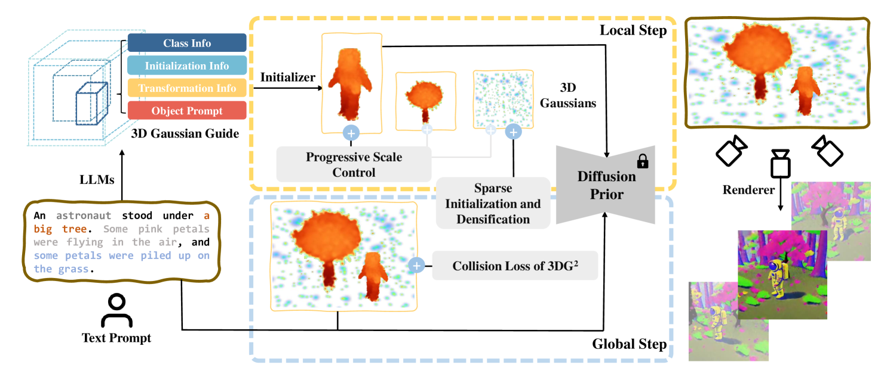
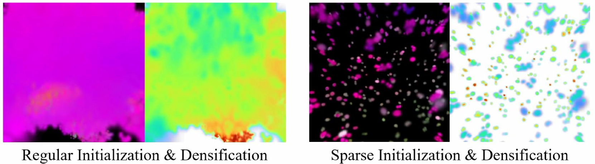
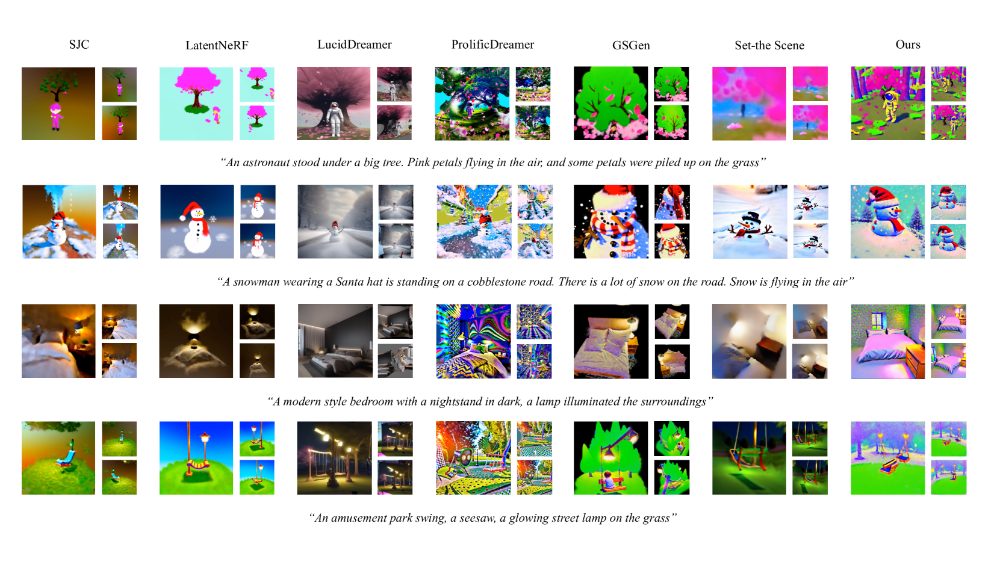
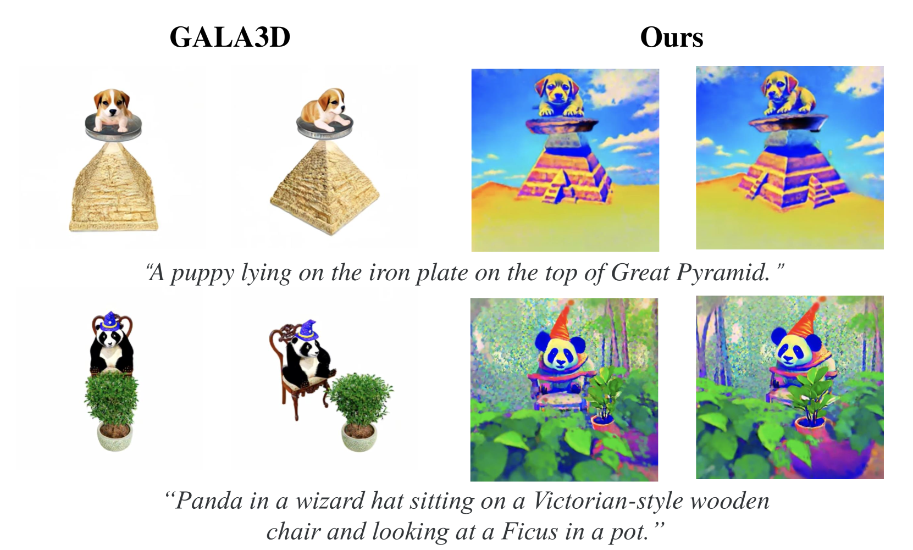
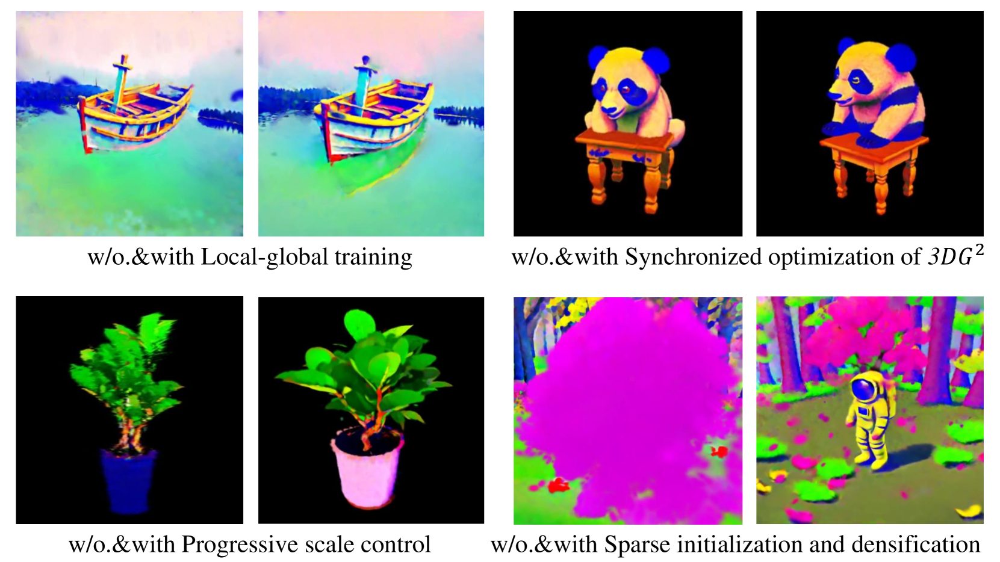
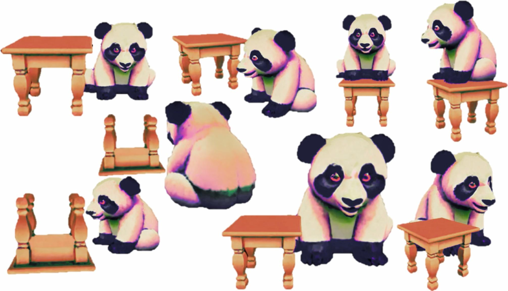

# DreamScape：运用高斯溅射与联合相关性建模技术打造三维场景

发布时间：2024年04月14日

`LLM应用` `3D建模` `文本到图像生成`

> DreamScape: 3D Scene Creation via Gaussian Splatting joint Correlation Modeling

# 摘要

> 在文本到3D创作领域，最新进展得益于扩散模型的先进知识从文本到图像的生成技术成功迁移到3D领域。尽管如此，制作包含多个实例和复杂布局的3D场景依然是个难题。本研究推出了DreamScape，一种仅通过文本描述就能打造出高度一致性3D场景的新方法。它结合了高斯散射出色的3D表现力和大型语言模型（LLMs）在复杂排列上的能力。我们采用的3D高斯引导技术（$3{DG^2}$），通过LLMs直接从文本提示中提取语义基础元素（物体）和它们之间的空间转换与关系，实现了场景的局部到全局优化。在生成局部物体时，我们特别设计了渐进式尺度控制，确保各种规模和密度的物体能够和谐融入场景，有效解决了在全局优化阶段因简单混合导致的训练不稳定问题。同时，为了减少LLM先验知识可能带来的偏差，我们在全局层面上模拟物体间的碰撞关系，提升了场景的物理真实性。此外，为了创造出遍布整个场景的雨、雪等普遍物体，我们引入了稀疏初始化和密集化策略。实验证明，DreamScape具有出色的可用性和可控性，能够仅从文本提示中创造出高保真度的3D场景，并在性能上超越了其他方法，达到了业界领先水平。

> Recent progress in text-to-3D creation has been propelled by integrating the potent prior of Diffusion Models from text-to-image generation into the 3D domain. Nevertheless, generating 3D scenes characterized by multiple instances and intricate arrangements remains challenging. In this study, we present DreamScape, a method for creating highly consistent 3D scenes solely from textual descriptions, leveraging the strong 3D representation capabilities of Gaussian Splatting and the complex arrangement abilities of large language models (LLMs). Our approach involves a 3D Gaussian Guide ($3{DG^2}$) for scene representation, consisting of semantic primitives (objects) and their spatial transformations and relationships derived directly from text prompts using LLMs. This compositional representation allows for local-to-global optimization of the entire scene. A progressive scale control is tailored during local object generation, ensuring that objects of different sizes and densities adapt to the scene, which addresses training instability issue arising from simple blending in the subsequent global optimization stage. To mitigate potential biases of LLM priors, we model collision relationships between objects at the global level, enhancing physical correctness and overall realism. Additionally, to generate pervasive objects like rain and snow distributed extensively across the scene, we introduce a sparse initialization and densification strategy. Experiments demonstrate that DreamScape offers high usability and controllability, enabling the generation of high-fidelity 3D scenes from only text prompts and achieving state-of-the-art performance compared to other methods.

[Arxiv](https://arxiv.org/abs/2404.09227)