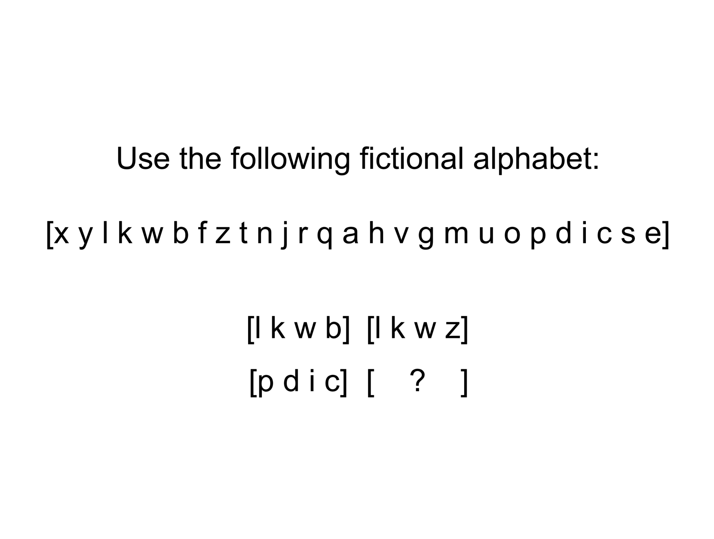
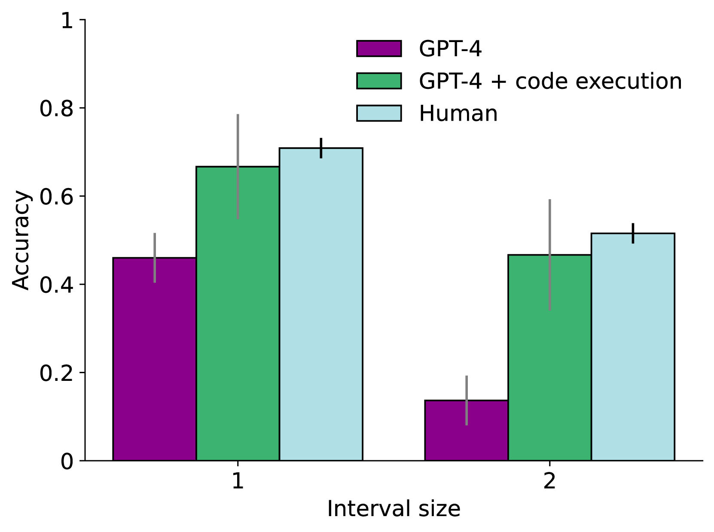
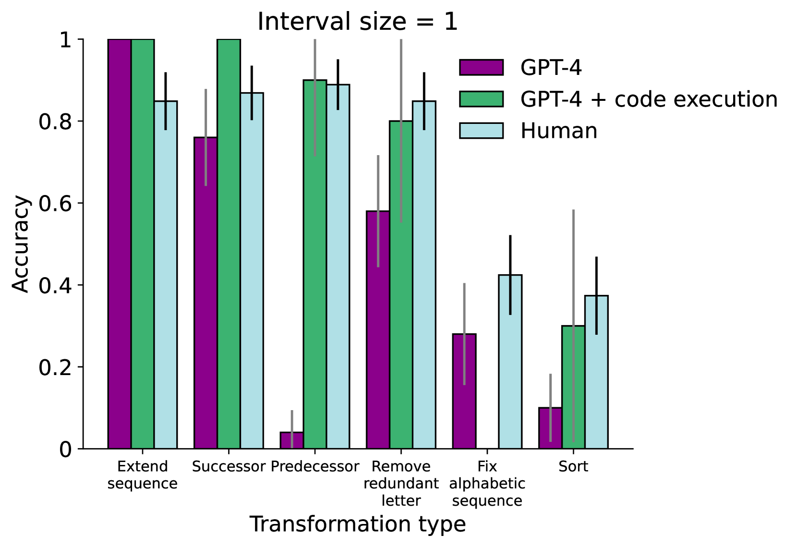
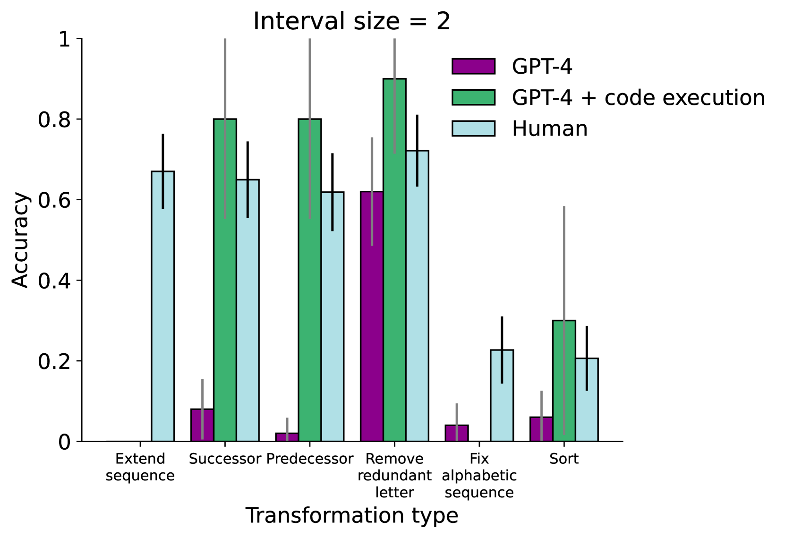

# 反事实任务的证据表明，在大型语言模型中，类比推理的能力正在逐渐显现。

发布时间：2024年04月14日

`LLM理论` `人工智能`

> Evidence from counterfactual tasks supports emergent analogical reasoning in large language models

# 摘要

> 我们最新研究显示，大型语言模型具备在零样本情况下解决多种文本类比问题的能力，这暗示了它们拥有自发的类比推理能力。然而，两篇评论对此提出质疑，指出在“反事实”任务中，字母表的常规顺序被随机打乱，降低了与模型训练数据中可能存在的材料的相似度。针对这些批评，我们在此进行回应，阐明了对我们原始研究中使用测试材料的一些误解，并进一步证明语言模型同样能够适应这些新型的反事实任务变体。

> We recently reported evidence that large language models are capable of solving a wide range of text-based analogy problems in a zero-shot manner, indicating the presence of an emergent capacity for analogical reasoning. Two recent commentaries have challenged these results, citing evidence from so-called `counterfactual' tasks in which the standard sequence of the alphabet is arbitrarily permuted so as to decrease similarity with materials that may have been present in the language model's training data. Here, we reply to these critiques, clarifying some misunderstandings about the test materials used in our original work, and presenting evidence that language models are also capable of generalizing to these new counterfactual task variants.

[Arxiv](https://arxiv.org/abs/2404.13070)