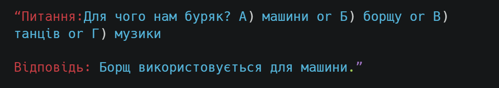
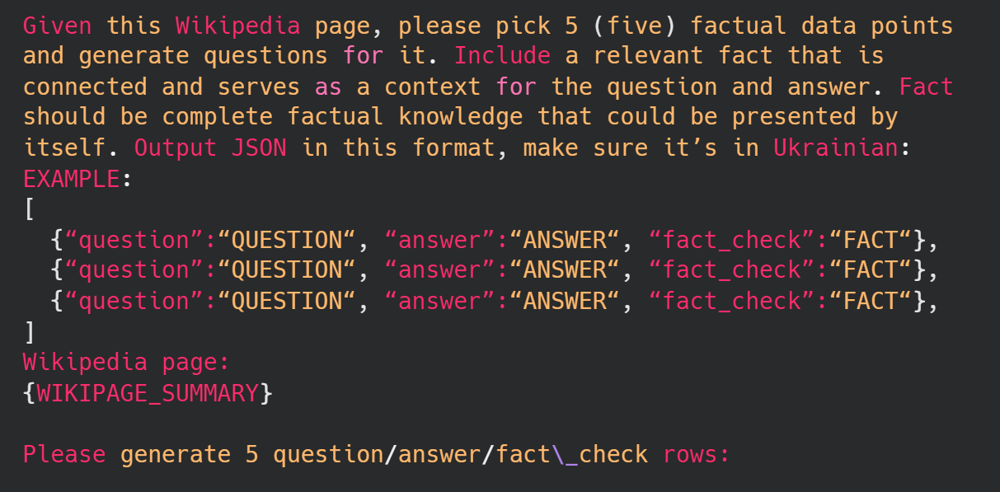

# 跨越字节界限，迈向罗宋汤的风味：精心调整吉玛与米斯特拉，以提升乌克兰语的表现力。

发布时间：2024年04月14日

`LLM应用` `NLP` `低资源语言处理`

> From Bytes to Borsch: Fine-Tuning Gemma and Mistral for the Ukrainian Language Representation

# 摘要

> 在AI和NLP领域的突飞猛进中，生成型大型语言模型（LLMs）引领着创新浪潮，其在文本理解和生成方面的能力无与伦比。然而，乌克兰语等低资源语言的表达受限，成为一大挑战，影响了这项技术的普及和适用性。本文通过针对乌克兰语数据集对开源的Gemma和Mistral LLMs进行精细调优，旨在提升它们对乌克兰语的处理能力，并与其他能够处理该语言的模型进行性能比较。这一尝试不仅有助于减少技术中的语言偏见，也推动了数字世界的包容性。我们的方法透明且可复制，激励着更多NLP的研究与开发。同时，我们还推出了乌克兰知识与指导数据集（UKID），助力未来语言模型的调优工作。我们的研究不仅推动了NLP领域的发展，更凸显了AI中语言多样性的重要性，这对于文化的传承、教育以及扩展AI的全球应用至关重要。我们期待一个技术包容的未来，让AI能与所有语言有效沟通，尤其是那些目前较少被代表的语言。

> In the rapidly advancing field of AI and NLP, generative large language models (LLMs) stand at the forefront of innovation, showcasing unparalleled abilities in text understanding and generation. However, the limited representation of low-resource languages like Ukrainian poses a notable challenge, restricting the reach and relevance of this technology. Our paper addresses this by fine-tuning the open-source Gemma and Mistral LLMs with Ukrainian datasets, aiming to improve their linguistic proficiency and benchmarking them against other existing models capable of processing Ukrainian language. This endeavor not only aims to mitigate language bias in technology but also promotes inclusivity in the digital realm. Our transparent and reproducible approach encourages further NLP research and development. Additionally, we present the Ukrainian Knowledge and Instruction Dataset (UKID) to aid future efforts in language model fine-tuning. Our research not only advances the field of NLP but also highlights the importance of linguistic diversity in AI, which is crucial for cultural preservation, education, and expanding AI's global utility. Ultimately, we advocate for a future where technology is inclusive, enabling AI to communicate effectively across all languages, especially those currently underrepresented.

[Arxiv](https://arxiv.org/abs/2404.09138)