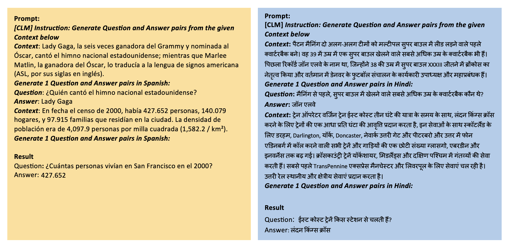
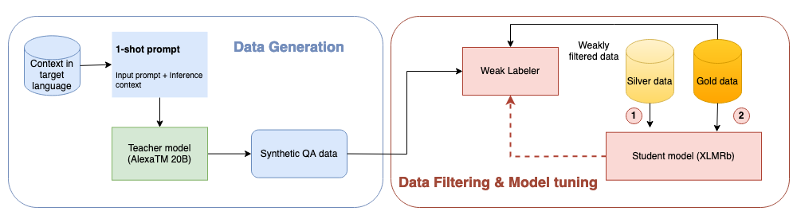
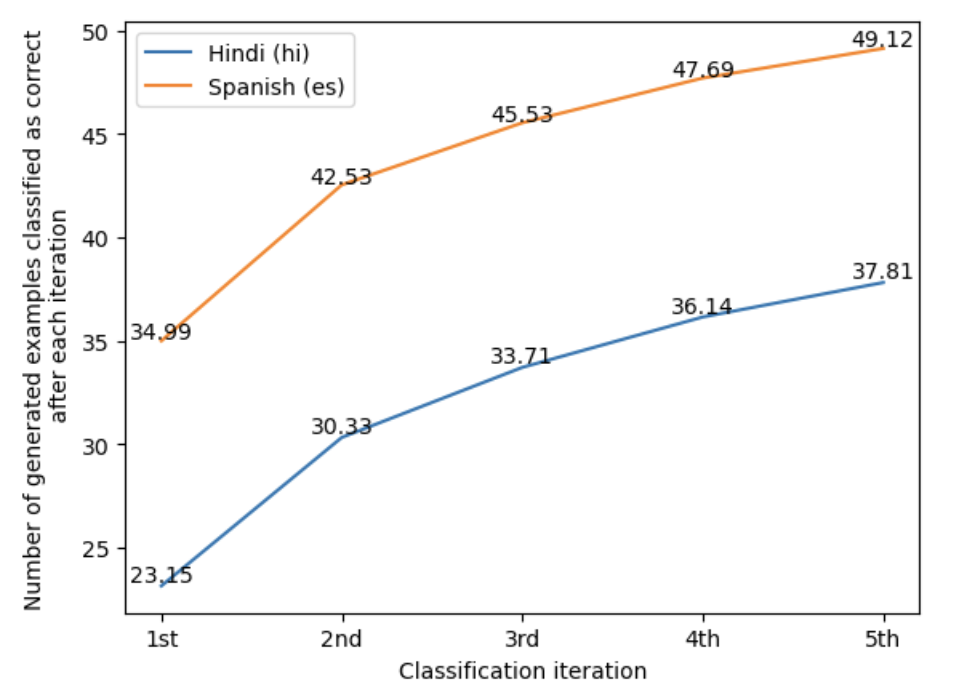
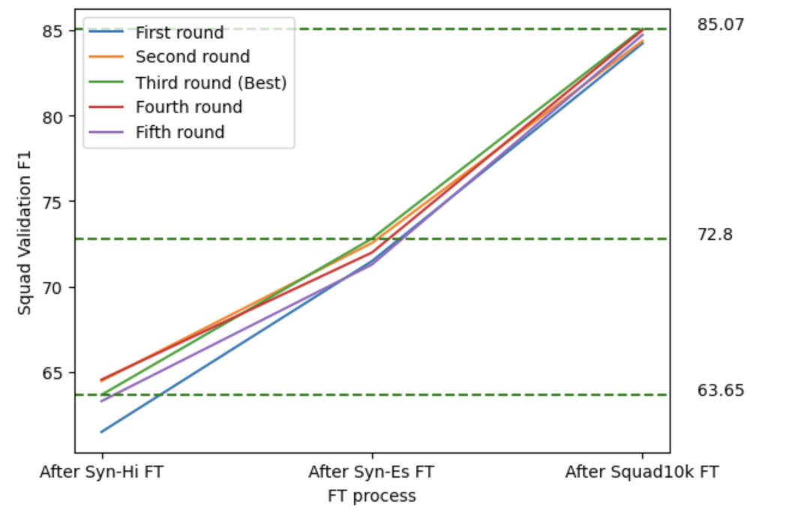
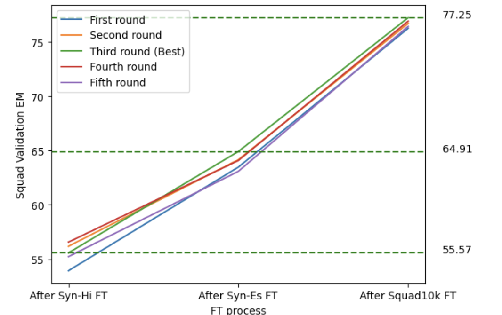

# GeMQuAD：借助少量样本学习技术，从大型语言模型中打造多语言问答数据集。

发布时间：2024年04月14日

`LLM应用` `数据生成` `问答系统`

> GeMQuAD : Generating Multilingual Question Answering Datasets from Large Language Models using Few Shot Learning

# 摘要

> 随着具备In-Context Learning (ICL) 功能的Large Language Models (LLMs)的兴起，数据生成在多个领域焕发新活力，减少了对庞大数据集和复杂建模技术的依赖。研究者们尝试利用这些合成数据优化精简版模型，以降低部署成本和减少后续任务的响应时间。然而，受限于任务特定性和ICL中使用的样本数量，ICL产出的数据质量常常不尽人意。本文提出了GeMQuAD，一种半监督学习方法，基于WeakDAP框架，应用于仅使用AlexaTM 20B Seq2Seq LLM中一个目标语言示例通过ICL生成的数据集。通过迭代筛选高质量数据，我们的框架显著提升了模型性能，特别是在多语言环境下的Extractive Question Answering任务。在MLQA数据集上，我们的模型在印地语和西班牙语的F1/EM（精确匹配）指标上分别超越了机器翻译增强模型1.68和1.37个百分点，以及仅使用英语数据集训练的模型6.50和3.69个百分点。值得注意的是，我们的方法无需对预训练的LLM进行微调，仅利用ICL中的一个标注示例来生成数据，实现了经济高效的发展策略。

> The emergence of Large Language Models (LLMs) with capabilities like In-Context Learning (ICL) has ushered in new possibilities for data generation across various domains while minimizing the need for extensive data collection and modeling techniques. Researchers have explored ways to use this generated synthetic data to optimize smaller student models for reduced deployment costs and lower latency in downstream tasks. However, ICL-generated data often suffers from low quality as the task specificity is limited with few examples used in ICL. In this paper, we propose GeMQuAD - a semi-supervised learning approach, extending the WeakDAP framework, applied to a dataset generated through ICL with just one example in the target language using AlexaTM 20B Seq2Seq LLM. Through our approach, we iteratively identify high-quality data to enhance model performance, especially for low-resource multilingual setting in the context of Extractive Question Answering task. Our framework outperforms the machine translation-augmented model by 0.22/1.68 F1/EM (Exact Match) points for Hindi and 0.82/1.37 F1/EM points for Spanish on the MLQA dataset, and it surpasses the performance of model trained on an English-only dataset by 5.05/6.50 F1/EM points for Hindi and 3.81/3.69 points F1/EM for Spanish on the same dataset. Notably, our approach uses a pre-trained LLM for generation with no fine-tuning (FT), utilizing just a single annotated example in ICL to generate data, providing a cost-effective development process.

[Arxiv](https://arxiv.org/abs/2404.09163)