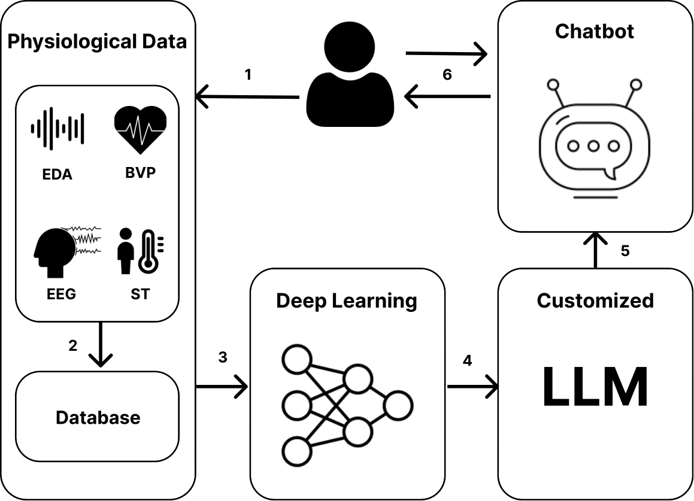
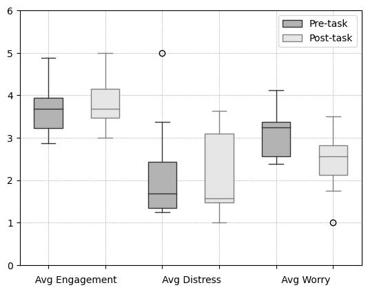

# 融合生理信息与先进的语言模型，打造更具同理心的人机交互体验。

发布时间：2024年04月14日

`LLM应用` `聊天机器人` `心理健康`

> Integrating Physiological Data with Large Language Models for Empathic Human-AI Interaction

# 摘要

> 本研究致力于提升大型语言模型（LLMs）的同理心，通过整合生理数据实现。我们提出了一种生理计算策略，开发了利用生理信息来识别心理状态的深度学习模型，并将这些预测状态与LLMs融合，以促进富有同理心的交流。这一策略在一款名为“同理心增强型大型语言模型”（EmLLM）的聊天机器人中得到了应用，主要用于监测和控制压力。此外，我们还对一项初步研究的结果进行了讨论，该研究评估了EmLLM聊天机器人在准确预测用户压力、提供人性化回复以及与用户建立治疗性联盟方面的表现。

> This paper explores enhancing empathy in Large Language Models (LLMs) by integrating them with physiological data. We propose a physiological computing approach that includes developing deep learning models that use physiological data for recognizing psychological states and integrating the predicted states with LLMs for empathic interaction. We showcase the application of this approach in an Empathic LLM (EmLLM) chatbot for stress monitoring and control. We also discuss the results of a pilot study that evaluates this EmLLM chatbot based on its ability to accurately predict user stress, provide human-like responses, and assess the therapeutic alliance with the user.

[Arxiv](https://arxiv.org/abs/2404.15351)