# 通过大型语言模型的模拟数据进行离线强化学习，打造出见多识广的智能代理。

发布时间：2024年04月14日

`LLM应用` `人工智能`

> Knowledgeable Agents by Offline Reinforcement Learning from Large Language Model Rollouts

# 摘要

> 通过与环境互动，强化学习（RL）培养智能体解决复杂问题，但受限于现有数据的范围。本研究提出了一种创新方法——基于语言模型展开的知识智能体（KALM），它从大型语言模型（LLMs）中提取知识，以智能体能够通过离线强化学习轻松掌握的想象展开形式。KALM面临的核心难题是如何将LLM与环境数据相衔接，因为LLMs通常只处理文本数据，而环境数据往往包含LLMs未曾接触的数值向量。为此，KALM对LLM进行精细调整，让其根据环境数据执行任务，包括将技能的自然语言描述与其对应的展开数据进行双向翻译。这一过程提升了LLM对环境变化的理解力，使其能够创造出多样化且富有意义的情景展开，映射出新技能。在CLEVR-Robot环境中的初期实验显示，KALM助力智能体完成复杂的任务目标重构，并将能力拓展至新任务，这些任务需展现出前所未有的最优行为。KALM在执行未见目标的任务时，成功率达到46%，远超基线方法的26%。此外，KALM还有效促进了LLM对环境变化的理解，创造出反映新技能的有意义想象展开，实现了大型语言模型与强化学习的完美融合。

> Reinforcement learning (RL) trains agents to accomplish complex tasks through environmental interaction data, but its capacity is also limited by the scope of the available data. To obtain a knowledgeable agent, a promising approach is to leverage the knowledge from large language models (LLMs). Despite previous studies combining LLMs with RL, seamless integration of the two components remains challenging due to their semantic gap. This paper introduces a novel method, Knowledgeable Agents from Language Model Rollouts (KALM), which extracts knowledge from LLMs in the form of imaginary rollouts that can be easily learned by the agent through offline reinforcement learning methods. The primary challenge of KALM lies in LLM grounding, as LLMs are inherently limited to textual data, whereas environmental data often comprise numerical vectors unseen to LLMs. To address this, KALM fine-tunes the LLM to perform various tasks based on environmental data, including bidirectional translation between natural language descriptions of skills and their corresponding rollout data. This grounding process enhances the LLM's comprehension of environmental dynamics, enabling it to generate diverse and meaningful imaginary rollouts that reflect novel skills. Initial empirical evaluations on the CLEVR-Robot environment demonstrate that KALM enables agents to complete complex rephrasings of task goals and extend their capabilities to novel tasks requiring unprecedented optimal behaviors. KALM achieves a success rate of 46% in executing tasks with unseen goals, substantially surpassing the 26% success rate achieved by baseline methods. Furthermore, KALM effectively enables the LLM to comprehend environmental dynamics, resulting in the generation of meaningful imaginary rollouts that reflect novel skills and demonstrate the seamless integration of large language models and reinforcement learning.

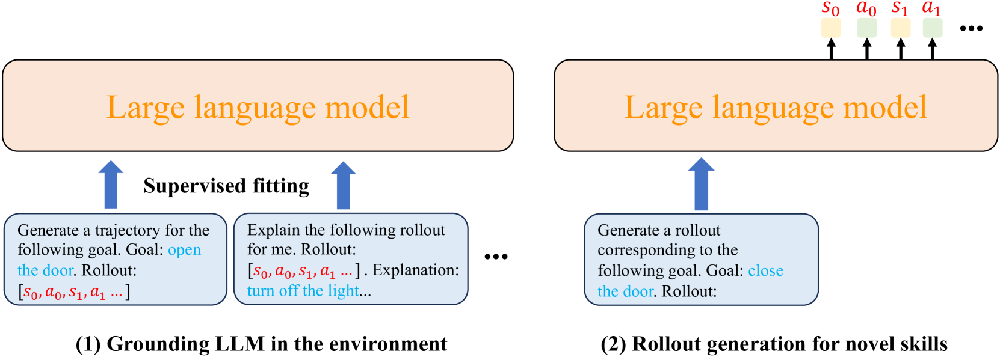

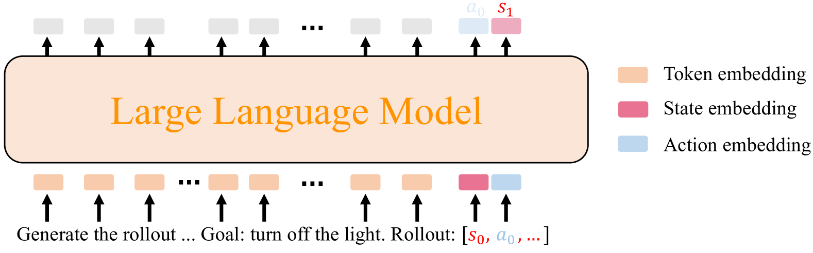

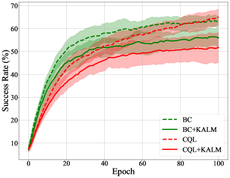

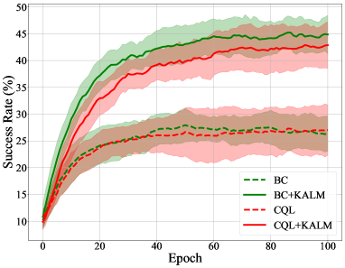

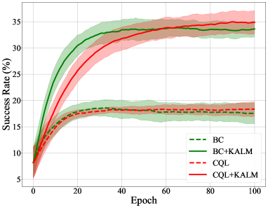

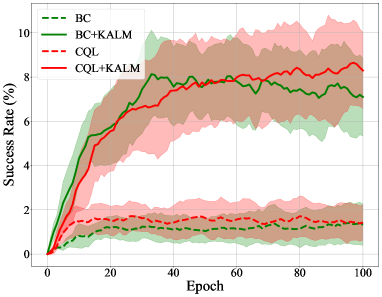

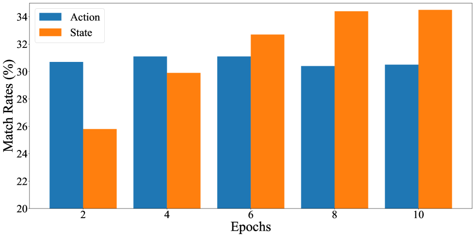

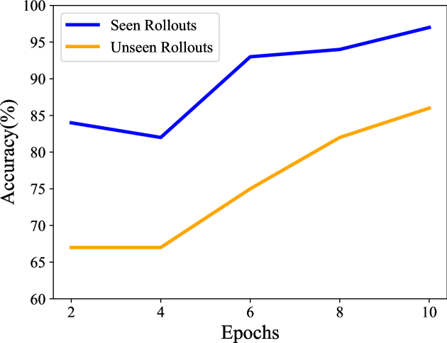

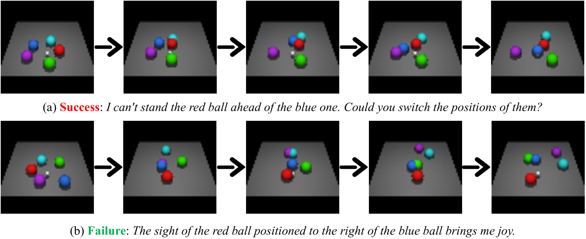

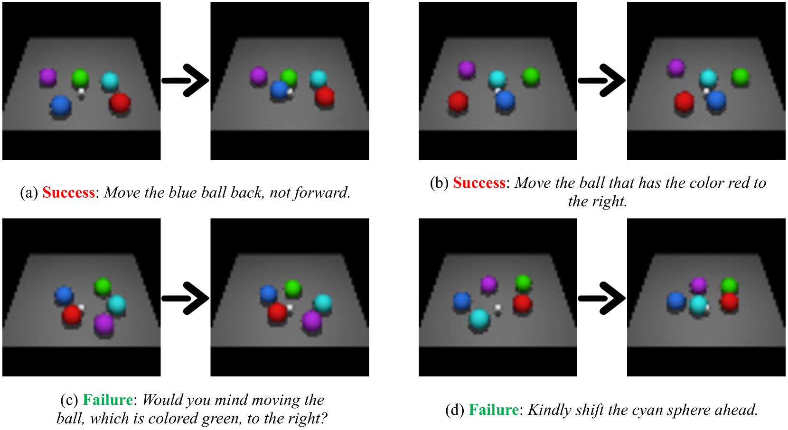

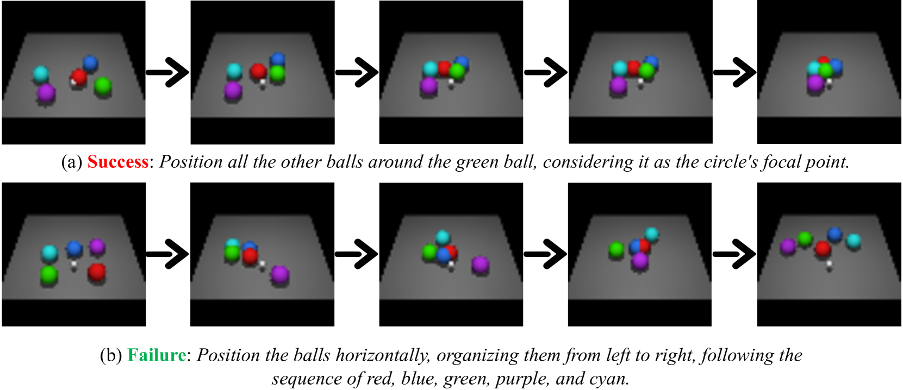

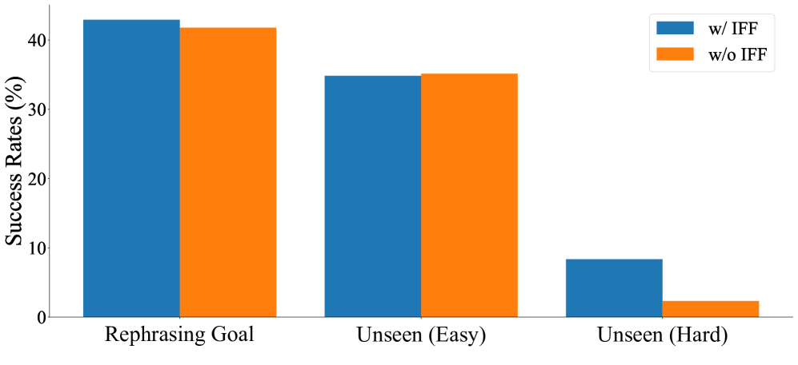

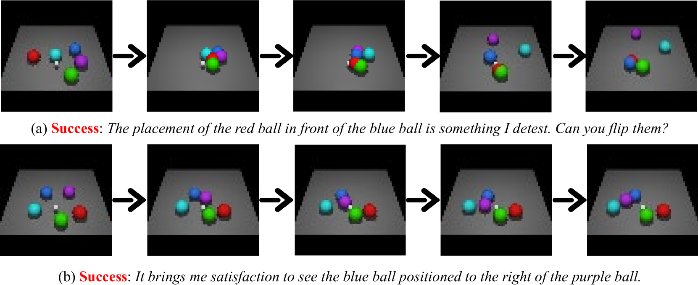

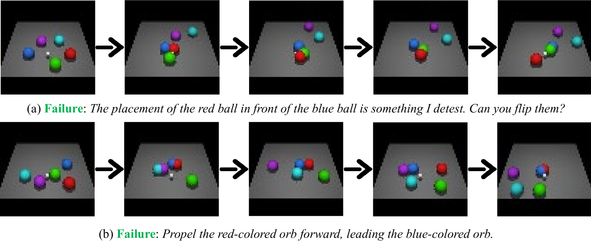

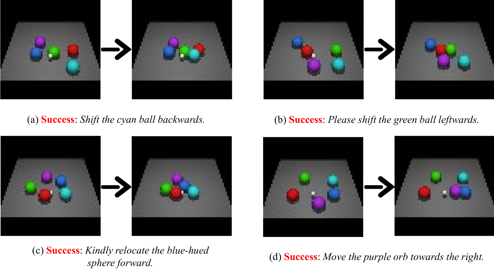

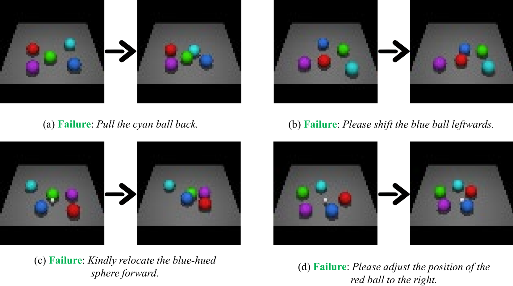

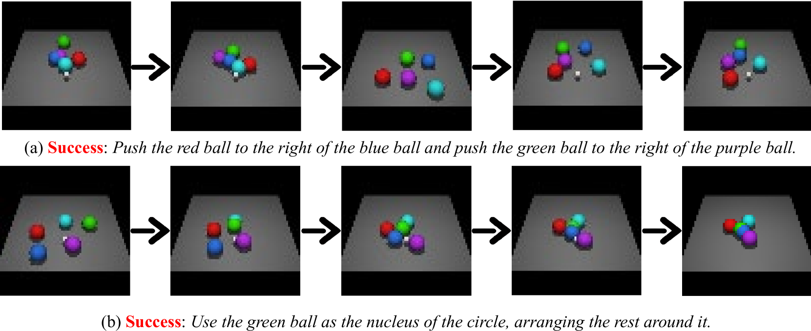

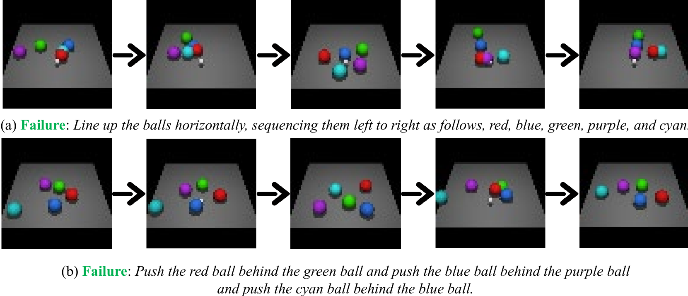

[Arxiv](https://arxiv.org/abs/2404.09248)