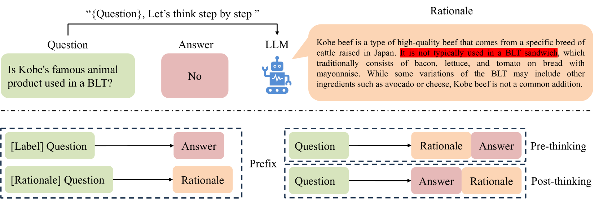
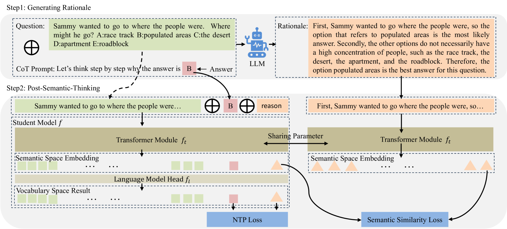
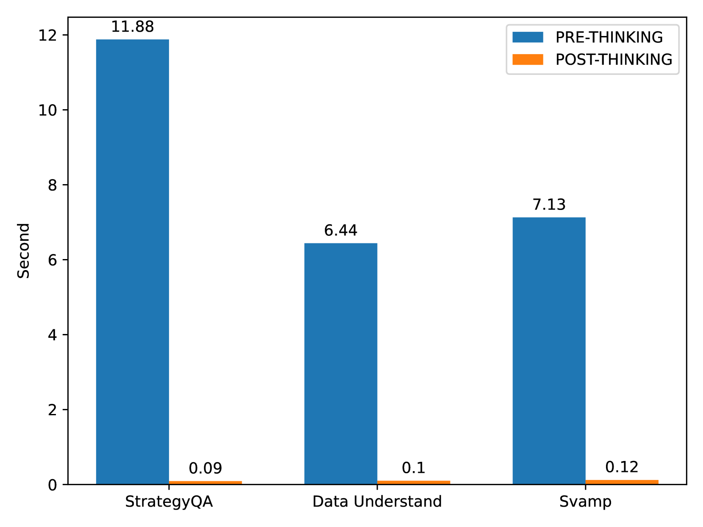
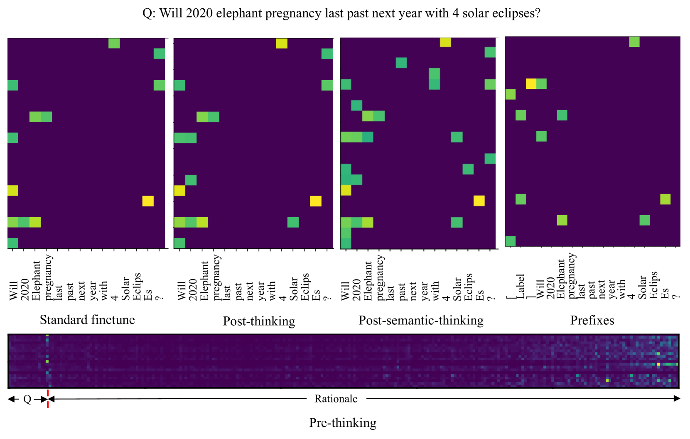
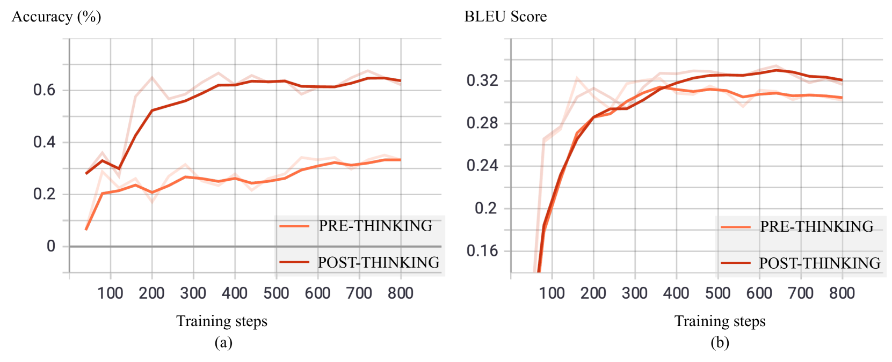
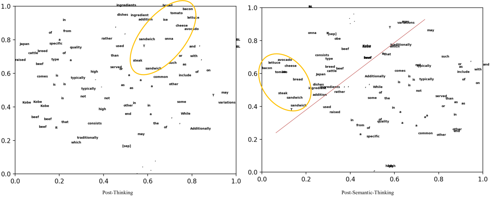
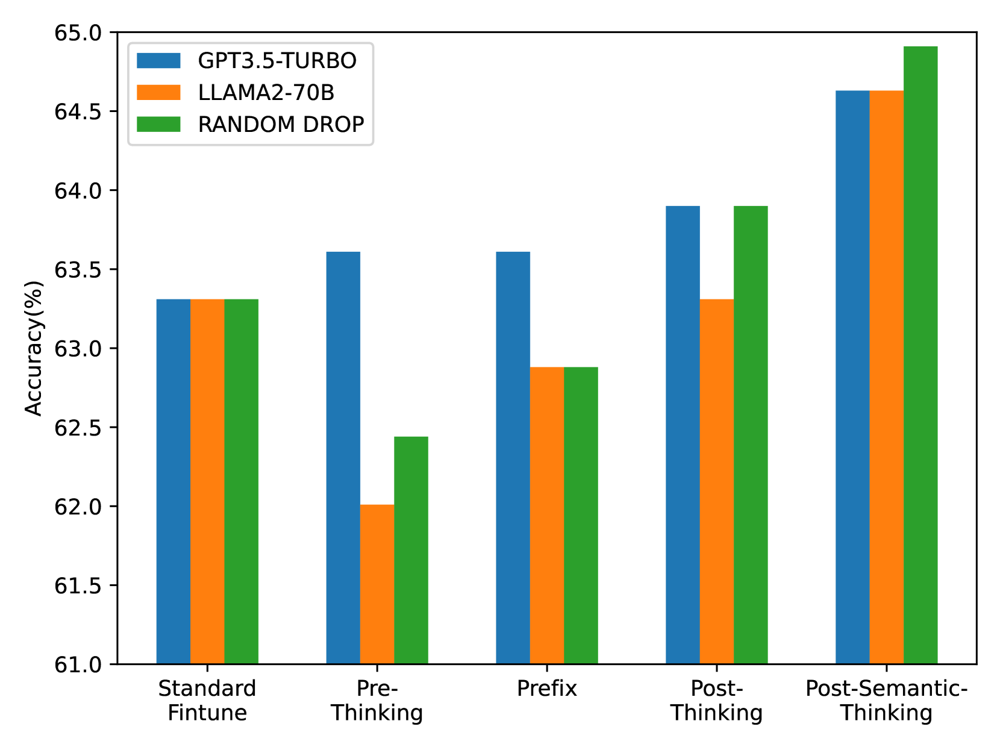

# 探索后语义思维：高效提炼大型语言模型的推理能力

发布时间：2024年04月14日

`LLM应用` `思维链微调`

> Post-Semantic-Thinking: A Robust Strategy to Distill Reasoning Capacity from Large Language Models

# 摘要

> 思维链微调致力于让小型模型通过模仿大型语言模型的推理过程来提升特定任务的表现，而非仅仅预测问题的答案。但现有方法存在局限：先产生理由再给出答案，容易受到理由幻觉的影响；强制学生模型逐字复述LLMs的推理，可能导致模型过分关注表达而忽视了逻辑理解。因此，我们提出了一种新的后语义思维策略，先给出答案再构建理由。这样做的好处是：1）答题不再受理由幻觉的负面影响；2）复杂推理与简洁答案紧密结合，让问题解答在已有答案信息的基础上更加简单；3）推理效率得到提升，因为用户在得到答案后即可停止生成过程。此外，PST策略不再严格要求生成理由与LLMs的黄金标准在词汇空间上完全一致，而是更注重在隐藏的语义空间上的接近度，帮助小型模型更好地把握理由背后的语义逻辑。经过12项推理任务的广泛测试，PST策略已证明其有效性。

> Chain of thought finetuning aims to endow small student models with reasoning capacity to improve their performance towards a specific task by allowing them to imitate the reasoning procedure of large language models (LLMs) beyond simply predicting the answer to the question. However, the existing methods 1) generate rationale before the answer, making their answer correctness sensitive to the hallucination in the rationale;2) force the student model to repeat the exact LLMs rationale expression word-after-word, which could have the model biased towards learning the expression in rationale but count against the model from understanding the core logic behind it. Therefore, we propose a robust Post-Semantic-Thinking (PST) strategy to generate answers before rationale. Thanks to this answer-first setting, 1) the answering procedure can escape from the adverse effects caused by hallucinations in the rationale; 2) the complex reasoning procedure is tightly bound with the relatively concise answer, making the reasoning for questions easier with the prior information in the answer; 3) the efficiency of the method can also benefit from the setting since users can stop the generation right after answers are outputted when inference is conducted. Furthermore, the PST strategy loose the constraint against the generated rationale to be close to the LLMs gold standard in the hidden semantic space instead of the vocabulary space, thus making the small student model better comprehend the semantic reasoning logic in rationale. Extensive experiments conducted across 12 reasoning tasks demonstrate the effectiveness of PST.

[Arxiv](https://arxiv.org/abs/2404.09170)