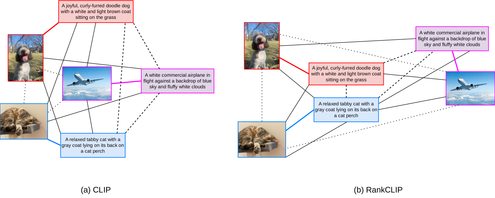
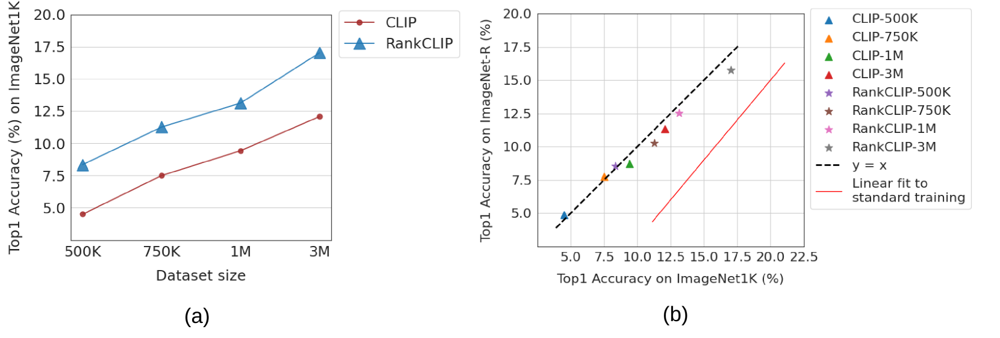
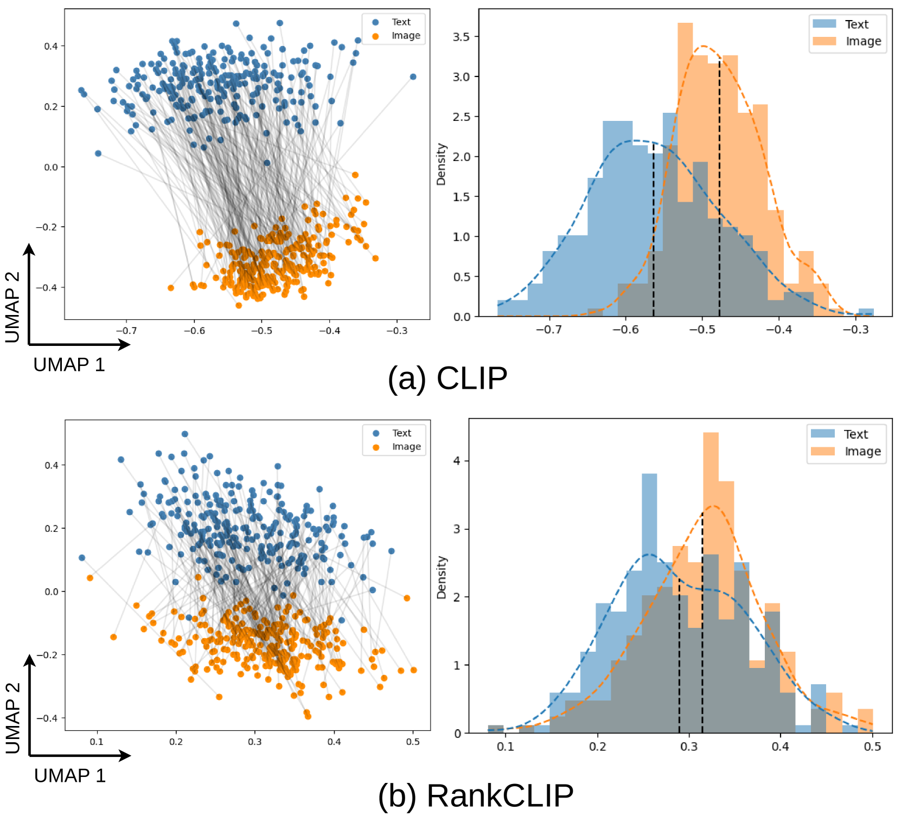

# RankCLIP：实现语言与图像预训练的排名一致性

发布时间：2024年04月14日

`LLM应用` `视觉-语言模型` `零-shot分类`

> RankCLIP: Ranking-Consistent Language-Image Pretraining

# 摘要

> 在视觉-语言模型的持续进化中，对比语言-图像预训练（CLIP）借助大量文本-图像配对的自监督对比学习，在零-shot分类等众多下游任务中创造了新的里程碑。然而，CLIP对死板的一对一对应关系的依赖，忽略了文本与图像之间复杂的多层次联系。为了解决这一问题，我们提出了RankCLIP，这是一种创新的预训练方法，它突破了CLIP及其衍生模型的局限，通过强化模态内和跨模态的排名一致性，优化了对齐过程，使其能够更精准地捕捉文本和图像之间以及它们内部的丰富多样的关系。经过一系列全面的实验验证，RankCLIP在提升各类下游任务的性能上表现出色，特别是在零-shot分类任务中实现了对现有最先进方法的显著超越，展现了RankCLIP在推动视觉-语言预训练发展上的巨大潜力。

> Among the ever-evolving development of vision-language models, contrastive language-image pretraining (CLIP) has set new benchmarks in many downstream tasks such as zero-shot classifications by leveraging self-supervised contrastive learning on large amounts of text-image pairs. However, its dependency on rigid one-to-one mappings overlooks the complex and often multifaceted relationships between and within texts and images. To this end, we introduce RankCLIP, a novel pretraining method that extends beyond the rigid one-to-one matching framework of CLIP and its variants. By leveraging both in-modal and cross-modal ranking consistency, RankCLIP improves the alignment process, enabling it to capture the nuanced many-to-many relationships between and within each modality. Through comprehensive experiments, we demonstrate the enhanced capability of RankCLIP to effectively improve performance across various downstream tasks, notably achieving significant gains in zero-shot classifications over state-of-the-art methods, underscoring the potential of RankCLIP in further advancing vision-language pretraining.

[Arxiv](https://arxiv.org/abs/2404.09387)