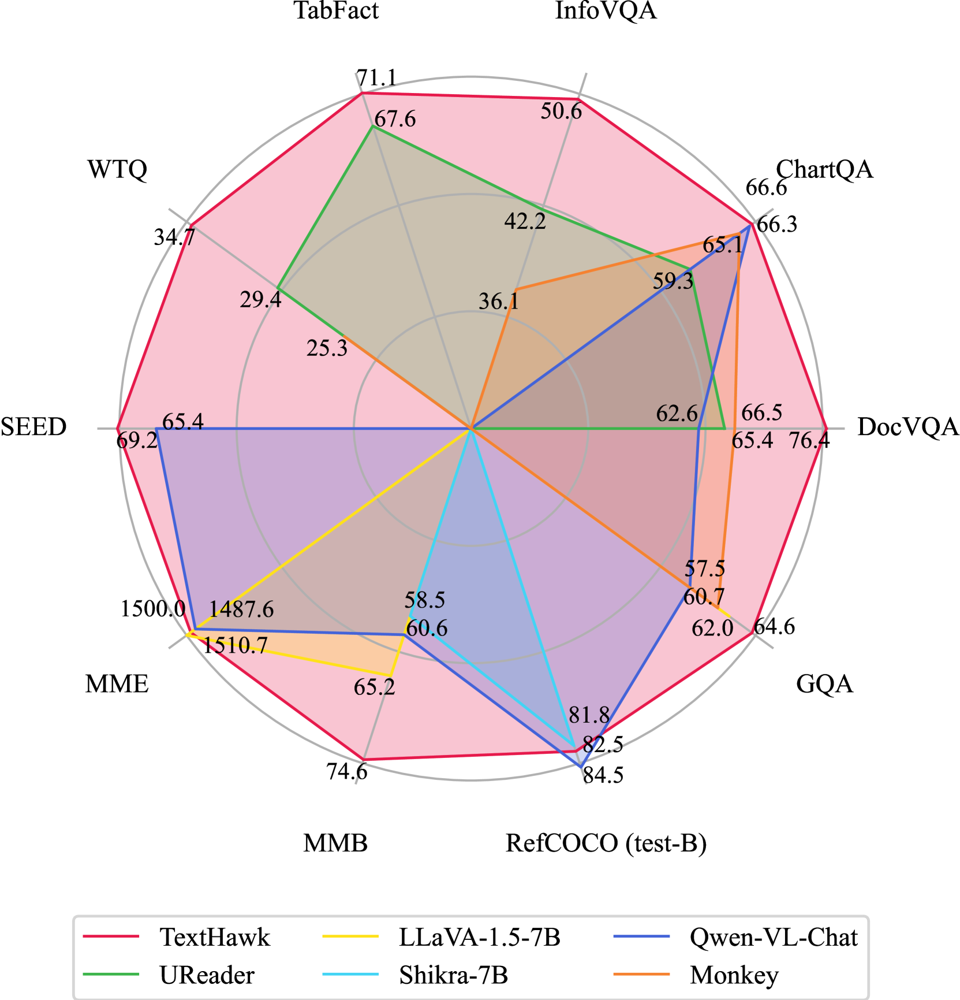
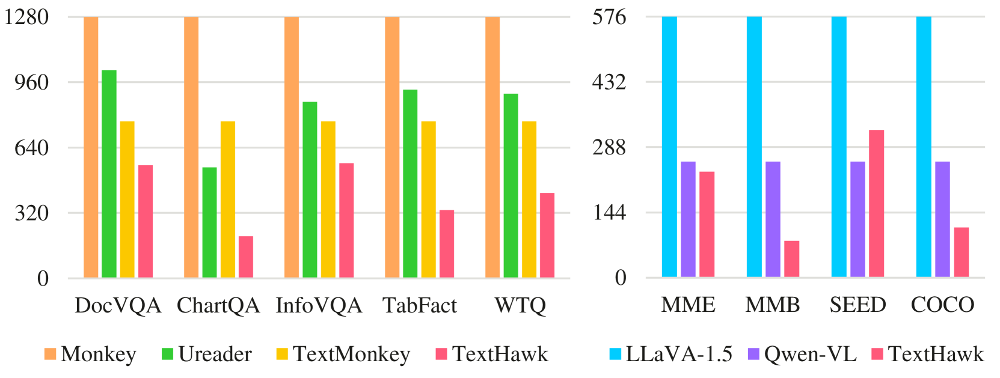
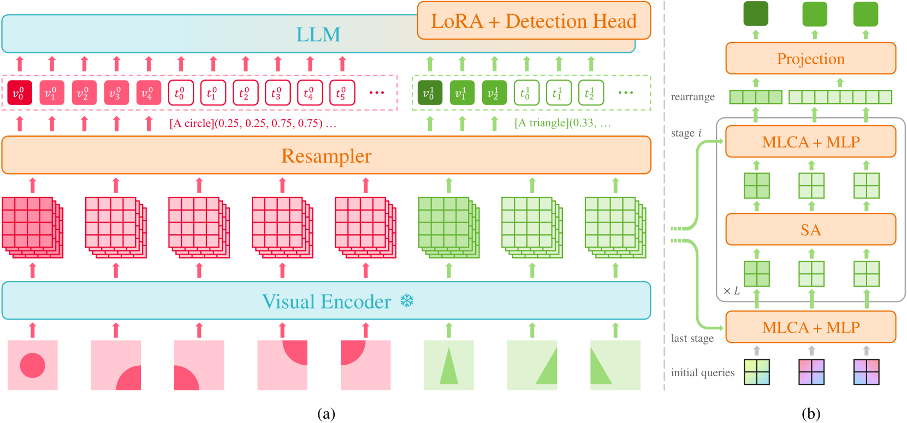
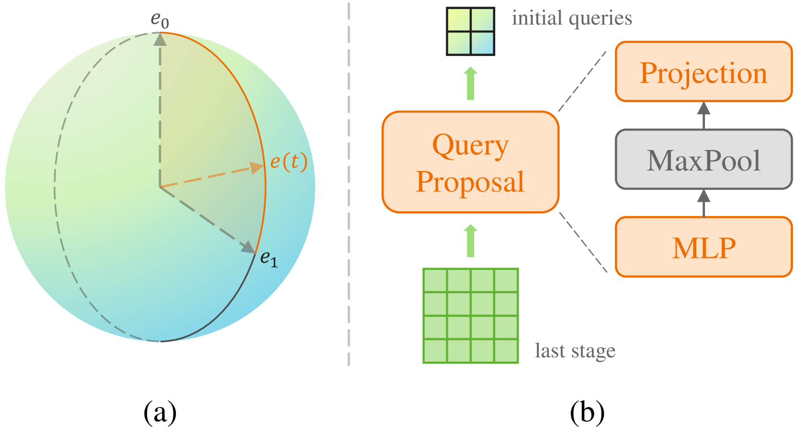
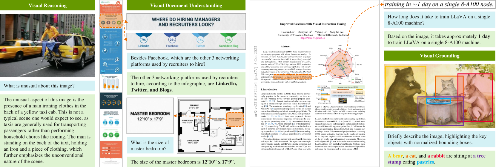

# TextHawk：高效精准感知多模态大型语言模型的新探索

发布时间：2024年04月14日

`LLM应用` `文档处理` `多模态学习`

> TextHawk: Exploring Efficient Fine-Grained Perception of Multimodal Large Language Models

# 摘要

> 多模态大型语言模型（MLLMs）在多项多模态任务中取得了显著成果。然而，现有MLLMs在处理需要精细图像理解和信息压缩的文档任务时，往往不太适应。本文介绍了TextHawk，一款专为文档任务量身打造的MLLM，同时兼顾了MLLM的通用性能。TextHawk通过四个专门组件，致力于提升细粒度感知效率。首先，引入重采样与重排（ReSA）模块，旨在减少文档文本的冗余，降低MLLM的计算负担。通过可伸缩位置嵌入（SPEs），我们能够编码每个局部特征的位置，适应不同尺寸的图像，保持模型的可扩展性。接着，采用查询提案网络（QPN）动态初始化不同子图像中的查询。为了增强MLLM的细粒度视觉感知能力，我们设计了多级交叉注意（MLCA）机制，以捕捉文档图像的层级结构和语义关联。此外，通过Gemini Pro丰富多模态文档数据，我们构建了一个新的面向文档任务的指令调整数据集。在广泛的实验中，TextHawk在通用和文档任务的MLLM基准测试上均超越了当前最先进的方法，展现了其在细粒度文档理解和通用性能上的有效性和优越性。

> Multimodal Large Language Models (MLLMs) have shown impressive results on various multimodal tasks. However, most existing MLLMs are not well suited for document-oriented tasks, which require fine-grained image perception and information compression. In this paper, we present TextHawk, a MLLM that is specifically designed for document-oriented tasks, while preserving the general capabilities of MLLMs. TextHawk is aimed to explore efficient fine-grained perception by designing four dedicated components. Firstly, a ReSampling and ReArrangement (ReSA) module is proposed to reduce the redundancy in the document texts and lower the computational cost of the MLLM. We explore encoding the positions of each local feature by presenting Scalable Positional Embeddings (SPEs), which can preserve the scalability of various image sizes. A Query Proposal Network (QPN) is then adopted to initialize the queries dynamically among different sub-images. To further enhance the fine-grained visual perceptual ability of the MLLM, we design a Multi-Level Cross-Attention (MLCA) mechanism that captures the hierarchical structure and semantic relations of document images. Furthermore, we create a new instruction-tuning dataset for document-oriented tasks by enriching the multimodal document data with Gemini Pro. We conduct extensive experiments on both general and document-oriented MLLM benchmarks, and show that TextHawk outperforms the state-of-the-art methods, demonstrating its effectiveness and superiority in fine-grained document perception and general abilities.

[Arxiv](https://arxiv.org/abs/2404.09204)