# Trajeglish：视交通建模为继绀令牌预测的艺术

发布时间：2024年04月14日

`Agent` `自动驾驶` `交通模拟`

> Trajeglish: Traffic Modeling as Next-Token Prediction

# 摘要

> 自动驾驶技术发展中的一项长期挑战是如何基于记录的驾驶日志模拟动态驾驶情境。为此，我们采用了离散序列建模的工具来模拟车辆、行人和骑行者在驾驶情境中的相互作用。通过一个简洁的数据驱动标记化方法，我们将轨迹细化至厘米级精度，并利用有限的词汇库进行编码。接着，我们利用类似GPT的编码器-解码器架构，对离散运动标记的序列进行建模，该架构在时间上具有自回归特性，并能够捕捉智能体间的时间步内互动。我们模型生成的情境在真实感上达到了先进水平；在Waymo Sim Agents基准测试中，我们的模型超越了先前的研究，在真实感指标上提升了3.3%，在交互指标上提升了9.9%。我们还全面探讨了在完全自动驾驶和部分自动驾驶环境下的建模决策，并证明了我们模型学习到的表征能够迅速适应并提升在nuScenes上的表现。此外，我们还评估了模型在参数数量和数据集规模上的扩展性，并利用模型的密度估计来量化交通建模任务中上下文长度和时间步内交互的重要性。

> A longstanding challenge for self-driving development is simulating dynamic driving scenarios seeded from recorded driving logs. In pursuit of this functionality, we apply tools from discrete sequence modeling to model how vehicles, pedestrians and cyclists interact in driving scenarios. Using a simple data-driven tokenization scheme, we discretize trajectories to centimeter-level resolution using a small vocabulary. We then model the multi-agent sequence of discrete motion tokens with a GPT-like encoder-decoder that is autoregressive in time and takes into account intra-timestep interaction between agents. Scenarios sampled from our model exhibit state-of-the-art realism; our model tops the Waymo Sim Agents Benchmark, surpassing prior work along the realism meta metric by 3.3% and along the interaction metric by 9.9%. We ablate our modeling choices in full autonomy and partial autonomy settings, and show that the representations learned by our model can quickly be adapted to improve performance on nuScenes. We additionally evaluate the scalability of our model with respect to parameter count and dataset size, and use density estimates from our model to quantify the saliency of context length and intra-timestep interaction for the traffic modeling task.

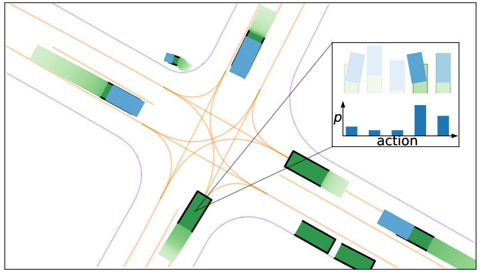

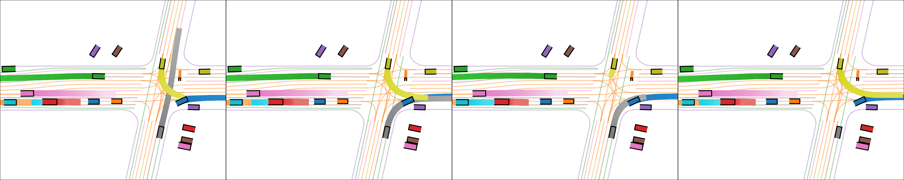

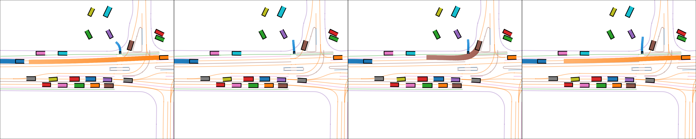

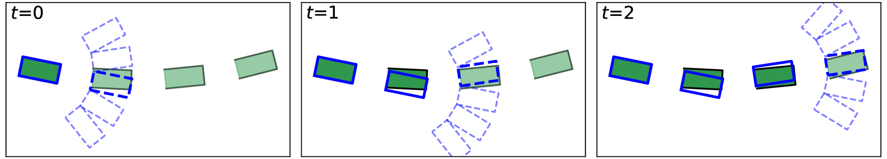

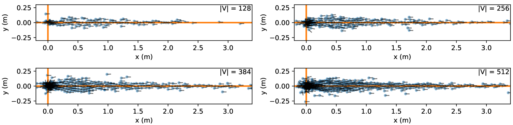

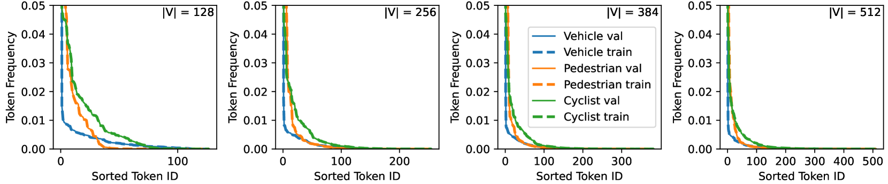

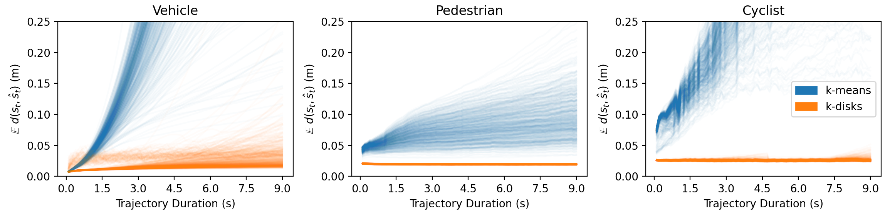

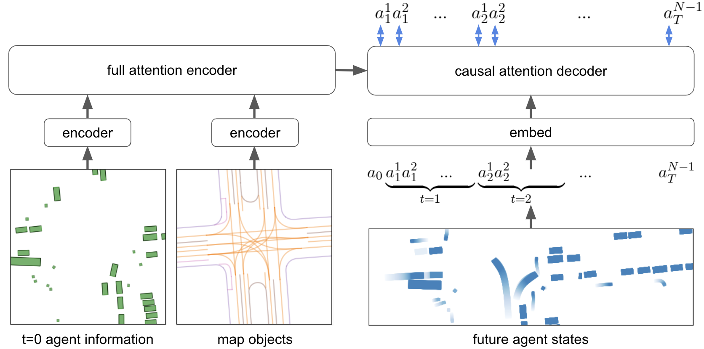

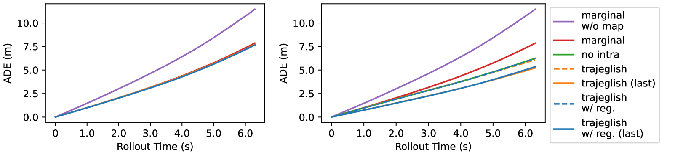

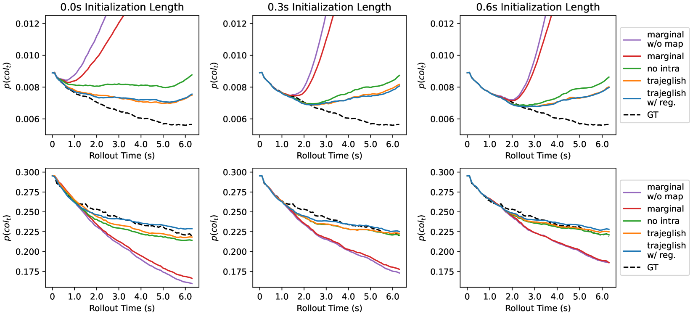

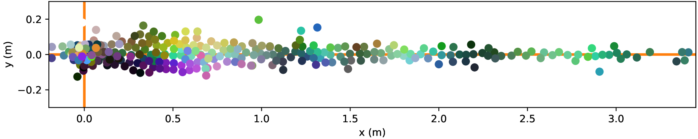

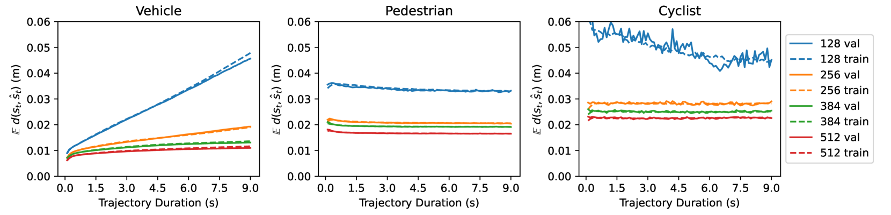

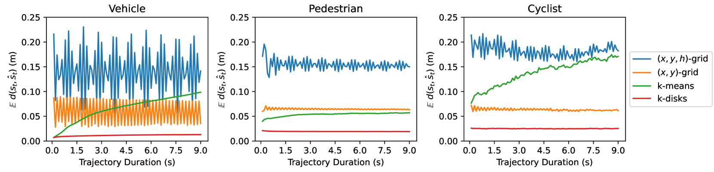

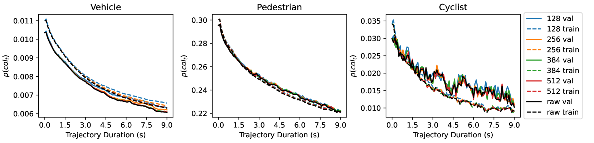

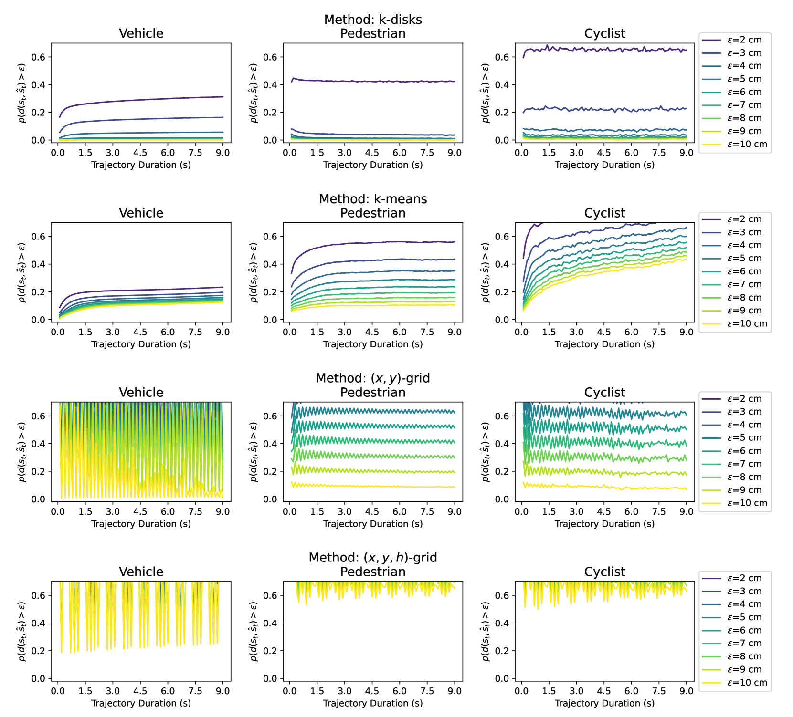

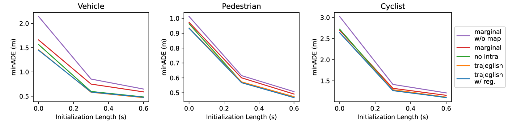

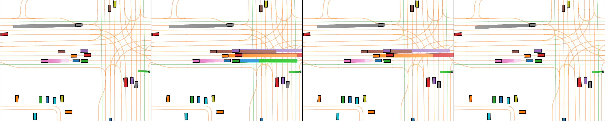

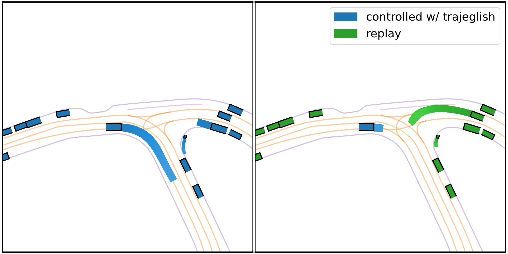

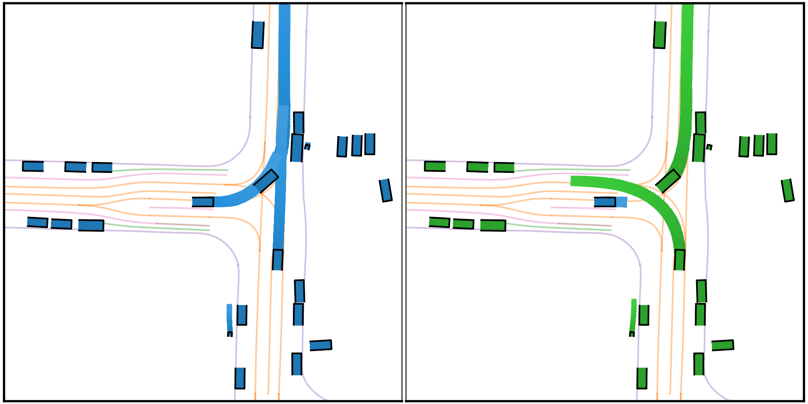

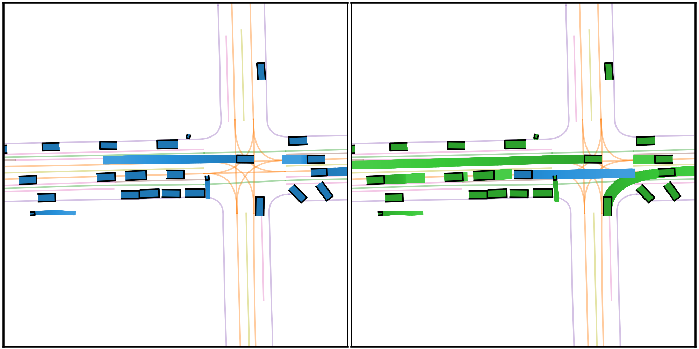

[Arxiv](https://arxiv.org/abs/2312.04535)