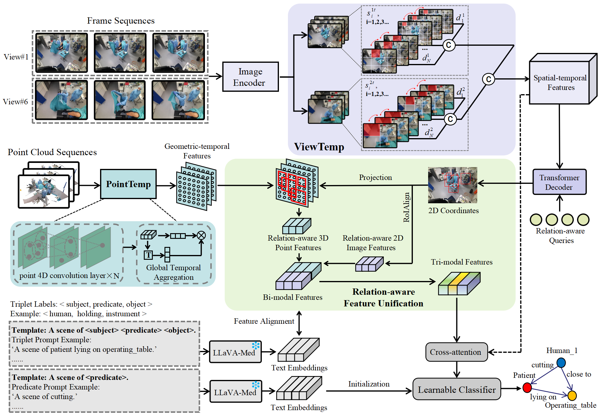
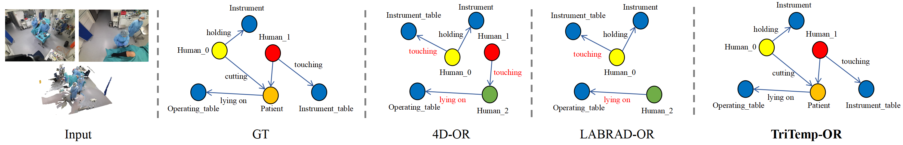
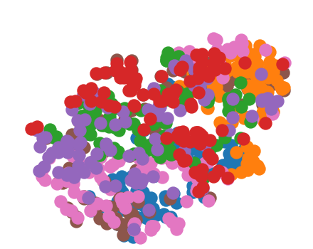
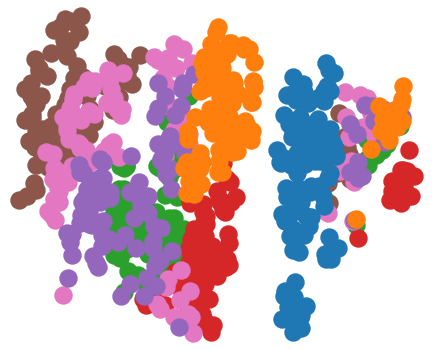

# 在手术室场景中，结合时间动态的三模态交汇技术，用于生成场景图。

发布时间：2024年04月14日

`LLM应用` `手术场景理解`

> Tri-modal Confluence with Temporal Dynamics for Scene Graph Generation in Operating Rooms

# 摘要

> 深入掌握手术场景有助于监督手术流程，降低意外发生并提升医疗人员的工作效率。我们提出了一种名为TriTemp-OR的三模态（图像、点云、语言）融合与时间动态框架，用以在手术室中构建语义场景图。此框架突破了以往通过记忆网络整合时间信息的局限，直接从视频流中提取双模态时间信息进行层次化特征交互，并利用大型语言模型（LLMs）的先验知识来解决手术室内类别不平衡的问题。模型在2D图像帧和3D点云间进行时间互动，采用自适应尺度的多视角时间互动（ViewTemp）和几何时间点聚合（PointTemp）技术。此外，我们还引入生物医学领域LLM——LLaVA-Med的知识，以深化对手术过程中内在关系的把握。TriTemp-OR模型通过关系感知的三模态特征聚合，精准预测并生成场景图，实验结果显示，其在4D-OR基准测试中的长期手术室流媒体处理上表现卓越。

> A comprehensive understanding of surgical scenes allows for monitoring of the surgical process, reducing the occurrence of accidents and enhancing efficiency for medical professionals. Semantic modeling within operating rooms, as a scene graph generation (SGG) task, is challenging since it involves consecutive recognition of subtle surgical actions over prolonged periods. To address this challenge, we propose a Tri-modal (i.e., images, point clouds, and language) confluence with Temporal dynamics framework, termed TriTemp-OR. Diverging from previous approaches that integrated temporal information via memory graphs, our method embraces two advantages: 1) we directly exploit bi-modal temporal information from the video streaming for hierarchical feature interaction, and 2) the prior knowledge from Large Language Models (LLMs) is embedded to alleviate the class-imbalance problem in the operating theatre. Specifically, our model performs temporal interactions across 2D frames and 3D point clouds, including a scale-adaptive multi-view temporal interaction (ViewTemp) and a geometric-temporal point aggregation (PointTemp). Furthermore, we transfer knowledge from the biomedical LLM, LLaVA-Med, to deepen the comprehension of intraoperative relations. The proposed TriTemp-OR enables the aggregation of tri-modal features through relation-aware unification to predict relations so as to generate scene graphs. Experimental results on the 4D-OR benchmark demonstrate the superior performance of our model for long-term OR streaming.

[Arxiv](https://arxiv.org/abs/2404.09231)